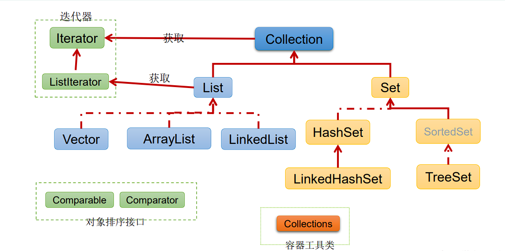
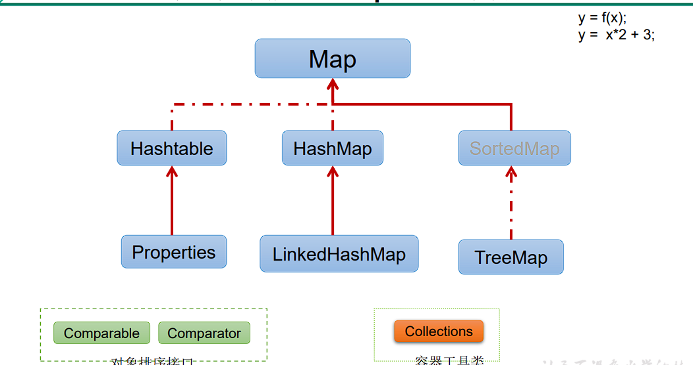

# 复习JavaSE

###### 1、JDK是Java development kit （开发工具包）

###### 2、JRE是Java runtime environment（运行环境）

###### 3、JDK和JRE的关系

​		JDK=JRE+开发工具集

​		JRE=JVM+Java SE标准库

###### 4、环境变量path配置及其作用

​		作用：在任何路径下，都能执行java工具，不限于只在bin目录中。

###### 5、命名规范

​		1>. 包名：xxxyyyzzz

​		2>.类名、接口名：XxxYyyZzz

​		3>.变量名、方法名：xxxYyyZzz

​		4>.常量名：XXX_YYY_ZZZ

​		特别注意：需要见名知义

###### 6、基本数据类型

​		数值型：1>整数型：byte（1字节=8bit）、short（2字节）、int（4字节）、long（8字节）

​						2>浮点型：float（4字节）、double（8字节）

​		字符型：char（2字节）

​		布尔型：boolean

###### 7、引动数据类型

​		类：class(String字符串在这)

​		接口：interface

​		数组：（[]）

###### 8、“&”和“&&”的区别，“|”和“||”的区别

​		在“&”中在式子的左右两边都会参与计算。而在“&&”中，若左边式子为false则，右边不参与运算，直接返回一个false的值。

​		“|”和“|”的区别和上述是一样的。在“||”中，若左边为真，则直接返回true，右边的式子不参与运算。

###### 9、排序算法分类：

​		内部排序：整个排序过程不需要借助外部存储器（如磁盘），所有排序操作都在内存完成。

​						选择排序：直接选择排序、堆排序。

​						交换排序：冒泡排序O(n^2)、快速排序O（nlog(n)）。

​						插入排序：直接插入排序、折半插入排序、Shell排序。

​						归并排序

​						桶式排序

​						基数排序

​		外部排序：参与排序的数据非常多，数据量非常大，计算机无法把整个排序过程放在内存完成，必须借助外部存储器（如磁盘）。外部排序最常见的是多路归并排序。可以认为外部排序是由多次内部排序组成。

###### 10、重载和重写

重载：在同一个类中，允许存在一个以上的同名方法，只要它们的参数个数或者参数类型不同即可。

重写：在子类中可以根据需要对从父类中继承来的方法进行改造，也称为方法的重置、覆盖。

###### 11、权限修饰符

###### 12、==和equals的区别

​		1>==既可以比较基本数据类型也可以比较引用数据类型。对于基本类型就是比较值，对于引用类型就是比较内存地址

​		2>equals的画，他是属于java.lang.Object类里面的方法，如果该方法没有被重写过默认也是==；我们可以看到String等类的equals方法是被重写过的，而且		String类在日常开发中用的比较多，久而久之，形成了equals是比较值的错误观点。

​		3>具体要看自定义类里有没有重写Object的equals方法的判断。

​		4>通常情况下，重写equals方法，会比较类中的相应属性是否都相等。

###### 13、多线程创建的方法

​		①继承Thread类		 ②实现Runnable接口	 ③实现Callable接口

​		方式 一：1）：定义子类继承Thread类

​						2）：子类中重写Thread类中的run方法

​						3）：创建Thread子类对象，即创建了线程对象

​						4）：调用线程对象的start方法：启动线程，调用run方法

​		方式二：1）：定义子类，实现Runnable接口。

​						2）：子类中重写Runnable接口中的run方法。

​						3）：通过Thread类含参构造器创建线程对象。

​						4）：将Runnable接口的子类对象作为实际参数传递给Thread类的构造器中。

​						5）：调用Thread类中的start方法：开启线程，调用Runnable子类接口的run方法。

​		 方式三：1）：创建一个实现Callable的实现类

​						2）：实现call方法，将此线程需要执行的操作声明在call()中。

​						3）：创建Callable接口实现类的对象

​						4）：将此Callable接口实现类的对象作为传递到FutureTask构造器中，创建FutureTask的对象。

​						5）：将FutureTask的对象作为参数传递到Thread类的构造器中，创建Thread对象，并调用start()。

###### 14、Thread类中的有关方法

​		**start**():启动线程，并执行run方法。

​		**run**():线程在被调度时被执行操作。

​		**String getName**():返回线程的名字。

​		**void setName**():设置线程名称。

​		**static Thread currentThread**():返回当前的线程。在Thread子类中就是this，通常用于主程序和Runnable实现类。

​		**static void yield**():线程让步。暂停当前正在执行的线程，把执行机会让给优先级相同或者更高的线程。

​		**join**():当某个程序执行流中调用其他线程的join的方法时，调用线程将被阻塞，直到join()方法加入的join线程执行完毕为止。

​		**static void sleep**(long millis):令当前活动线程在指定时间段内放弃对CPU的控制，是其他线程有机会被执行，时间到后重新排队。

###### 15、线程的生命周期

​		①新建	②就绪	③运行	④阻塞	⑤死亡

###### 16、synchronized同步锁

​	1): 任意对象都可以作为同步锁。所有对象都自动含有单一的锁（监视器）。

​	2):同步方法的锁：静态方法（类名.class）、非静态方法（this)。

​	3): 同步代码块：自己指定，很多时候也是指定为this或类名.class。

- 必须确保使用同一个资源的多个线程共用一把锁，这个非常重要，否则就 无法保证共享资源的安全。
- 一个线程类中的所有静态方法共用同一把锁（类名.class），所有非静态方 法共用同一把锁（this），同步代码块（指定需谨慎）。

###### 17、Lock锁

​	1）：jdk5.0开始，ReentrantLock 类实现了 Lock ，它拥有与 synchronized 相同的并发性和 内存语义，在实现线程安全的控制中，比较常用的是    ReentrantLock，可以 显式加锁、释放锁。

​	2）：需要手动上锁，以及释放锁。

###### 18、synchronized与Lock的对比

1. Lock是显式锁（手动开启和关闭锁，别忘记关闭锁），synchronized是 隐式锁，出了作用域自动释放。
2.  Lock只有代码块锁，synchronized有代码块锁和方法锁
3.  使用Lock锁，JVM将花费较少的时间来调度线程，性能更好。并且具有更好的扩展性（提供更多的子类）。

- 优先使用顺序：

​	Lock ->同步代码块（已经进入了方法体，分配了相应资源）-> 同步方法 （在方法体之外）

###### 19、wait()、notify()和notifyAll()

​	**wait()**:令当前线程挂起并放弃CPU、同步资源并等待，使别的线程可访问并修改共享资源，而当前线程排队等候其他线程调用notify()或notifyAll()方法唤醒，唤醒后等待重新获得对监视器的所有 权后才能继续执行。

​	**notify**():唤醒正在排队等待同步资源的线程中优先级最高者结束等待。

​	**notifyAll**():唤醒正在排队等待资源的所有线程结束等待。

###### 20、StringBuffer

- StringBuffer():初始的容量为16的字符缓冲区
- StringBuffer(int size):构造指定容量的字符串缓冲区
- StringBuffer(String str):将内容初始化为指定字符串内容

###### 21、对比String、StringBuffer、StringBuilder

​		Stirng(JDK1.0):不可变字符序列

​		StringBuffer（JDK1.0）：可变字符序列、效率低、线程安全

​		StringBuilder(JDK5.0):  可变字符序列、效率高、线程不安全

###### 22、Java比较器

​		方式一：自然排序：java.lang.Comparable

- Comparable接口强行对实现它的每个类的对象进行整体排序。这种排序被称 为类的自然排序。
-  实现 Comparable 的类必须实现 compareTo(Object obj) 方法，两个对象即 通过 compareTo(Object obj) 方法的返回值来比较大小。如果当前对象this大 于形参对象obj，则返回正整数，如果当前对象this小于形参对象obj，则返回 负整数，如果当前对象this等于形参对象obj，则返回零。
-  实现Comparable接口的对象列表（和数组）可以通过 Collections.sort 或 Arrays.sort进行自动排序。实现此接口的对象可以用作有序映射中的键或有 序集合中的元素，无需指定比较器。
- 对于类 C 的每一个 e1 和 e2 来说，当且仅当 e1.compareTo(e2) == 0 与 e1.equals(e2) 具有相同的 boolean 值时，类 C 的自然排序才叫做与 equals  一致。建议（虽然不是必需的）最好使自然排序与 equals 一致。

​	方式二：定制排序：java.util.Comparator

-  当元素的类型没有实现java.lang.Comparable接口而又不方便修改代码， 或者实现了java.lang.Comparable接口的排序规则不适合当前的操作，那 么可以考虑使用 Comparator 的对象来排序，强行对多个对象进行整体排 序的比较。
-  重写compare(Object o1,Object o2)方法，比较o1和o2的大小：如果方法返 回正整数，则表示o1大于o2；如果返回0，表示相等；返回负整数，表示 o1小于o2。
- 可以将 Comparator 传递给 sort 方法（如 Collections.sort 或 Arrays.sort）， 从而允许在排序顺序上实现精确控制。
- 还可以使用 Comparator 来控制某些数据结构（如有序 set或有序映射）的 顺序，或者为那些没有自然顺序的对象 collection 提供排序。

###### 23、自定义枚举类

1. 私有化类的构造器，保证不能在类的外部创建其对象。
2.  在类的内部创建枚举类的实例。声明为：public static final 。
3. 对象如果有实例变量，应该声明为private final，并在构造器中初始化。

###### 24、Java集合

- ​		Java集合可分为Collection和Map两种体系

​			Collection接口：单列数据，定义了存取一组对象的方法的集合

​				---List:元素有序、可重复的集合

​				---Set:元素无序、不可重复的集合

​		Map 接口：双列数据，保存具有映射关系”Key-value对“的集合。

​	

