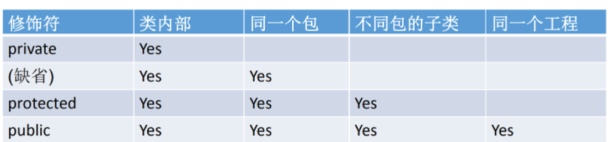
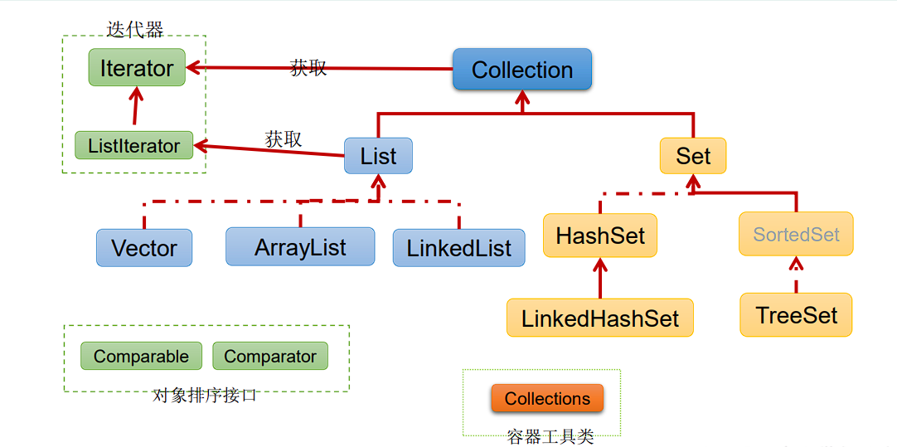
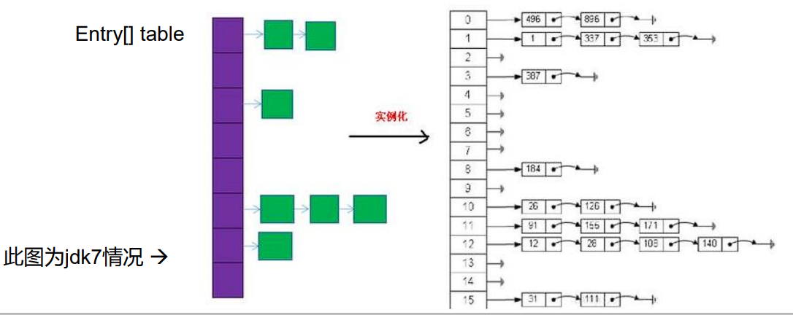
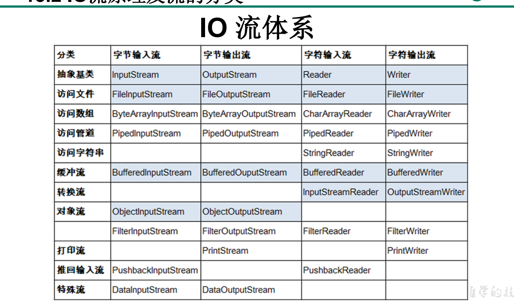
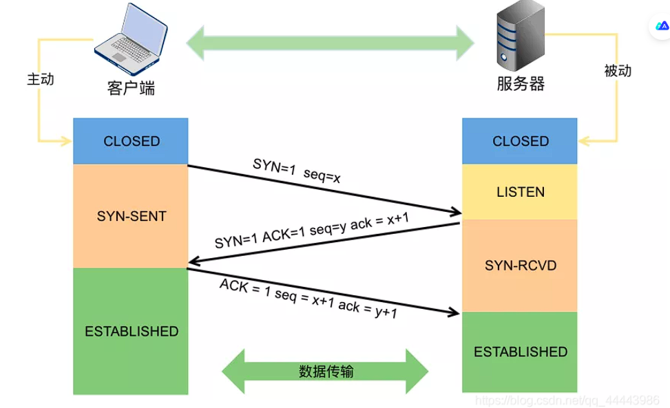
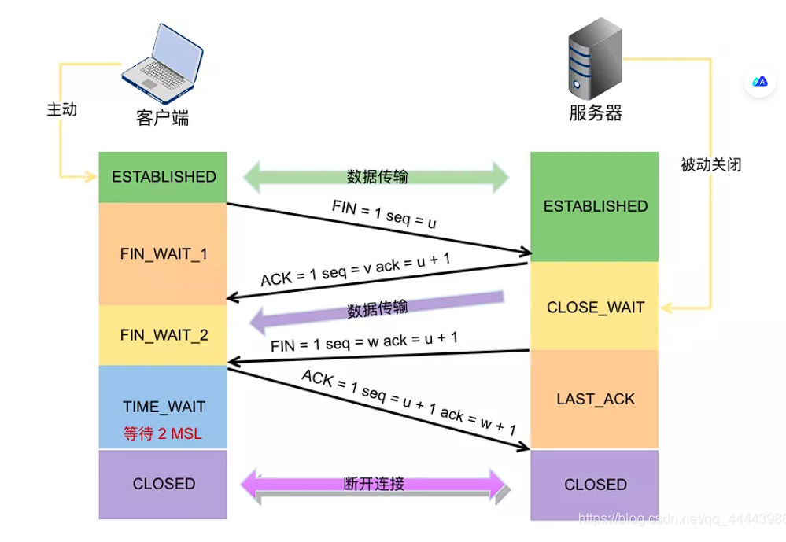
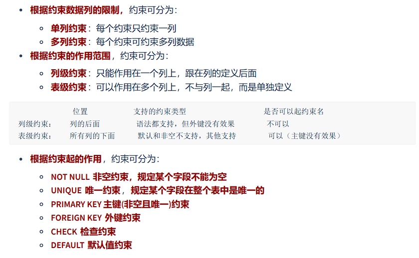

# 复习JavaSE

###### 1、JDK是Java development kit （开发工具包）

###### 2、JRE是Java runtime environment（运行环境）

###### 3、JDK和JRE的关系

​		JDK=JRE+开发工具集

​		JRE=JVM+Java SE标准库

###### 4、环境变量path配置及其作用

​		作用：在任何路径下，都能执行java工具，不限于只在bin目录中。

###### 5、命名规范

​		1>. 包名：xxxyyyzzz

​		2>.类名、接口名：XxxYyyZzz

​		3>.变量名、方法名：xxxYyyZzz

​		4>.常量名：XXX_YYY_ZZZ

​		特别注意：需要见名知义

###### 6、基本数据类型

​		数值型：1>整数型：byte（1字节=8bit）、short（2字节）、int（4字节）、long（8字节）

​						2>浮点型：float（4字节）、double（8字节）

​		字符型：char（2字节）

​		布尔型：boolean

###### 7、引动数据类型

​		类：class(String字符串在这)

​		接口：interface

​		数组：（[]）

###### 8、“&”和“&&”的区别，“|”和“||”的区别

​		在“&”中在式子的左右两边都会参与计算。而在“&&”中，若左边式子为false则，右边不参与运算，直接返回一个false的值。

​		“|”和“|”的区别和上述是一样的。在“||”中，若左边为真，则直接返回true，右边的式子不参与运算。

###### 9、排序算法分类：

​		内部排序：整个排序过程不需要借助外部存储器（如磁盘），所有排序操作都在内存完成。

​						选择排序：直接选择排序、堆排序。

​						交换排序：冒泡排序O(n^2)、快速排序O（nlog(n)）。

​						插入排序：直接插入排序、折半插入排序、Shell排序。

​						归并排序

​						桶式排序

​						基数排序

​		外部排序：参与排序的数据非常多，数据量非常大，计算机无法把整个排序过程放在内存完成，必须借助外部存储器（如磁盘）。外部排序最常见的是多路归并排序。可以认为外部排序是由多次内部排序组成。

###### 10、重载和重写

重载：在同一个类中，允许存在一个以上的同名方法，只要它们的参数个数或者参数类型不同即可。

重写：在子类中可以根据需要对从父类中继承来的方法进行改造，也称为方法的重置、覆盖。


###### 11、权限修饰符



###### 12、==和equals的区别

​		1>==既可以比较基本数据类型也可以比较引用数据类型。对于基本类型就是比较值，对于引用类型就是比较内存地址

​		2>equals的画，他是属于java.lang.Object类里面的方法，如果该方法没有被重写过默认也是==；我们可以看到String等类的equals方法是被重写过的，而且		String类在日常开发中用的比较多，久而久之，形成了equals是比较值的错误观点。

​		3>具体要看自定义类里有没有重写Object的equals方法的判断。

​		4>通常情况下，重写equals方法，会比较类中的相应属性是否都相等。

###### 13、多线程创建的方法

​		①继承Thread类		 ②实现Runnable接口	 ③实现Callable接口

​		方式 一：1）：定义子类继承Thread类

​						2）：子类中重写Thread类中的run方法

​						3）：创建Thread子类对象，即创建了线程对象

​						4）：调用线程对象的start方法：启动线程，调用run方法

​		方式二：1）：定义子类，实现Runnable接口。

​						2）：子类中重写Runnable接口中的run方法。

​						3）：通过Thread类含参构造器创建线程对象。

​						4）：将Runnable接口的子类对象作为实际参数传递给Thread类的构造器中。

​						5）：调用Thread类中的start方法：开启线程，调用Runnable子类接口的run方法。

​		 方式三：1）：创建一个实现Callable的实现类

​						2）：实现call方法，将此线程需要执行的操作声明在call()中。

​						3）：创建Callable接口实现类的对象

​						4）：将此Callable接口实现类的对象作为传递到FutureTask构造器中，创建FutureTask的对象。

​						5）：将FutureTask的对象作为参数传递到Thread类的构造器中，创建Thread对象，并调用start()。

###### 14、Thread类中的有关方法

​		**start**():启动线程，并执行run方法。

​		**run**():线程在被调度时被执行操作。

​		**String getName**():返回线程的名字。

​		**void setName**():设置线程名称。

​		**static Thread currentThread**():返回当前的线程。在Thread子类中就是this，通常用于主程序和Runnable实现类。

​		**static void yield**():线程让步。暂停当前正在执行的线程，把执行机会让给优先级相同或者更高的线程。

​		**join**():当某个程序执行流中调用其他线程的join的方法时，调用线程将被阻塞，直到join()方法加入的join线程执行完毕为止。

​		**static void sleep**(long millis):令当前活动线程在指定时间段内放弃对CPU的控制，是其他线程有机会被执行，时间到后重新排队。

###### 15、线程的生命周期

​		①新建	②就绪	③运行	④阻塞	⑤死亡

###### 16、synchronized同步锁

​	1): 任意对象都可以作为同步锁。所有对象都自动含有单一的锁（监视器）。

​	2):同步方法的锁：静态方法（类名.class）、非静态方法（this)。

​	3): 同步代码块：自己指定，很多时候也是指定为this或类名.class。

- 必须确保使用同一个资源的多个线程共用一把锁，这个非常重要，否则就 无法保证共享资源的安全。
- 一个线程类中的所有静态方法共用同一把锁（类名.class），所有非静态方 法共用同一把锁（this），同步代码块（指定需谨慎）。

###### 17、Lock锁

​	1）：jdk5.0开始，ReentrantLock 类实现了 Lock ，它拥有与 synchronized 相同的并发性和 内存语义，在实现线程安全的控制中，比较常用的是    ReentrantLock，可以 显式加锁、释放锁。

​	2）：需要手动上锁，以及释放锁。

###### 18、synchronized与Lock的对比

1. Lock是显式锁（手动开启和关闭锁，别忘记关闭锁），synchronized是 隐式锁，出了作用域自动释放。
2.  Lock只有代码块锁，synchronized有代码块锁和方法锁
3.  使用Lock锁，JVM将花费较少的时间来调度线程，性能更好。并且具有更好的扩展性（提供更多的子类）。

- 优先使用顺序：

​	Lock ->同步代码块（已经进入了方法体，分配了相应资源）-> 同步方法 （在方法体之外）

###### 19、wait()、notify()和notifyAll()

​	**wait()**:令当前线程挂起并放弃CPU、同步资源并等待，使别的线程可访问并修改共享资源，而当前线程排队等候其他线程调用notify()或notifyAll()方法唤醒，唤醒后等待重新获得对监视器的所有 权后才能继续执行。

​	**notify**():唤醒正在排队等待同步资源的线程中优先级最高者结束等待。

​	**notifyAll**():唤醒正在排队等待资源的所有线程结束等待。

###### 20、StringBuffer

- StringBuffer():初始的容量为16的字符缓冲区
- StringBuffer(int size):构造指定容量的字符串缓冲区
- StringBuffer(String str):将内容初始化为指定字符串内容

###### 21、对比String、StringBuffer、StringBuilder

​		Stirng(JDK1.0):不可变字符序列

​		StringBuffer（JDK1.0）：可变字符序列、效率低、线程安全

​		StringBuilder(JDK5.0):  可变字符序列、效率高、线程不安全

###### 22、Java比较器

​		方式一：自然排序：java.lang.Comparable

- Comparable接口强行对实现它的每个类的对象进行整体排序。这种排序被称 为类的自然排序。
-  实现 Comparable 的类必须实现 compareTo(Object obj) 方法，两个对象即 通过 compareTo(Object obj) 方法的返回值来比较大小。如果当前对象this大 于形参对象obj，则返回正整数，如果当前对象this小于形参对象obj，则返回 负整数，如果当前对象this等于形参对象obj，则返回零。
-  实现Comparable接口的对象列表（和数组）可以通过 Collections.sort 或 Arrays.sort进行自动排序。实现此接口的对象可以用作有序映射中的键或有 序集合中的元素，无需指定比较器。
- 对于类 C 的每一个 e1 和 e2 来说，当且仅当 e1.compareTo(e2) == 0 与 e1.equals(e2) 具有相同的 boolean 值时，类 C 的自然排序才叫做与 equals  一致。建议（虽然不是必需的）最好使自然排序与 equals 一致。

​	方式二：定制排序：java.util.Comparator

-  当元素的类型没有实现java.lang.Comparable接口而又不方便修改代码， 或者实现了java.lang.Comparable接口的排序规则不适合当前的操作，那 么可以考虑使用 Comparator 的对象来排序，强行对多个对象进行整体排 序的比较。
-  重写compare(Object o1,Object o2)方法，比较o1和o2的大小：如果方法返 回正整数，则表示o1大于o2；如果返回0，表示相等；返回负整数，表示 o1小于o2。
- 可以将 Comparator 传递给 sort 方法（如 Collections.sort 或 Arrays.sort）， 从而允许在排序顺序上实现精确控制。
- 还可以使用 Comparator 来控制某些数据结构（如有序 set或有序映射）的 顺序，或者为那些没有自然顺序的对象 collection 提供排序。

###### 23、自定义枚举类

1. 私有化类的构造器，保证不能在类的外部创建其对象。
2.  在类的内部创建枚举类的实例。声明为：public static final 。
3. 对象如果有实例变量，应该声明为private final，并在构造器中初始化。

###### 24、Java集合

- ​		Java集合可分为Collection和Map两种体系

​			Collection接口：单列数据，定义了存取一组对象的方法的集合

​				---List:元素有序、可重复的集合

​				---Set:元素无序、不可重复的集合



​		Map 接口：双列数据，保存具有映射关系”Key-value对“的集合。


###### 25、ArrayList

- ​		在JDK1.8之前和之后的实现区别?

  ​			JDK1.7:ArrayList像饿汉式，直接创建一个初始容量为10的数组

  ​			JDK1.8：ArrayList像懒汉式，一开始创建一个长度为0的数组，当添加第一个元素的时候再创建一个始容量为10的数组。

###### 26、LinkedList:

​			双向链表，内部没有声明数组，而是定义了Node类型的first和last, 用于记录首尾元素，同时定义内部类Node,作为LinkedList中保存数据的基本结构。Node除了保存数据，还定义了两个变量：

- ​	prev变量记录前一个元素的位置
- ​    next变量 记录下一个元素的位置	

###### 27、Vector

​		Vector是一个古老的集合，JDK1.0就有了，大多数操作与ArrayList相同，区别就是线程是安全的，尽量避免使用。

###### 28、请问ArrayList/LinkedList/Vector的异同？谈谈你的理解？ArrayList底层 是什么？扩容机制？Vector和ArrayList的最大区别?

- ArrayList和LinkedList的异同

​		二者都线程不安全，相对线程安全的Vector，执行效率高。 此外，ArrayList是实现了基于动态数组的数据结构，LinkedList基于链表的数据结构。对于 随机访问get和set，ArrayList觉得优于LinkedList，因为LinkedList要移动指针。对于新增 和删除操作add(特指插入)和remove，LinkedList比较占优势，因为ArrayList要移动数据。

-  ArrayList和Vector的区别

  ​	Vector和ArrayList几乎是完全相同的,唯一的区别在于Vector是同步类(synchronized)，属于 强同步类。因此开销就比ArrayList要大，访问要慢。正常情况下,大多数的Java程序员使用 ArrayList而不是Vector,因为同步完全可以由程序员自己来控制。Vector每次扩容请求其大 小的2倍空间，而ArrayList是1.5倍。Vector还有一个子类Stack。

###### 29、HashSet

- 集合元素可以为null

- 向HashSet中添加元素的过程：

  当向 HashSet 集合中存入一个元素时，HashSet 会调用该对象的 hashCode() 方法 来得到该对象的 hashCode 值，然后根据 hashCode 值，通过某种散列函数决定该对象 在 HashSet 底层数组中的存储位置。（这个散列函数会与底层数组的长度相计算得到在 数组中的下标，并且这种散列函数计算还尽可能保证能均匀存储元素，越是散列分布， 该散列函数设计的越好）

  如果两个元素的hashCode()值相等，会再继续调用equals方法，如果equals方法结果 为true，添加失败；如果为false，那么会保存该元素，但是该数组的位置已经有元素了， 那么会通过链表的方式继续链接。、

- 底层也是数组，初始容量为16，当如果使用率超过0.75，（16*0.75=12） 就会扩大容量为原来的2倍。（16扩容为32，依次为64,128....等）

###### 30、LinkedHashSet

- LinkedHashSet 根据元素的 hashCode 值来决定元素的存储位置， 但它同时使用双向链表维护元素的次序，这使得元素看起来是以插入 顺序保存的。
- LinkedHashSet插入性能略低于 HashSet，但在迭代访问 Set 里的全 部元素时有很好的性能。

###### 31、TreeSet

​	TreeSet底层使用红黑树结构存储数据

​	特点：有序，查询速度比List快

###### 32、HashMap

- HashMap是 Map 接口使用频率最高的实现类。

- 允许使用null键和null值，与HashSet一样，不保证映射的顺序。

- 所有的key构成的集合是Set:无序的、不可重复的。所以，key所在的类要重写： equals()和hashCode()

- 所有的value构成的集合是Collection:无序的、可以重复的。所以，value所在的类 要重写：equals()

- HashMap 判断两个 key 相等的标准是：两个 key 通过 equals() 方法返回 true， hashCode 值也相等。

- HashMap 判断两个 value相等的标准是：两个 value 通过 equals() 方法返回 true。

- 

  存储结构：

  ​	JDK 7及以前版本：HashMap是数组+链表结构(即为链地址法)

  ​	JDK 8版本发布以后：HashMap是数组+链表+红黑树实现。

  ​	默认初始容量是16 

  ​	扩容达到0.75 扩容一倍

###### 33、负载因子值的大小，对HashMap有什么影响

-  负载因子的大小决定了HashMap的数据密度。
- 负载因子越大密度越大，发生碰撞的几率越高，数组中的链表越容易长, 造成查询或插入时的比较次数增多，性能会下降。
- 负载因子越小，就越容易触发扩容，数据密度也越小，意味着发生碰撞的 几率越小，数组中的链表也就越短，查询和插入时比较的次数也越小，性 能会更高。但是会浪费一定的内容空间。而且经常扩容也会影响性能，建 议初始化预设大一点的空间。
- 按照其他语言的参考及研究经验，会考虑将负载因子设置为0.7~0.75，此 时平均检索长度接近于常数

###### 34、LinkedHashMap

- 在HashMap存储结构的基础上，使用了一对双向链表来记录添加 元素的顺序
- 与LinkedHashSet类似，LinkedHashMap 可以维护 Map 的迭代 顺序：迭代顺序与 Key-Value 对的插入顺序一致

###### 35、TreeMap

- TreeSet底层使用红黑树结构存储数据
- TreeMap判断两个key相等的标准：两个key通过compareTo()方法或 者compare()方法返回0。
- TreeMap存储 Key-Value 对时，需要根据 key-value 对进行排序。 TreeMap 可以保证所有的 Key-Value 对处于有序状态。

###### 36、Hashtable

-  Hashtable是个古老的 Map 实现类，JDK1.0就提供了。不同于HashMap， Hashtable是线程安全的。
-  Hashtable实现原理和HashMap相同，功能相同。底层都使用哈希表结构，查询 速度快，很多情况下可以互用。
-  与HashMap不同，Hashtable 不允许使用 null 作为 key 和 value
-  与HashMap一样，Hashtable 也不能保证其中 Key-Value 对的顺序
-  Hashtable判断两个key相等、两个value相等的标准，与HashMap一致。

###### 37、Properties

- Properties 类是 Hashtable 的子类，该对象用于处理属性文件
- 由于属性文件里的 key、value 都是字符串类型，所以 Properties 里的 key  和 value 都是字符串类型
- 存取数据时，建议使用setProperty(String key,String value)方法和 getProperty(String key)方法

###### 38、循环的集中方式

​	①while	②do-while	③for	④增强for	⑤iterate

```JAVA
  public static void main(String[] args) {
        ArrayList<Object> list = new ArrayList<>();
        list.add(1);
        list.add(3);
        list.add(2);
        list.add(1);
        for (Object coll:list){
            System.out.print(coll+"\t");
        }

    }
```

```java
Iterator iter = coll.iterator();//回到起点
while(iter.hasNext()){
Object obj = iter.next();
if(obj.equals("Tom")){
iter.remove();
}
}

```

###### 39、IO流体系



###### 40、IO流之输入输出流

```java
BufferedReader br = null;
BufferedWriter bw = null;
try {
// 创建缓冲流对象：它是处理流，是对节点流的包装
br = new BufferedReader(new FileReader("d:\\IOTest\\source.txt"));
bw = new BufferedWriter(new FileWriter("d:\\IOTest\\dest.txt"));
String str;
while ((str = br.readLine()) != null) { // 一次读取字符文本文件的一行字符
bw.write(str); // 一次写入一行字符串
bw.newLine(); // 写入行分隔符
}
bw.flush(); // 刷新缓冲区
} catch (IOException e) {
e.printStackTrace();
} finally {
// 关闭IO流对象
try {
if (bw != null) {
bw.close(); // 关闭过滤流时,会自动关闭它所包装的底层节点流
}
} catch (IOException e) {
e.printStackTrace();
}
try {
if (br != null) {
br.close();
}
} catch (IOException e) {
e.printStackTrace();
}
}

```

###### 41、TCP和UDP

TCP协议：

- 使用TCP协议前，须先建立TCP连接，形成传输数据通道

- 传输前，采用“三次握手”方式，点对点通信，是可靠的。四次挥手。
-  TCP协议进行通信的两个应用进程：客户端、服务端。
-  在连接中可进行大数据量的传输
-  传输完毕，需释放已建立的连接，效率低

UDP协议：

-  将数据、源、目的封装成数据包，不需要建立连接
-  每个数据报的大小限制在64K内
-  发送不管对方是否准备好，接收方收到也不确认，故是不可靠的
-  可以广播发送
-  发送数据结束时无需释放资源，开销小，速度快

###### 42、三次握手

服务端新建套接字，绑定地址信息后开始监听，进入LISTEN状态。客户端新建套接字绑定地址信息后调用connect，发送连接请求SYN，并进入SYN_SENT状态，等待服务器的确认。服务端一旦监听到连接请求，就会将连接放入内核等待队列中，并向客户端发送SYN和确认报文段ACK，进入SYN_RECD状态。客户端收到SYN+ACK报文后向服务端发送确认报文段ACK，并进入ESTABLISHED状态，开始读写数据。服务端一旦收到客户端的确认报文，就进入ESTABLISHED状态，就可以进行读写数据了。



###### 43、为什么握手是三次，而不是两次或者四次？

两次不安全，四次没必要。tcp通信需要确保双方都具有数据收发的能力，得到ACK响应则认为对方具有数据收发的能力，因此双方都要发送SYN确保对方具有通信的能力。第一次握手是客户端发送SYN，服务端接收，服务端得出客户端的发送能力和服务端的接收能力都正常；第二次握手是服务端发送SYN+ACK，客户端接收，客户端得出客户端发送接收能力正常，服务端发送接收能力也都正常，但是此时服务器并不能确认客户端的接收能力是否正常；第三次握手客户端发送ACK，服务器接收，服务端才能得出客户端发送接收能力正常，服务端自己发送接收能力也都正常。

###### 44、三次握手可以携带数据吗？

第一次、第二次握手不可以携带数据，而第三次握手是可以携带数据的。假设第一次可以携带数据，如果有人恶意攻击服务器，每次都在第一次握手中的SYN报文放入大量数据，重复发送大量SYN报文，此时服务器会花费大量内存空间来缓冲这些报文，服务器就更容易被攻击了

###### 45、tcp三次握手失败，服务端会如何处理?

握手失败的原因有两种，第一种是服务端没有收到SYN，则什么都不做；第二种是服务端回复了SYN+ACK后，长时间没有收到ACK响应，则超时后就会发送RST重置连接报文，释放资源

###### 46、ISN代表什么？意义何在？ISN是固定不变的吗？ISN为何要动态随机

`ISN`全称是`Initial Sequence Number`，是TCP发送方的字节数据编号的原点，告诉对方我要开始发送数据的初始化序列号。ISN如果是固定的，攻击者很容易猜出后序的确认号，为了安全起见，避免被第三方猜到从而发送伪造的`RST`报文，因此ISN是动态生成的

###### 47、四次挥手

客户端主动调用close时，向服务端发送结束报文段FIN报，同时进入FIN_WAIT1状态；服务器会收到结束报文段FIN报，服务器返回确认报文段ACK并进入CLOSE_WAIT状态，此时如果服务端有数据要发送的话，客户端依然需要接收。客户端收到服务器对结束报文段的确认，就会进入到FIN_WAIT2状态，开始等待服务器的结束报文段；服务器端数据发送完毕后，当服务器真正调用close关闭连接时，会向客户端发送结束报文段FIN包，此时服务器进入LAST_ACK状态，等待最后一个ACK的带来；客户端收到服务器发来的结束报文段, 进入TIME_WAIT, 并发出送确认报文段ACK；服务器收到了对结束报文段确认的ACK，进入CLOSED状态，断开连接。而客户端要等待2MSL的时间，才会进入到CLOSED状态



###### 48、为什么握手是三次，而挥手时需要四次呢？

其实在TCP握手的时候，接收端将SYN包和ACK确认包合并到一个包中发送的，所以减少了一次包的发送。对于四次挥手，由于TCP是全双工通信，主动关闭方发送FIN请求不代表完全断开连接，只能表示主动关闭方不再发送数据了。而接收方可能还要发送数据，就不能立即关闭服务器端到客户端的数据通道，所以就不能将服务端的FIN包和对客户端的ACK包合并发送，只能先确认ACK，等服务器无需发送数据时在发送FIN包，所以四次挥手时需要四次数据包的交互

###### 49、tcp连接管理中的保活机制

tcp通信中，若两端长时间没有数据往来，则这时候每隔一段时间，服务端会向客户端发送一个保活探测数据报，要求客户端进行回复。若连续多次没有收到响应，就认为连接已经断开。长时间默认为7200s，每隔一段时间默认为75s，连续多次无响应默认为9次。这些数据都可以在套接字中修改，接口：Setsockopt

###### 50、代理设计模式的原理：

使用一个代理将对象装起来，然后用该代理对象取代原始对象。任何对原始对象的调用都要通过代理。代理对象决定是否以及何时将方法调用转到原始对象上。 

------------------------------------------------------------------------------------分割线---------------------------------------------------------------------------------------------------------------------------

# Mysql

###### 1、WHERE和HAVING的对比

- 区别1：WHERE 可以直接使用表中的字段作为筛选条件，但不能使用分组中的计算函数作为筛选条件； HAVING 必须要与 GROUP BY 配合使用，可以把分组计算的函数和分组字段作为筛选条件。
- 区别2：如果需要通过连接从关联表中获取需要的数据，WHERE 是先筛选后连接，而 HAVING 是先连接 后筛选。WHERE 比 HAVING 更高效。因为 WHERE 可以先筛选，用一 个筛选后的较小数据集和关联表进行连接，这样占用的资源比较少，执行效率也比较高。

开发中的选择：

​		WHERE 和 HAVING 也不是互相排斥的，我们可以在一个查询里面同时使用 WHERE 和 HAVING。包含分组 统计函数的条件用 HAVING，普通条件用 WHERE。这样，我们就既利用了 WHERE 条件的高效快速，又发 挥了 HAVING 可以使用包含分组统计函数的查询条件的优点。当数据量特别大的时候，运行效率会有很大的差别。

###### 2、查询的结构

```sql
#方式1：
SELECT ...,....,...
FROM ...,...,....
WHERE 多表的连接条件
AND 不包含组函数的过滤条件
GROUP BY ...,...
HAVING 包含组函数的过滤条件
ORDER BY ... ASC/DESC
LIMIT ...,...
#方式2：
SELECT ...,....,...
FROM ... JOIN ...
ON 多表的连接条件
JOIN ...
ON ...
WHERE 不包含组函数的过滤条件
AND/OR 不包含组函数的过滤条件
GROUP BY ...,...
HAVING 包含组函数的过滤条件
ORDER BY ... ASC/DESC
LIMIT ...,...
#其中：
#（1）from：从哪些表中筛选
#（2）on：关联多表查询时，去除笛卡尔积
#（3）where：从表中筛选的条件
#（4）group by：分组依据
#（5）having：在统计结果中再次筛选
#（6）order by：排序
#（7）limit：分页

```

###### 3、自连接和子查询两种方式有好坏之分吗？

题目中可以使用子查询，也可以使用自连接。

一般情况建议你使用自连接，因为在许多 DBMS 的处理过程中，对于自连接的处理速度要比子查询快得多。

 可以这样理解：子查询实际上是通过未知表进行查询后的条件判断，而自连接是通过已知的自身数据表 进行条件判断，因此在大部分 DBMS 中都对自连接处理进行了优化。

###### 4、标识符命名规则

- 数据库名、表名不得超过30个字符，变量名限制为29个
- 必须只能包含 A–Z, a–z, 0–9, _共63个字符
- 数据库名、表名、字段名等对象名中间不要包含空格
- 同一个MySQL软件中，数据库不能同名；同一个库中，表不能重名；同一个表中，字段不能重名
- 必须保证你的字段没有和保留字、数据库系统或常用方法冲突。如果坚持使用，请在SQL语句中使 用`（着重号）引起来
- 保持字段名和类型的一致性：在命名字段并为其指定数据类型的时候一定要保证一致性，假如数据 类型在一个表里是整数，那在另一个表里可就别变成字符型了

###### 5、创建表和修改数据库

```sql
CREATE DATABASE IF NOT EXISTS 数据库名;
```

更改数据库字符集

```sql
ALTER DATABASE 数据库名 CHARACTER SET 字符集; #比如：gbk、utf8等
```

删除指定的数据库

```sql
DROP DATABASE IF EXISTS 数据库名;
```

###### 6、创建表

```sql
CREATE TABLE [IF NOT EXISTS] 表名(
字段1, 数据类型 [约束条件] [默认值],
字段2, 数据类型 [约束条件] [默认值],
字段3, 数据类型 [约束条件] [默认值],
……
[表约束条件]
);

```

```sql
CREATE TABLE dept(
-- int类型，自增
deptno INT(2) AUTO_INCREMENT,
dname VARCHAR(14),
loc VARCHAR(13),
-- 主键
PRIMARY KEY (deptno)
);

```

查看数据表结构

```sql
SHOW CREATE TABLE 表名\G
```

###### 7、修改表

```sql
ALTER TABLE 表名 ADD 【COLUMN】 字段名 字段类型 【FIRST|AFTER 字段名】;
```

example:

```sql
ALTER TABLE dept80
ADD job_id varchar(15);

```

修改一个列

```sql
ALTER TABLE 表名 MODIFY 【COLUMN】 字段名1 字段类型 【DEFAULT 默认值】【FIRST|AFTER 字段名
2】;

```

example:

```sql
ALTER TABLE dept80
MODIFY last_name VARCHAR(30);
```

重命名一个列

```sql
ALTER TABLE 表名 CHANGE 【column】 列名 新列名 新数据类型;
```

example:

```sql
ALTER TABLE dept80
CHANGE department_name dept_name varchar(15);
```

删除一个列

```sql
ALTER TABLE 表名 DROP 【COLUMN】字段名
```

example:

```sql
ALTER TABLE dept80
DROP COLUMN job_id;
```

###### 8、删除表

```sql
DROP TABLE [IF EXISTS] 数据表1 [, 数据表2, …, 数据表n];
```

example:

```sql
DROP TABLE dept80;
```

###### 9、 清空表

```sql
TRUNCATE TABLE detail_dept;
```

- TRUNCATE语句不能回滚，而使用 DELETE 语句删除数据，可以回滚		

​		阿里开发规范： 【参考】TRUNCATE TABLE 比 DELETE 速度快，且使用的系统和事务日志资源少，但 TRUNCATE 无事务且不触发 TRIGGER，有可能造成事故，故不建议在开发代码中使用此语句。 说明：TRUNCATE TABLE 在功能上与不带 WHERE 子句的 DELETE 语句相同。

###### 10、插入数据

```sql
INSERT INTO 表名
VALUES (value1,value2,....);
```

example:

```sql
INSERT INTO departments(department_id, department_name)
VALUES (80, 'IT');
```

-  同时插入多条记录

```sql
INSERT INTO table_name(column1 [, column2, …, columnn])
VALUES
(value1 [,value2, …, valuen]),
(value1 [,value2, …, valuen]),
……
(value1 [,value2, …, valuen]);
```

example:

```sql
mysql> INSERT INTO emp(emp_id,emp_name)
-> VALUES (1001,'shkstart'),
-> (1002,'atguigu'),
-> (1003,'Tom');
Query OK, 3 rows affected (0.00 sec)
Records: 3 Duplicates: 0 Warnings: 0
```

- 还有一种格式

```sql
INSERT INTO 目标表名
(tar_column1 [, tar_column2, …, tar_columnn])
SELECT
(src_column1 [, src_column2, …, src_columnn])
FROM 源表名
[WHERE condition]
```

example

```sql
INSERT INTO sales_reps(id, name, salary, commission_pct)
SELECT employee_id, last_name, salary, commission_pct
FROM employees
WHERE job_id LIKE '%REP%';
```

###### 11、更新数据

```sql
UPDATE table_name
SET column1=value1, column2=value2, … , column=valuen
[WHERE condition]
```

example:

```sql
UPDATE employees
SET department_id = 70
WHERE employee_id = 113;
```

###### 12、删除数据

```sql
DELETE FROM table_name 
[WHERE <condition>];
```

example:

```sql
DELETE FROM departments
WHERE department_name = 'Finance';
```

###### 13、为什么需要约束(constraint)

​		数据完整性（Data Integrity）是指数据的精确性（Accuracy）和可靠性（Reliability）。它是防止数据库中 存在不符合语义规定的数据和防止因错误信息的输入输出造成无效操作或错误信息而提出的。

###### 14、 什么是约束

约束是表级的强制规定。

可以在创建表时规定约束（通过 CREATE TABLE 语句），或者在表创建之后通过 ALTER TABLE 语句规定约束。

###### 15、约束的分类



###### 16、添加非空约束

- 建表时

```sql
CREATE TABLE 表名称(
字段名 数据类型,
字段名 数据类型 NOT NULL,
字段名 数据类型 NOT NULL
);

```

example

```sql
CREATE TABLE student(
sid int,
sname varchar(20) not null,
tel char(11) ,
cardid char(18) not null
);
```

- 建表后

```sql
alter table 表名称 modify 字段名 数据类型 not null;
```

example:

```sql
ALTER TABLE emp
MODIFY sex VARCHAR(30) NOT NULL;
```

###### 17、删除非空约束

```sql
alter table 表名称 modify 字段名 数据类型 NULL;#去掉not null，相当于修改某个非注解字段，该字段允
许为空
或
alter table 表名称 modify 字段名 数据类型;#去掉not null，相当于修改某个非注解字段，该字段允许为空
```

example:

```sql
ALTER TABLE emp
MODIFY sex VARCHAR(30) NULL;
```

###### 18、唯一性约束

- 建表时

```sql
create table 表名称(
字段名 数据类型,
字段名 数据类型 unique,
字段名 数据类型 unique key,
字段名 数据类型
);
create table 表名称(
字段名 数据类型,
字段名 数据类型,
字段名 数据类型,
[constraint 约束名] unique key(字段名)
);
```

example

```sql
CREATE TABLE t_course(
cid INT UNIQUE,
cname VARCHAR(100) UNIQUE,
description VARCHAR(200)
);


CREATE TABLE USER(
id INT NOT NULL,
NAME VARCHAR(25),
PASSWORD VARCHAR(16),
-- 使用表级约束语法
CONSTRAINT uk_name_pwd UNIQUE(NAME,PASSWORD)
);
```

- 建表后

```sql
#字段列表中如果是一个字段，表示该列的值唯一。如果是两个或更多个字段，那么复合唯一，即多个字段的组合是唯
一的
#方式1：
alter table 表名称 add unique key(字段列表);
#方式2：
alter table 表名称 modify 字段名 字段类型 unique;
```

example:

```sql
ALTER TABLE USER
MODIFY NAME VARCHAR(20) UNIQUE;


create table student(
sid int primary key,
sname varchar(20),
tel char(11) ,
cardid char(18)
);
alter table student add unique key(tel);
alter table student add unique key(cardid);
```

###### 19、 删除唯一约束

```sql
ALTER TABLE USER
DROP INDEX uk_name_pwd;
```

###### 20、主键约束

​		主键约束相当于唯一约束+非空约束的组合，主键约束列不允许重复，也不允许出现空值。

- 建表前

```sql
create table 表名称(
字段名 数据类型 primary key, #列级模式
字段名 数据类型,
字段名 数据类型
);
create table 表名称(
字段名 数据类型,
字段名 数据类型,
字段名 数据类型,
[constraint 约束名] primary key(字段名) #表级模式
);

```

example:

```sql
create table temp(
id int primary key,
name varchar(20)
);

CREATE TABLE emp4(
id INT PRIMARY KEY AUTO_INCREMENT ,
NAME VARCHAR(20)
);

CREATE TABLE emp5(
id INT NOT NULL AUTO_INCREMENT,
NAME VARCHAR(20),
pwd VARCHAR(15),
CONSTRAINT emp5_id_pk PRIMARY KEY(id)
);
```

- 建表后

```sql
ALTER TABLE 表名称 ADD PRIMARY KEY(字段列表); #字段列表可以是一个字段，也可以是多个字段，如果是多个字段的话，是复合主键
```

```sql
ALTER TABLE emp5 ADD PRIMARY KEY(NAME,pwd);
```

###### 21、复合主键

```sql
create table 表名称(
字段名 数据类型,
字段名 数据类型,
字段名 数据类型,
primary key(字段名1,字段名2) #表示字段1和字段2的组合是唯一的，也可以有更多个字段
);
```

example:

```sql
#选课表
create table student_course(
sid int,
cid int,
score int,
primary key(sid,cid) #复合主键
);
```

###### 22、删除主键约束

```sql
alter table 表名称 drop primary key;
```

example:

```sql
ALTER TABLE emp5 DROP PRIMARY KEY;
```

###### 23、自增列：AUTO_INCREMENT

- 特点和要求
  1. 一个表最多只能有一个自增长列
  2. 当需要产生唯一标识符或顺序值时，可设置自增长
  3. 自增长列约束的列必须是键列（主键列，唯一键列）
  4. 自增约束的列的数据类型必须是整数类型
  5. 如果自增列指定了 0 和 null，会在当前最大值的基础上自增；如果自增列手动指定了具体值，直接 赋值为具体值。

###### 24、指定自增约束

- ​	建表时

```sql
create table 表名称(
字段名 数据类型 primary key auto_increment,
字段名 数据类型 unique key not null,
字段名 数据类型 unique key,
字段名 数据类型 not null default 默认值,
);
create table 表名称(
字段名 数据类型 default 默认值 ,
字段名 数据类型 unique key auto_increment,
字段名 数据类型 not null default 默认值,,
primary key(字段名)
);

```

example:

```sql
create table employee(
eid int primary key auto_increment,
ename varchar(20)
);

```

- 建表后

```sql
alter table 表名称 modify 字段名 数据类型 auto_increment;
```

example:

```sql
alter table employee modify eid int auto_increment;
```

###### 25、删除自增约束

```sql
#alter table 表名称 modify 字段名 数据类型 auto_increment;#给这个字段增加自增约束
alter table 表名称 modify 字段名 数据类型; #去掉auto_increment相当于删除
```

example:

```sql
alter table employee modify eid int;
```

###### 26、FOREIGN KEY 约束

- 作用

​		限定某个表的某个字段的引用完整性。 比如：员工表的员工所在部门的选择，必须在部门表能找到对应的部分。

- 添加外键约束

  ①建表时

  ```sql
  create table 主表名称(
  字段1 数据类型 primary key,
  字段2 数据类型
  );
  create table 从表名称(
  字段1 数据类型 primary key,
  字段2 数据类型,
  [CONSTRAINT <外键约束名称>] FOREIGN KEY（从表的某个字段) references 主表名(被参考字段)
  );
  #(从表的某个字段)的数据类型必须与主表名(被参考字段)的数据类型一致，逻辑意义也一样
  #(从表的某个字段)的字段名可以与主表名(被参考字段)的字段名一样，也可以不一样
  -- FOREIGN KEY: 在表级指定子表中的列
  -- REFERENCES: 标示在父表中的列
  ```

  example:

  ```sql
  create table dept( #主表
  did int primary key, #部门编号
  dname varchar(50) #部门名称
  );
  create table emp(#从表
  eid int primary key, #员工编号
  ename varchar(5), #员工姓名
  deptid int, #员工所在的部门
  foreign key (deptid) references dept(did) #在从表中指定外键约束
  #emp表的deptid和和dept表的did的数据类型一致，意义都是表示部门的编号
  );
  说明：
  （1）主表dept必须先创建成功，然后才能创建emp表，指定外键成功。
  （2）删除表时，先删除从表emp，再删除主表dept
  
  ```

  ​	②建表后

  ```sql
  ALTER TABLE 从表名 ADD [CONSTRAINT 约束名] FOREIGN KEY (从表的字段) REFERENCES 主表名(被引用
  字段) [on update xx][on delete xx];
  ```

  example:

  ```sql
  ALTER TABLE emp1
  ADD [CONSTRAINT emp_dept_id_fk] FOREIGN KEY(dept_id) REFERENCES dept(dept_id);
  
  ```

###### 27、删除外键约束

```sql
(1)第一步先查看约束名和删除外键约束
SELECT * FROM information_schema.table_constraints WHERE table_name = '表名称';#查看某个表的约束名
ALTER TABLE 从表名 DROP FOREIGN KEY 外键约束名;
（2）第二步查看索引名和删除索引。（注意，只能手动删除）
SHOW INDEX FROM 表名称; #查看某个表的索引名
ALTER TABLE 从表名 DROP INDEX 索引名;

```

example:

```sql
mysql> SELECT * FROM information_schema.table_constraints WHERE table_name = 'emp';
mysql> alter table emp drop foreign key emp_ibfk_1;
Query OK, 0 rows affected (0.02 sec)
Records: 0 Duplicates: 0 Warnings: 0

```

```sql
mysql> show index from emp;
mysql> alter table emp drop index deptid;
Query OK, 0 rows affected (0.01 sec)
Records: 0 Duplicates: 0 Warnings: 0
mysql> show index from emp;
```

###### 28、如果两个表之间有关系（一对一、一对多），比如：员工表和部门表（一对多），它们之间是否 一定要建外键约束？

答：不是的

###### 29、建和不建外键约束有什么区别？

答：建外键约束，你的操作（创建表、删除表、添加、修改、删除）会受到限制，从语法层面受到限 制。例如：在员工表中不可能添加一个员工信息，它的部门的值在部门表中找不到。 不建外键约束，你的操作（创建表、删除表、添加、修改、删除）不受限制，要保证数据的 引用完整 性 ，只能依 靠程序员的自觉 ，或者是 在Java程序中进行限定 。例如：在员工表中，可以添加一个员工的 信息，它的部门指定为一个完全不存在的部门。

###### 30、那么建和不建外键约束和查询有没有关系？

答：没有

阿里开发规范 【 强制 】不得使用外键与级联，一切外键概念必须在应用层解决。

###### 31、CHECK 约束

- 作用

  检查某个字段的值是否符号xx要求，一般指的是值的范围

```sql
create table employee(
eid int primary key,
ename varchar(5),
gender char check ('男' or '女')
);
```

example:

```sql
CREATE TABLE temp(
id INT AUTO_INCREMENT,
NAME VARCHAR(20),
age INT CHECK(age > 20),
PRIMARY KEY(id)
);
```

###### 32、DEFAULT约束

- 作用

给某个字段/某列指定默认值，一旦设置默认值，在插入数据时，如果此字段没有显式赋值，则赋值为默认值。

- 建表时

```sql
create table 表名称(
字段名 数据类型 primary key,
字段名 数据类型 unique key not null,
字段名 数据类型 unique key,
字段名 数据类型 not null default 默认值,
);
```

example:

```sql
create table employee(
eid int primary key,
ename varchar(20) not null,
gender char default '男',
tel char(11) not null default '' #默认是空字符串
);
CREATE TABLE myemp(
id INT AUTO_INCREMENT PRIMARY KEY,
NAME VARCHAR(15),
salary DOUBLE(10,2) DEFAULT 2000
);
```

- 建表后

```sql
alter table 表名称 modify 字段名 数据类型 default 默认值;
#如果这个字段原来有非空约束，你还保留非空约束，那么在加默认值约束时，还得保留非空约束，否则非空约束就被
删除了
#同理，在给某个字段加非空约束也一样，如果这个字段原来有默认值约束，你想保留，也要在modify语句中保留默
认值约束，否则就删除了
alter table 表名称 modify 字段名 数据类型 default 默认值 not null;
```

example:

```sql
create table employee(
eid int primary key,
ename varchar(20),
gender char,
tel char(11) not null
);
```

###### 33、如何删除默认值约束

```sql
alter table 表名称 modify 字段名 数据类型 ;#删除默认值约束，也不保留非空约束
alter table 表名称 modify 字段名 数据类型 not null; #删除默认值约束，保留非空约束
```

example:

```sql
alter table employee modify gender char; #删除gender字段默认值约束，如果有非空约束，也一并删除
alter table employee modify tel char(11) not null;#删除tel字段默认值约束，保留非空约束
```

###### 34、为什么建表时，加 not null default '' 或 default 0

答：不想让表中出现null值。

###### 35、为什么不想要 null 的值

（1）不好比较。null是一种特殊值，比较时只能用专门的is null 和 is not null来比较。碰到运算符，通 常返回null。

（2）效率不高。影响提高索引效果。因此，我们往往在建表时 not null default '' 或 default 0

###### 36、带AUTO_INCREMENT约束的字段值是从1开始的吗？

在MySQL中，默认AUTO_INCREMENT的初始值是1，每新增一条记录，字段值自动加1。设置自增属性（AUTO_INCREMENT）的时候，还可以指定第 一条插入记录的自增字段的值，这样新插入的记录的自增字段值从初始值开始递增，如在表中插入第一 条记录，同时指定id值为5，则以后插入的记录的id值就会从6开始往上增加。添加主键约束时，往往需要 设置字段自动增加属性。

###### 37、并不是每个表都可以任意选择存储引擎？

外键约束（FOREIGN KEY）不能跨引擎使用。 MySQL支持多种存储引擎，每一个表都可以指定一个不同的存储引擎，需要注意的是：外键约束是用来 保证数据的参照完整性的，如果表之间需要关联外键，却指定了不同的存储引擎，那么这些表之间是不 能创建外键约束的。所以说，存储引擎的选择也不完全是随意的。
