# 复习JavaSE

###### 1、JDK是Java development kit （开发工具包）

###### 2、JRE是Java runtime environment（运行环境）

###### 3、JDK和JRE的关系

​		JDK=JRE+开发工具集

​		JRE=JVM+Java SE标准库

###### 4、环境变量path配置及其作用

​		作用：在任何路径下，都能执行java工具，不限于只在bin目录中。

###### 5、命名规范

​		1>. 包名：xxxyyyzzz

​		2>.类名、接口名：XxxYyyZzz

​		3>.变量名、方法名：xxxYyyZzz

​		4>.常量名：XXX_YYY_ZZZ

​		特别注意：需要见名知义

###### 6、基本数据类型

​		数值型：1>整数型：byte（1字节=8bit）、short（2字节）、int（4字节）、long（8字节）

​						2>浮点型：float（4字节）、double（8字节）

​		字符型：char（2字节）

​		布尔型：boolean

###### 7、引动数据类型

​		类：class(String字符串在这)

​		接口：interface

​		数组：（[]）

###### 8、“&”和“&&”的区别，“|”和“||”的区别

​		在“&”中在式子的左右两边都会参与计算。而在“&&”中，若左边式子为false则，右边不参与运算，直接返回一个false的值。

​		“|”和“|”的区别和上述是一样的。在“||”中，若左边为真，则直接返回true，右边的式子不参与运算。

###### 9、排序算法分类：

​		内部排序：整个排序过程不需要借助外部存储器（如磁盘），所有排序操作都在内存完成。

​						选择排序：直接选择排序、堆排序。

​						交换排序：冒泡排序O(n^2)、快速排序O（nlog(n)）。

​						插入排序：直接插入排序、折半插入排序、Shell排序。

​						归并排序

​						桶式排序

​						基数排序

​		外部排序：参与排序的数据非常多，数据量非常大，计算机无法把整个排序过程放在内存完成，必须借助外部存储器（如磁盘）。外部排序最常见的是多路归并排序。可以认为外部排序是由多次内部排序组成。

###### 10、重载和重写

重载：在同一个类中，允许存在一个以上的同名方法，只要它们的参数个数或者参数类型不同即可。

重写：在子类中可以根据需要对从父类中继承来的方法进行改造，也称为方法的重置、覆盖。


###### 11、权限修饰符


###### 12、==和equals的区别

​		1>==既可以比较基本数据类型也可以比较引用数据类型。对于基本类型就是比较值，对于引用类型就是比较内存地址

​		2>equals的画，他是属于java.lang.Object类里面的方法，如果该方法没有被重写过默认也是==；我们可以看到String等类的equals方法是被重写过的，而且		String类在日常开发中用的比较多，久而久之，形成了equals是比较值的错误观点。

​		3>具体要看自定义类里有没有重写Object的equals方法的判断。

​		4>通常情况下，重写equals方法，会比较类中的相应属性是否都相等。

###### 13、多线程创建的方法

​		①继承Thread类		 ②实现Runnable接口	 ③实现Callable接口

​		方式 一：1）：定义子类继承Thread类

​						2）：子类中重写Thread类中的run方法

​						3）：创建Thread子类对象，即创建了线程对象

​						4）：调用线程对象的start方法：启动线程，调用run方法

​		方式二：1）：定义子类，实现Runnable接口。

​						2）：子类中重写Runnable接口中的run方法。

​						3）：通过Thread类含参构造器创建线程对象。

​						4）：将Runnable接口的子类对象作为实际参数传递给Thread类的构造器中。

​						5）：调用Thread类中的start方法：开启线程，调用Runnable子类接口的run方法。

​		 方式三：1）：创建一个实现Callable的实现类

​						2）：实现call方法，将此线程需要执行的操作声明在call()中。

​						3）：创建Callable接口实现类的对象

​						4）：将此Callable接口实现类的对象作为传递到FutureTask构造器中，创建FutureTask的对象。

​						5）：将FutureTask的对象作为参数传递到Thread类的构造器中，创建Thread对象，并调用start()。

###### 14、Thread类中的有关方法

​		**start**():启动线程，并执行run方法。

​		**run**():线程在被调度时被执行操作。

​		**String getName**():返回线程的名字。

​		**void setName**():设置线程名称。

​		**static Thread currentThread**():返回当前的线程。在Thread子类中就是this，通常用于主程序和Runnable实现类。

​		**static void yield**():线程让步。暂停当前正在执行的线程，把执行机会让给优先级相同或者更高的线程。

​		**join**():当某个程序执行流中调用其他线程的join的方法时，调用线程将被阻塞，直到join()方法加入的join线程执行完毕为止。

​		**static void sleep**(long millis):令当前活动线程在指定时间段内放弃对CPU的控制，是其他线程有机会被执行，时间到后重新排队。

###### 15、线程的生命周期

​		①新建	②就绪	③运行	④阻塞	⑤死亡

###### 16、synchronized同步锁

​	1): 任意对象都可以作为同步锁。所有对象都自动含有单一的锁（监视器）。

​	2):同步方法的锁：静态方法（类名.class）、非静态方法（this)。

​	3): 同步代码块：自己指定，很多时候也是指定为this或类名.class。

- 必须确保使用同一个资源的多个线程共用一把锁，这个非常重要，否则就 无法保证共享资源的安全。
- 一个线程类中的所有静态方法共用同一把锁（类名.class），所有非静态方 法共用同一把锁（this），同步代码块（指定需谨慎）。

###### 17、Lock锁

​	1）：jdk5.0开始，ReentrantLock 类实现了 Lock ，它拥有与 synchronized 相同的并发性和 内存语义，在实现线程安全的控制中，比较常用的是    ReentrantLock，可以 显式加锁、释放锁。

​	2）：需要手动上锁，以及释放锁。

###### 18、synchronized与Lock的对比

1. Lock是显式锁（手动开启和关闭锁，别忘记关闭锁），synchronized是 隐式锁，出了作用域自动释放。
2.  Lock只有代码块锁，synchronized有代码块锁和方法锁
3.  使用Lock锁，JVM将花费较少的时间来调度线程，性能更好。并且具有更好的扩展性（提供更多的子类）。

- 优先使用顺序：

​	Lock ->同步代码块（已经进入了方法体，分配了相应资源）-> 同步方法 （在方法体之外）

###### 19、wait()、notify()和notifyAll()

​	**wait()**:令当前线程挂起并放弃CPU、同步资源并等待，使别的线程可访问并修改共享资源，而当前线程排队等候其他线程调用notify()或notifyAll()方法唤醒，唤醒后等待重新获得对监视器的所有 权后才能继续执行。

​	**notify**():唤醒正在排队等待同步资源的线程中优先级最高者结束等待。

​	**notifyAll**():唤醒正在排队等待资源的所有线程结束等待。

###### 20、StringBuffer

- StringBuffer():初始的容量为16的字符缓冲区
- StringBuffer(int size):构造指定容量的字符串缓冲区
- StringBuffer(String str):将内容初始化为指定字符串内容

###### 21、对比String、StringBuffer、StringBuilder

​		Stirng(JDK1.0):不可变字符序列

​		StringBuffer（JDK1.0）：可变字符序列、效率低、线程安全

​		StringBuilder(JDK5.0):  可变字符序列、效率高、线程不安全

###### 22、Java比较器

​		方式一：自然排序：java.lang.Comparable

- Comparable接口强行对实现它的每个类的对象进行整体排序。这种排序被称 为类的自然排序。
-  实现 Comparable 的类必须实现 compareTo(Object obj) 方法，两个对象即 通过 compareTo(Object obj) 方法的返回值来比较大小。如果当前对象this大 于形参对象obj，则返回正整数，如果当前对象this小于形参对象obj，则返回 负整数，如果当前对象this等于形参对象obj，则返回零。
-  实现Comparable接口的对象列表（和数组）可以通过 Collections.sort 或 Arrays.sort进行自动排序。实现此接口的对象可以用作有序映射中的键或有 序集合中的元素，无需指定比较器。
- 对于类 C 的每一个 e1 和 e2 来说，当且仅当 e1.compareTo(e2) == 0 与 e1.equals(e2) 具有相同的 boolean 值时，类 C 的自然排序才叫做与 equals  一致。建议（虽然不是必需的）最好使自然排序与 equals 一致。

​	方式二：定制排序：java.util.Comparator

-  当元素的类型没有实现java.lang.Comparable接口而又不方便修改代码， 或者实现了java.lang.Comparable接口的排序规则不适合当前的操作，那 么可以考虑使用 Comparator 的对象来排序，强行对多个对象进行整体排 序的比较。
-  重写compare(Object o1,Object o2)方法，比较o1和o2的大小：如果方法返 回正整数，则表示o1大于o2；如果返回0，表示相等；返回负整数，表示 o1小于o2。
- 可以将 Comparator 传递给 sort 方法（如 Collections.sort 或 Arrays.sort）， 从而允许在排序顺序上实现精确控制。
- 还可以使用 Comparator 来控制某些数据结构（如有序 set或有序映射）的 顺序，或者为那些没有自然顺序的对象 collection 提供排序。

###### 23、自定义枚举类

1. 私有化类的构造器，保证不能在类的外部创建其对象。
2.  在类的内部创建枚举类的实例。声明为：public static final 。
3. 对象如果有实例变量，应该声明为private final，并在构造器中初始化。

###### 24、Java集合

- ​		Java集合可分为Collection和Map两种体系

​			Collection接口：单列数据，定义了存取一组对象的方法的集合

​				---List:元素有序、可重复的集合

​				---Set:元素无序、不可重复的集合


​		Map 接口：双列数据，保存具有映射关系”Key-value对“的集合。


###### 25、ArrayList

- ​		在JDK1.8之前和之后的实现区别?

  ​			JDK1.7:ArrayList像饿汉式，直接创建一个初始容量为10的数组

  ​			JDK1.8：ArrayList像懒汉式，一开始创建一个长度为0的数组，当添加第一个元素的时候再创建一个始容量为10的数组。

###### 26、LinkedList:

​			双向链表，内部没有声明数组，而是定义了Node类型的first和last, 用于记录首尾元素，同时定义内部类Node,作为LinkedList中保存数据的基本结构。Node除了保存数据，还定义了两个变量：

- ​	prev变量记录前一个元素的位置
- ​    next变量 记录下一个元素的位置	

###### 27、Vector

​		Vector是一个古老的集合，JDK1.0就有了，大多数操作与ArrayList相同，区别就是线程是安全的，尽量避免使用。

###### 28、请问ArrayList/LinkedList/Vector的异同？谈谈你的理解？ArrayList底层 是什么？扩容机制？Vector和ArrayList的最大区别?

- ArrayList和LinkedList的异同

​		二者都线程不安全，相对线程安全的Vector，执行效率高。 此外，ArrayList是实现了基于动态数组的数据结构，LinkedList基于链表的数据结构。对于 随机访问get和set，ArrayList觉得优于LinkedList，因为LinkedList要移动指针。对于新增 和删除操作add(特指插入)和remove，LinkedList比较占优势，因为ArrayList要移动数据。

-  ArrayList和Vector的区别

  ​	Vector和ArrayList几乎是完全相同的,唯一的区别在于Vector是同步类(synchronized)，属于 强同步类。因此开销就比ArrayList要大，访问要慢。正常情况下,大多数的Java程序员使用 ArrayList而不是Vector,因为同步完全可以由程序员自己来控制。Vector每次扩容请求其大 小的2倍空间，而ArrayList是1.5倍。Vector还有一个子类Stack。

###### 29、HashSet

- 集合元素可以为null

- 向HashSet中添加元素的过程：

  当向 HashSet 集合中存入一个元素时，HashSet 会调用该对象的 hashCode() 方法 来得到该对象的 hashCode 值，然后根据 hashCode 值，通过某种散列函数决定该对象 在 HashSet 底层数组中的存储位置。（这个散列函数会与底层数组的长度相计算得到在 数组中的下标，并且这种散列函数计算还尽可能保证能均匀存储元素，越是散列分布， 该散列函数设计的越好）

  如果两个元素的hashCode()值相等，会再继续调用equals方法，如果equals方法结果 为true，添加失败；如果为false，那么会保存该元素，但是该数组的位置已经有元素了， 那么会通过链表的方式继续链接。、

- 底层也是数组，初始容量为16，当如果使用率超过0.75，（16*0.75=12） 就会扩大容量为原来的2倍。（16扩容为32，依次为64,128....等）

###### 30、LinkedHashSet

- LinkedHashSet 根据元素的 hashCode 值来决定元素的存储位置， 但它同时使用双向链表维护元素的次序，这使得元素看起来是以插入 顺序保存的。
- LinkedHashSet插入性能略低于 HashSet，但在迭代访问 Set 里的全 部元素时有很好的性能。

###### 31、TreeSet

​	TreeSet底层使用红黑树结构存储数据

​	特点：有序，查询速度比List快

###### 32、HashMap

- HashMap是 Map 接口使用频率最高的实现类。

- 允许使用null键和null值，与HashSet一样，不保证映射的顺序。

- 所有的key构成的集合是Set:无序的、不可重复的。所以，key所在的类要重写： equals()和hashCode()

- 所有的value构成的集合是Collection:无序的、可以重复的。所以，value所在的类 要重写：equals()

- HashMap 判断两个 key 相等的标准是：两个 key 通过 equals() 方法返回 true， hashCode 值也相等。

- HashMap 判断两个 value相等的标准是：两个 value 通过 equals() 方法返回 true。

- 

  存储结构：

  ​	JDK 7及以前版本：HashMap是数组+链表结构(即为链地址法)

  ​	JDK 8版本发布以后：HashMap是数组+链表+红黑树实现。

  ​	默认初始容量是16 

  ​	扩容达到0.75 扩容一倍

###### 33、负载因子值的大小，对HashMap有什么影响

-  负载因子的大小决定了HashMap的数据密度。
- 负载因子越大密度越大，发生碰撞的几率越高，数组中的链表越容易长, 造成查询或插入时的比较次数增多，性能会下降。
- 负载因子越小，就越容易触发扩容，数据密度也越小，意味着发生碰撞的 几率越小，数组中的链表也就越短，查询和插入时比较的次数也越小，性 能会更高。但是会浪费一定的内容空间。而且经常扩容也会影响性能，建 议初始化预设大一点的空间。
- 按照其他语言的参考及研究经验，会考虑将负载因子设置为0.7~0.75，此 时平均检索长度接近于常数

###### 34、LinkedHashMap

- 在HashMap存储结构的基础上，使用了一对双向链表来记录添加 元素的顺序
- 与LinkedHashSet类似，LinkedHashMap 可以维护 Map 的迭代 顺序：迭代顺序与 Key-Value 对的插入顺序一致

###### 35、TreeMap

- TreeSet底层使用红黑树结构存储数据
- TreeMap判断两个key相等的标准：两个key通过compareTo()方法或 者compare()方法返回0。
- TreeMap存储 Key-Value 对时，需要根据 key-value 对进行排序。 TreeMap 可以保证所有的 Key-Value 对处于有序状态。

###### 36、Hashtable

-  Hashtable是个古老的 Map 实现类，JDK1.0就提供了。不同于HashMap， Hashtable是线程安全的。
-  Hashtable实现原理和HashMap相同，功能相同。底层都使用哈希表结构，查询 速度快，很多情况下可以互用。
-  与HashMap不同，Hashtable 不允许使用 null 作为 key 和 value
-  与HashMap一样，Hashtable 也不能保证其中 Key-Value 对的顺序
-  Hashtable判断两个key相等、两个value相等的标准，与HashMap一致。

###### 37、Properties

- Properties 类是 Hashtable 的子类，该对象用于处理属性文件
- 由于属性文件里的 key、value 都是字符串类型，所以 Properties 里的 key  和 value 都是字符串类型
- 存取数据时，建议使用setProperty(String key,String value)方法和 getProperty(String key)方法

###### 38、循环的集中方式

​	①while	②do-while	③for	④增强for	⑤iterate

```JAVA
  public static void main(String[] args) {
        ArrayList<Object> list = new ArrayList<>();
        list.add(1);
        list.add(3);
        list.add(2);
        list.add(1);
        for (Object coll:list){
            System.out.print(coll+"\t");
        }

    }
```

```java
Iterator iter = coll.iterator();//回到起点
while(iter.hasNext()){
Object obj = iter.next();
if(obj.equals("Tom")){
iter.remove();
}
}

```

###### 39、IO流体系


###### 40、IO流之输入输出流

```java
BufferedReader br = null;
BufferedWriter bw = null;
try {
// 创建缓冲流对象：它是处理流，是对节点流的包装
br = new BufferedReader(new FileReader("d:\\IOTest\\source.txt"));
bw = new BufferedWriter(new FileWriter("d:\\IOTest\\dest.txt"));
String str;
while ((str = br.readLine()) != null) { // 一次读取字符文本文件的一行字符
bw.write(str); // 一次写入一行字符串
bw.newLine(); // 写入行分隔符
}
bw.flush(); // 刷新缓冲区
} catch (IOException e) {
e.printStackTrace();
} finally {
// 关闭IO流对象
try {
if (bw != null) {
bw.close(); // 关闭过滤流时,会自动关闭它所包装的底层节点流
}
} catch (IOException e) {
e.printStackTrace();
}
try {
if (br != null) {
br.close();
}
} catch (IOException e) {
e.printStackTrace();
}
}

```

###### 41、TCP和UDP

TCP协议：

- 使用TCP协议前，须先建立TCP连接，形成传输数据通道

- 传输前，采用“三次握手”方式，点对点通信，是可靠的。四次挥手。
-  TCP协议进行通信的两个应用进程：客户端、服务端。
-  在连接中可进行大数据量的传输
-  传输完毕，需释放已建立的连接，效率低

UDP协议：

-  将数据、源、目的封装成数据包，不需要建立连接
-  每个数据报的大小限制在64K内
-  发送不管对方是否准备好，接收方收到也不确认，故是不可靠的
-  可以广播发送
-  发送数据结束时无需释放资源，开销小，速度快

###### 42、三次握手

服务端新建套接字，绑定地址信息后开始监听，进入LISTEN状态。客户端新建套接字绑定地址信息后调用connect，发送连接请求SYN，并进入SYN_SENT状态，等待服务器的确认。服务端一旦监听到连接请求，就会将连接放入内核等待队列中，并向客户端发送SYN和确认报文段ACK，进入SYN_RECD状态。客户端收到SYN+ACK报文后向服务端发送确认报文段ACK，并进入ESTABLISHED状态，开始读写数据。服务端一旦收到客户端的确认报文，就进入ESTABLISHED状态，就可以进行读写数据了。


###### 43、为什么握手是三次，而不是两次或者四次？

两次不安全，四次没必要。tcp通信需要确保双方都具有数据收发的能力，得到ACK响应则认为对方具有数据收发的能力，因此双方都要发送SYN确保对方具有通信的能力。第一次握手是客户端发送SYN，服务端接收，服务端得出客户端的发送能力和服务端的接收能力都正常；第二次握手是服务端发送SYN+ACK，客户端接收，客户端得出客户端发送接收能力正常，服务端发送接收能力也都正常，但是此时服务器并不能确认客户端的接收能力是否正常；第三次握手客户端发送ACK，服务器接收，服务端才能得出客户端发送接收能力正常，服务端自己发送接收能力也都正常。

###### 44、三次握手可以携带数据吗？

第一次、第二次握手不可以携带数据，而第三次握手是可以携带数据的。假设第一次可以携带数据，如果有人恶意攻击服务器，每次都在第一次握手中的SYN报文放入大量数据，重复发送大量SYN报文，此时服务器会花费大量内存空间来缓冲这些报文，服务器就更容易被攻击了

###### 45、tcp三次握手失败，服务端会如何处理?

握手失败的原因有两种，第一种是服务端没有收到SYN，则什么都不做；第二种是服务端回复了SYN+ACK后，长时间没有收到ACK响应，则超时后就会发送RST重置连接报文，释放资源

###### 46、ISN代表什么？意义何在？ISN是固定不变的吗？ISN为何要动态随机

`ISN`全称是`Initial Sequence Number`，是TCP发送方的字节数据编号的原点，告诉对方我要开始发送数据的初始化序列号。ISN如果是固定的，攻击者很容易猜出后序的确认号，为了安全起见，避免被第三方猜到从而发送伪造的`RST`报文，因此ISN是动态生成的

###### 47、四次挥手

客户端主动调用close时，向服务端发送结束报文段FIN报，同时进入FIN_WAIT1状态；服务器会收到结束报文段FIN报，服务器返回确认报文段ACK并进入CLOSE_WAIT状态，此时如果服务端有数据要发送的话，客户端依然需要接收。客户端收到服务器对结束报文段的确认，就会进入到FIN_WAIT2状态，开始等待服务器的结束报文段；服务器端数据发送完毕后，当服务器真正调用close关闭连接时，会向客户端发送结束报文段FIN包，此时服务器进入LAST_ACK状态，等待最后一个ACK的带来；客户端收到服务器发来的结束报文段, 进入TIME_WAIT, 并发出送确认报文段ACK；服务器收到了对结束报文段确认的ACK，进入CLOSED状态，断开连接。而客户端要等待2MSL的时间，才会进入到CLOSED状态


###### 48、为什么握手是三次，而挥手时需要四次呢？

其实在TCP握手的时候，接收端将SYN包和ACK确认包合并到一个包中发送的，所以减少了一次包的发送。对于四次挥手，由于TCP是全双工通信，主动关闭方发送FIN请求不代表完全断开连接，只能表示主动关闭方不再发送数据了。而接收方可能还要发送数据，就不能立即关闭服务器端到客户端的数据通道，所以就不能将服务端的FIN包和对客户端的ACK包合并发送，只能先确认ACK，等服务器无需发送数据时在发送FIN包，所以四次挥手时需要四次数据包的交互

###### 49、tcp连接管理中的保活机制

tcp通信中，若两端长时间没有数据往来，则这时候每隔一段时间，服务端会向客户端发送一个保活探测数据报，要求客户端进行回复。若连续多次没有收到响应，就认为连接已经断开。长时间默认为7200s，每隔一段时间默认为75s，连续多次无响应默认为9次。这些数据都可以在套接字中修改，接口：Setsockopt

###### 50、代理设计模式的原理：

使用一个代理将对象装起来，然后用该代理对象取代原始对象。任何对原始对象的调用都要通过代理。代理对象决定是否以及何时将方法调用转到原始对象上。 

------------------------------------------------------------------------------------分割线---------------------------------------------------------------------------------------------------------------------------

# Mysql

###### 1、WHERE和HAVING的对比

- 区别1：WHERE 可以直接使用表中的字段作为筛选条件，但不能使用分组中的计算函数作为筛选条件； HAVING 必须要与 GROUP BY 配合使用，可以把分组计算的函数和分组字段作为筛选条件。
- 区别2：如果需要通过连接从关联表中获取需要的数据，WHERE 是先筛选后连接，而 HAVING 是先连接 后筛选。WHERE 比 HAVING 更高效。因为 WHERE 可以先筛选，用一 个筛选后的较小数据集和关联表进行连接，这样占用的资源比较少，执行效率也比较高。

开发中的选择：

​		WHERE 和 HAVING 也不是互相排斥的，我们可以在一个查询里面同时使用 WHERE 和 HAVING。包含分组 统计函数的条件用 HAVING，普通条件用 WHERE。这样，我们就既利用了 WHERE 条件的高效快速，又发 挥了 HAVING 可以使用包含分组统计函数的查询条件的优点。当数据量特别大的时候，运行效率会有很大的差别。

###### 2、查询的结构

```sql
#方式1：
SELECT ...,....,...
FROM ...,...,....
WHERE 多表的连接条件
AND 不包含组函数的过滤条件
GROUP BY ...,...
HAVING 包含组函数的过滤条件
ORDER BY ... ASC/DESC
LIMIT ...,...
#方式2：
SELECT ...,....,...
FROM ... JOIN ...
ON 多表的连接条件
JOIN ...
ON ...
WHERE 不包含组函数的过滤条件
AND/OR 不包含组函数的过滤条件
GROUP BY ...,...
HAVING 包含组函数的过滤条件
ORDER BY ... ASC/DESC
LIMIT ...,...
#其中：
#（1）from：从哪些表中筛选
#（2）on：关联多表查询时，去除笛卡尔积
#（3）where：从表中筛选的条件
#（4）group by：分组依据
#（5）having：在统计结果中再次筛选
#（6）order by：排序
#（7）limit：分页

```

###### 3、自连接和子查询两种方式有好坏之分吗？

题目中可以使用子查询，也可以使用自连接。

一般情况建议你使用自连接，因为在许多 DBMS 的处理过程中，对于自连接的处理速度要比子查询快得多。

 可以这样理解：子查询实际上是通过未知表进行查询后的条件判断，而自连接是通过已知的自身数据表 进行条件判断，因此在大部分 DBMS 中都对自连接处理进行了优化。

###### 4、标识符命名规则

- 数据库名、表名不得超过30个字符，变量名限制为29个
- 必须只能包含 A–Z, a–z, 0–9, _共63个字符
- 数据库名、表名、字段名等对象名中间不要包含空格
- 同一个MySQL软件中，数据库不能同名；同一个库中，表不能重名；同一个表中，字段不能重名
- 必须保证你的字段没有和保留字、数据库系统或常用方法冲突。如果坚持使用，请在SQL语句中使 用`（着重号）引起来
- 保持字段名和类型的一致性：在命名字段并为其指定数据类型的时候一定要保证一致性，假如数据 类型在一个表里是整数，那在另一个表里可就别变成字符型了

###### 5、创建表和修改数据库

```sql
CREATE DATABASE IF NOT EXISTS 数据库名;
```

更改数据库字符集

```sql
ALTER DATABASE 数据库名 CHARACTER SET 字符集; #比如：gbk、utf8等
```

删除指定的数据库

```sql
DROP DATABASE IF EXISTS 数据库名;
```

###### 6、创建表

```sql
CREATE TABLE [IF NOT EXISTS] 表名(
字段1, 数据类型 [约束条件] [默认值],
字段2, 数据类型 [约束条件] [默认值],
字段3, 数据类型 [约束条件] [默认值],
……
[表约束条件]
);

```

```sql
CREATE TABLE dept(
-- int类型，自增
deptno INT(2) AUTO_INCREMENT,
dname VARCHAR(14),
loc VARCHAR(13),
-- 主键
PRIMARY KEY (deptno)
);

```

查看数据表结构

```sql
SHOW CREATE TABLE 表名\G
```

###### 7、修改表

```sql
ALTER TABLE 表名 ADD 【COLUMN】 字段名 字段类型 【FIRST|AFTER 字段名】;
```

example:

```sql
ALTER TABLE dept80
ADD job_id varchar(15);

```

修改一个列

```sql
ALTER TABLE 表名 MODIFY 【COLUMN】 字段名1 字段类型 【DEFAULT 默认值】【FIRST|AFTER 字段名
2】;

```

example:

```sql
ALTER TABLE dept80
MODIFY last_name VARCHAR(30);
```

重命名一个列

```sql
ALTER TABLE 表名 CHANGE 【column】 列名 新列名 新数据类型;
```

example:

```sql
ALTER TABLE dept80
CHANGE department_name dept_name varchar(15);
```

删除一个列

```sql
ALTER TABLE 表名 DROP 【COLUMN】字段名
```

example:

```sql
ALTER TABLE dept80
DROP COLUMN job_id;
```

###### 8、删除表

```sql
DROP TABLE [IF EXISTS] 数据表1 [, 数据表2, …, 数据表n];
```

example:

```sql
DROP TABLE dept80;
```

###### 9、 清空表

```sql
TRUNCATE TABLE detail_dept;
```

- TRUNCATE语句不能回滚，而使用 DELETE 语句删除数据，可以回滚		

​		阿里开发规范： 【参考】TRUNCATE TABLE 比 DELETE 速度快，且使用的系统和事务日志资源少，但 TRUNCATE 无事务且不触发 TRIGGER，有可能造成事故，故不建议在开发代码中使用此语句。 说明：TRUNCATE TABLE 在功能上与不带 WHERE 子句的 DELETE 语句相同。

###### 10、插入数据

```sql
INSERT INTO 表名
VALUES (value1,value2,....);
```

example:

```sql
INSERT INTO departments(department_id, department_name)
VALUES (80, 'IT');
```

-  同时插入多条记录

```sql
INSERT INTO table_name(column1 [, column2, …, columnn])
VALUES
(value1 [,value2, …, valuen]),
(value1 [,value2, …, valuen]),
……
(value1 [,value2, …, valuen]);
```

example:

```sql
mysql> INSERT INTO emp(emp_id,emp_name)
-> VALUES (1001,'shkstart'),
-> (1002,'atguigu'),
-> (1003,'Tom');
Query OK, 3 rows affected (0.00 sec)
Records: 3 Duplicates: 0 Warnings: 0
```

- 还有一种格式

```sql
INSERT INTO 目标表名
(tar_column1 [, tar_column2, …, tar_columnn])
SELECT
(src_column1 [, src_column2, …, src_columnn])
FROM 源表名
[WHERE condition]
```

example

```sql
INSERT INTO sales_reps(id, name, salary, commission_pct)
SELECT employee_id, last_name, salary, commission_pct
FROM employees
WHERE job_id LIKE '%REP%';
```

###### 11、更新数据

```sql
UPDATE table_name
SET column1=value1, column2=value2, … , column=valuen
[WHERE condition]
```

example:

```sql
UPDATE employees
SET department_id = 70
WHERE employee_id = 113;
```

###### 12、删除数据

```sql
DELETE FROM table_name 
[WHERE <condition>];
```

example:

```sql
DELETE FROM departments
WHERE department_name = 'Finance';
```

###### 13、为什么需要约束(constraint)

​		数据完整性（Data Integrity）是指数据的精确性（Accuracy）和可靠性（Reliability）。它是防止数据库中 存在不符合语义规定的数据和防止因错误信息的输入输出造成无效操作或错误信息而提出的。

###### 14、 什么是约束

约束是表级的强制规定。

可以在创建表时规定约束（通过 CREATE TABLE 语句），或者在表创建之后通过 ALTER TABLE 语句规定约束。

###### 15、约束的分类


###### 16、添加非空约束

- 建表时

```sql
CREATE TABLE 表名称(
字段名 数据类型,
字段名 数据类型 NOT NULL,
字段名 数据类型 NOT NULL
);

```

example

```sql
CREATE TABLE student(
sid int,
sname varchar(20) not null,
tel char(11) ,
cardid char(18) not null
);
```

- 建表后

```sql
alter table 表名称 modify 字段名 数据类型 not null;
```

example:

```sql
ALTER TABLE emp
MODIFY sex VARCHAR(30) NOT NULL;
```

###### 17、删除非空约束

```sql
alter table 表名称 modify 字段名 数据类型 NULL;#去掉not null，相当于修改某个非注解字段，该字段允
许为空
或
alter table 表名称 modify 字段名 数据类型;#去掉not null，相当于修改某个非注解字段，该字段允许为空
```

example:

```sql
ALTER TABLE emp
MODIFY sex VARCHAR(30) NULL;
```

###### 18、唯一性约束

- 建表时

```sql
create table 表名称(
字段名 数据类型,
字段名 数据类型 unique,
字段名 数据类型 unique key,
字段名 数据类型
);
create table 表名称(
字段名 数据类型,
字段名 数据类型,
字段名 数据类型,
[constraint 约束名] unique key(字段名)
);
```

example

```sql
CREATE TABLE t_course(
cid INT UNIQUE,
cname VARCHAR(100) UNIQUE,
description VARCHAR(200)
);


CREATE TABLE USER(
id INT NOT NULL,
NAME VARCHAR(25),
PASSWORD VARCHAR(16),
-- 使用表级约束语法
CONSTRAINT uk_name_pwd UNIQUE(NAME,PASSWORD)
);
```

- 建表后

```sql
#字段列表中如果是一个字段，表示该列的值唯一。如果是两个或更多个字段，那么复合唯一，即多个字段的组合是唯
一的
#方式1：
alter table 表名称 add unique key(字段列表);
#方式2：
alter table 表名称 modify 字段名 字段类型 unique;
```

example:

```sql
ALTER TABLE USER
MODIFY NAME VARCHAR(20) UNIQUE;


create table student(
sid int primary key,
sname varchar(20),
tel char(11) ,
cardid char(18)
);
alter table student add unique key(tel);
alter table student add unique key(cardid);
```

###### 19、 删除唯一约束

```sql
ALTER TABLE USER
DROP INDEX uk_name_pwd;
```

###### 20、主键约束

​		主键约束相当于唯一约束+非空约束的组合，主键约束列不允许重复，也不允许出现空值。

- 建表前

```sql
create table 表名称(
字段名 数据类型 primary key, #列级模式
字段名 数据类型,
字段名 数据类型
);
create table 表名称(
字段名 数据类型,
字段名 数据类型,
字段名 数据类型,
[constraint 约束名] primary key(字段名) #表级模式
);

```

example:

```sql
create table temp(
id int primary key,
name varchar(20)
);

CREATE TABLE emp4(
id INT PRIMARY KEY AUTO_INCREMENT ,
NAME VARCHAR(20)
);

CREATE TABLE emp5(
id INT NOT NULL AUTO_INCREMENT,
NAME VARCHAR(20),
pwd VARCHAR(15),
CONSTRAINT emp5_id_pk PRIMARY KEY(id)
);
```

- 建表后

```sql
ALTER TABLE 表名称 ADD PRIMARY KEY(字段列表); #字段列表可以是一个字段，也可以是多个字段，如果是多个字段的话，是复合主键
```

```sql
ALTER TABLE emp5 ADD PRIMARY KEY(NAME,pwd);
```

###### 21、复合主键

```sql
create table 表名称(
字段名 数据类型,
字段名 数据类型,
字段名 数据类型,
primary key(字段名1,字段名2) #表示字段1和字段2的组合是唯一的，也可以有更多个字段
);
```

example:

```sql
#选课表
create table student_course(
sid int,
cid int,
score int,
primary key(sid,cid) #复合主键
);
```

###### 22、删除主键约束

```sql
alter table 表名称 drop primary key;
```

example:

```sql
ALTER TABLE emp5 DROP PRIMARY KEY;
```

###### 23、自增列：AUTO_INCREMENT

- 特点和要求
  1. 一个表最多只能有一个自增长列
  2. 当需要产生唯一标识符或顺序值时，可设置自增长
  3. 自增长列约束的列必须是键列（主键列，唯一键列）
  4. 自增约束的列的数据类型必须是整数类型
  5. 如果自增列指定了 0 和 null，会在当前最大值的基础上自增；如果自增列手动指定了具体值，直接 赋值为具体值。

###### 24、指定自增约束

- ​	建表时

```sql
create table 表名称(
字段名 数据类型 primary key auto_increment,
字段名 数据类型 unique key not null,
字段名 数据类型 unique key,
字段名 数据类型 not null default 默认值,
);
create table 表名称(
字段名 数据类型 default 默认值 ,
字段名 数据类型 unique key auto_increment,
字段名 数据类型 not null default 默认值,,
primary key(字段名)
);

```

example:

```sql
create table employee(
eid int primary key auto_increment,
ename varchar(20)
);

```

- 建表后

```sql
alter table 表名称 modify 字段名 数据类型 auto_increment;
```

example:

```sql
alter table employee modify eid int auto_increment;
```

###### 25、删除自增约束

```sql
#alter table 表名称 modify 字段名 数据类型 auto_increment;#给这个字段增加自增约束
alter table 表名称 modify 字段名 数据类型; #去掉auto_increment相当于删除
```

example:

```sql
alter table employee modify eid int;
```

###### 26、FOREIGN KEY 约束

- 作用

​		限定某个表的某个字段的引用完整性。 比如：员工表的员工所在部门的选择，必须在部门表能找到对应的部分。

- 添加外键约束

  ①建表时

  ```sql
  create table 主表名称(
  字段1 数据类型 primary key,
  字段2 数据类型
  );
  create table 从表名称(
  字段1 数据类型 primary key,
  字段2 数据类型,
  [CONSTRAINT <外键约束名称>] FOREIGN KEY（从表的某个字段) references 主表名(被参考字段)
  );
  #(从表的某个字段)的数据类型必须与主表名(被参考字段)的数据类型一致，逻辑意义也一样
  #(从表的某个字段)的字段名可以与主表名(被参考字段)的字段名一样，也可以不一样
  -- FOREIGN KEY: 在表级指定子表中的列
  -- REFERENCES: 标示在父表中的列
  ```

  example:

  ```sql
  create table dept( #主表
  did int primary key, #部门编号
  dname varchar(50) #部门名称
  );
  create table emp(#从表
  eid int primary key, #员工编号
  ename varchar(5), #员工姓名
  deptid int, #员工所在的部门
  foreign key (deptid) references dept(did) #在从表中指定外键约束
  #emp表的deptid和和dept表的did的数据类型一致，意义都是表示部门的编号
  );
  说明：
  （1）主表dept必须先创建成功，然后才能创建emp表，指定外键成功。
  （2）删除表时，先删除从表emp，再删除主表dept
  
  ```

  ​	②建表后

  ```sql
  ALTER TABLE 从表名 ADD [CONSTRAINT 约束名] FOREIGN KEY (从表的字段) REFERENCES 主表名(被引用
  字段) [on update xx][on delete xx];
  ```

  example:

  ```sql
  ALTER TABLE emp1
  ADD [CONSTRAINT emp_dept_id_fk] FOREIGN KEY(dept_id) REFERENCES dept(dept_id);
  
  ```

###### 27、删除外键约束

```sql
(1)第一步先查看约束名和删除外键约束
SELECT * FROM information_schema.table_constraints WHERE table_name = '表名称';#查看某个表的约束名
ALTER TABLE 从表名 DROP FOREIGN KEY 外键约束名;
（2）第二步查看索引名和删除索引。（注意，只能手动删除）
SHOW INDEX FROM 表名称; #查看某个表的索引名
ALTER TABLE 从表名 DROP INDEX 索引名;

```

example:

```sql
mysql> SELECT * FROM information_schema.table_constraints WHERE table_name = 'emp';
mysql> alter table emp drop foreign key emp_ibfk_1;
Query OK, 0 rows affected (0.02 sec)
Records: 0 Duplicates: 0 Warnings: 0

```

```sql
mysql> show index from emp;
mysql> alter table emp drop index deptid;
Query OK, 0 rows affected (0.01 sec)
Records: 0 Duplicates: 0 Warnings: 0
mysql> show index from emp;
```

###### 28、如果两个表之间有关系（一对一、一对多），比如：员工表和部门表（一对多），它们之间是否 一定要建外键约束？

答：不是的

###### 29、建和不建外键约束有什么区别？

答：建外键约束，你的操作（创建表、删除表、添加、修改、删除）会受到限制，从语法层面受到限 制。例如：在员工表中不可能添加一个员工信息，它的部门的值在部门表中找不到。 不建外键约束，你的操作（创建表、删除表、添加、修改、删除）不受限制，要保证数据的 引用完整 性 ，只能依 靠程序员的自觉 ，或者是 在Java程序中进行限定 。例如：在员工表中，可以添加一个员工的 信息，它的部门指定为一个完全不存在的部门。

###### 30、那么建和不建外键约束和查询有没有关系？

答：没有

阿里开发规范 【 强制 】不得使用外键与级联，一切外键概念必须在应用层解决。

###### 31、CHECK 约束

- 作用

  检查某个字段的值是否符号xx要求，一般指的是值的范围

```sql
create table employee(
eid int primary key,
ename varchar(5),
gender char check ('男' or '女')
);
```

example:

```sql
CREATE TABLE temp(
id INT AUTO_INCREMENT,
NAME VARCHAR(20),
age INT CHECK(age > 20),
PRIMARY KEY(id)
);
```

###### 32、DEFAULT约束

- 作用

给某个字段/某列指定默认值，一旦设置默认值，在插入数据时，如果此字段没有显式赋值，则赋值为默认值。

- 建表时

```sql
create table 表名称(
字段名 数据类型 primary key,
字段名 数据类型 unique key not null,
字段名 数据类型 unique key,
字段名 数据类型 not null default 默认值,
);
```

example:

```sql
create table employee(
eid int primary key,
ename varchar(20) not null,
gender char default '男',
tel char(11) not null default '' #默认是空字符串
);
CREATE TABLE myemp(
id INT AUTO_INCREMENT PRIMARY KEY,
NAME VARCHAR(15),
salary DOUBLE(10,2) DEFAULT 2000
);
```

- 建表后

```sql
alter table 表名称 modify 字段名 数据类型 default 默认值;
#如果这个字段原来有非空约束，你还保留非空约束，那么在加默认值约束时，还得保留非空约束，否则非空约束就被
删除了
#同理，在给某个字段加非空约束也一样，如果这个字段原来有默认值约束，你想保留，也要在modify语句中保留默
认值约束，否则就删除了
alter table 表名称 modify 字段名 数据类型 default 默认值 not null;
```

example:

```sql
create table employee(
eid int primary key,
ename varchar(20),
gender char,
tel char(11) not null
);
```

###### 33、如何删除默认值约束

```sql
alter table 表名称 modify 字段名 数据类型 ;#删除默认值约束，也不保留非空约束
alter table 表名称 modify 字段名 数据类型 not null; #删除默认值约束，保留非空约束
```

example:

```sql
alter table employee modify gender char; #删除gender字段默认值约束，如果有非空约束，也一并删除
alter table employee modify tel char(11) not null;#删除tel字段默认值约束，保留非空约束
```

###### 34、为什么建表时，加 not null default '' 或 default 0

答：不想让表中出现null值。

###### 35、为什么不想要 null 的值

（1）不好比较。null是一种特殊值，比较时只能用专门的is null 和 is not null来比较。碰到运算符，通 常返回null。

（2）效率不高。影响提高索引效果。因此，我们往往在建表时 not null default '' 或 default 0

###### 36、带AUTO_INCREMENT约束的字段值是从1开始的吗？

在MySQL中，默认AUTO_INCREMENT的初始值是1，每新增一条记录，字段值自动加1。设置自增属性（AUTO_INCREMENT）的时候，还可以指定第 一条插入记录的自增字段的值，这样新插入的记录的自增字段值从初始值开始递增，如在表中插入第一 条记录，同时指定id值为5，则以后插入的记录的id值就会从6开始往上增加。添加主键约束时，往往需要 设置字段自动增加属性。

###### 37、并不是每个表都可以任意选择存储引擎？

外键约束（FOREIGN KEY）不能跨引擎使用。 MySQL支持多种存储引擎，每一个表都可以指定一个不同的存储引擎，需要注意的是：外键约束是用来 保证数据的参照完整性的，如果表之间需要关联外键，却指定了不同的存储引擎，那么这些表之间是不 能创建外键约束的。所以说，存储引擎的选择也不完全是随意的。

###### 38、视图的理解

- 为什么使用视图

​		视图一方面可以帮我们使用表的一部分而不是所有的表，另一方面也可以针对不同的用户制定不同的查询视图。比如，针对一个公司的销售人员，我们只想给他看部分数据，而某些特殊的数据，比如采购的价格，则不会提供给他。再比如，人员薪酬是个敏感的字段，那么只给某个级别以上的人员开放，其他 人的查询视图中则不提供这个字段。 刚才讲的只是视图的一个使用场景，实际上视图还有很多作用。最后，我们总结视图的优点。

- 创建视图

  ```sql
  CREATE [OR REPLACE]
  [ALGORITHM = {UNDEFINED | MERGE | TEMPTABLE}]
  VIEW 视图名称 [(字段列表)]
  AS 查询语句
  [WITH [CASCADED|LOCAL] CHECK OPTION]
  ```

  - 精简版

  ```sql
  CREATE VIEW 视图名称
  AS 查询语句
  ```

  example:

  ```sql
  CREATE VIEW empvu80
  AS
  SELECT employee_id, last_name, salary
  FROM employees
  WHERE department_id = 80;
  ```

  多表联合视图example：

  ```sql
  CREATE VIEW empview
  AS
  SELECT employee_id emp_id,last_name NAME,department_name
  FROM employees e,departments d
  WHERE e.department_id = d.department_id;
  ```

  ```sql
  CREATE VIEW emp_dept
  AS
  SELECT ename,dname
  FROM t_employee LEFT JOIN t_department
  ON t_employee.did = t_department.did;
  ```

  ```sql
  CREATE VIEW dept_sum_vu
  (name, minsal, maxsal, avgsal)
  AS
  SELECT d.department_name, MIN(e.salary), MAX(e.salary),AVG(e.salary)
  FROM employees e, departments d
  WHERE e.department_id = d.department_id
  GROUP BY d.department_name;
  ```

###### 39、视图相关语句

查看数据库的表对象、视图对象

```sql
SHOW TABLES;
```

查看视图的结构

```sql
DESC/ DESCRIBE 视图名称;
```

查看视图的属性信息

```sql
# 查看视图信息（显示数据表的存储引擎、版本、数据行数和数据大小等）
SHOW TABLE STATUS LIKE '视图名称'\G
```

查看视图的详细定义信息

```sql
SHOW CREATE VIEW 视图名称;
```

###### 40、修改、删除视图

- 方式一修改视图

```sql
CREATE OR REPLACE VIEW empvu80
(id_number, name, sal, department_id)
AS
SELECT employee_id, first_name || ' ' || last_name, salary, department_id
FROM employees
WHERE department_id = 80;

```

- 方式二修改视图

```sql
ALTER VIEW 视图名称
AS
查询语句
```

###### 41、删除视图

```sql
DROP VIEW IF EXISTS 视图名称;
```

example:

```sql
DROP VIEW empvu80;
```

###### 42、存储过程与函数

存储过程和函数能够将复杂的SQL逻辑封装在一起，应用程 序无须关注存储过程和函数内部复杂的SQL逻辑，而只需要简单地调用存储过程和函数即可。

###### 43、存储和视图、函数的对比

​		它和视图有着同样的优点，清晰、安全，还可以减少网络传输量。不过它和视图不同，视图是 虚拟表 ， 通常不对底层数据表直接操作，而存储过程是程序化的 SQL，可以 直接操作底层数据表 ，相比于面向集 合的操作方式，能够实现一些更复杂的数据处理。 一旦存储过程被创建出来，使用它就像使用函数一样简单，我们直接通过调用存储过程名即可。相较于 函数，存储过程是 没有返回值 的。

###### 44、存储过程分类

​		存储过程的参数类型可以是IN、OUT和INOUT。根据这点分类如下： 1、没有参数（无参数无返回） 2、仅仅带 IN 类型（有参数无返回） 3、仅仅带 OUT 类型（无参数有返 回） 4、既带 IN 又带 OUT（有参数有返回） 5、带 INOUT（有参数有返回） 注意：IN、OUT、INOUT 都可以在一个存储过程中带多个。

###### 45、创建存储过程

```sql
CREATE PROCEDURE 存储过程名(IN|OUT|INOUT 参数名 参数类型,...)
[characteristics ...]
BEGIN
存储过程体
END
```

example:

```sql
DELIMITER $
CREATE PROCEDURE select_all_data()
BEGIN
SELECT * FROM emps;
END $
DELIMITER ;
```

```sql
DELIMITER //
CREATE PROCEDURE avg_employee_salary ()
BEGIN
SELECT AVG(salary) AS avg_salary FROM emps;
END //
DELIMITER ;
```

```sql
DELIMITER //
CREATE PROCEDURE show_mgr_name(INOUT empname VARCHAR(20))
BEGIN
SELECT ename INTO empname FROM emps
WHERE eid = (SELECT MID FROM emps WHERE ename=empname);
END //
DELIMITER ;

```

```sql
DELIMITER //
CREATE PROCEDURE show_min_salary(OUT ms DOUBLE)
BEGIN
SELECT MIN(salary) INTO ms FROM emps;
END //
DELIMITER ;
```

```sql
DELIMITER //
CREATE PROCEDURE show_someone_salary(IN empname VARCHAR(20))
BEGIN
SELECT salary FROM emps WHERE ename = empname;
END //
DELIMITER ;
```

```sql
CREATE PROCEDURE show_someone_salary2(IN empname VARCHAR(20),OUT empsalary DOUBLE)
BEGIN
SELECT salary INTO empsalary FROM emps WHERE ename = empname;
END //
DELIMITER ;
```

###### 46、调用存储过程

1. 调用in模式的参数：

```sql
CALL sp1('值');
```

​	2.调用out模式的参数：

```sql
SET @name;
CALL sp1(@name);
SELECT @name;
```

​	3.调用inout模式的参数：

```sql
SET @name=值;
CALL sp1(@name);
SELECT @name;
```

example:

```sql
DELIMITER //
CREATE PROCEDURE CountProc(IN sid INT,OUT num INT)
BEGIN
SELECT COUNT(*) INTO num FROM fruits
WHERE s_id = sid;
END //
DELIMITER ;

mysql> CALL CountProc (101, @num);
Query OK, 1 row affected (0.00 sec)

SELECT @num
```

###### 47、存储函数

```sql
CREATE FUNCTION 函数名(参数名 参数类型,...)
RETURNS 返回值类型
[characteristics ...]
BEGIN
函数体 #函数体中肯定有 RETURN 语句
END
调用
SELECT 函数名(实参列表)

```

example:

```sql
DELIMITER //
CREATE FUNCTION email_by_name()
RETURNS VARCHAR(25)
DETERMINISTIC
CONTAINS SQL
BEGIN
RETURN (SELECT email FROM employees WHERE last_name = 'Abel');
END //
DELIMITER ;
```

```sql
DELIMITER //
CREATE FUNCTION count_by_id(dept_id INT)
RETURNS INT
LANGUAGE SQL
NOT DETERMINISTIC
READS SQL DATA
SQL SECURITY DEFINER
COMMENT '查询部门平均工资'
BEGIN
RETURN (SELECT COUNT(*) FROM employees WHERE department_id = dept_id);
END //
DELIMITER ;
```

```sql
SET @dept_id = 50;
SELECT count_by_id(@dept_id);
```

###### 48、对比存储函数和存储过程


​		存储函数可以放在查询语句中使用，存储过程不行。反之，存储过程的功能更加强大，包括能够执行对表的操作（比如创建表，删除表等）和事务操作，这些功能是存储函数不具备的。

###### 49、存储过程和函数的查看、修改、删除

- 查看（方式一）

```sql
SHOW CREATE {PROCEDURE | FUNCTION} 存储过程名或函数名
```

example:

```sql
SHOW CREATE FUNCTION test_db.CountProc \G
```

- 查看（方式二）

```sql
SHOW {PROCEDURE | FUNCTION} STATUS [LIKE 'pattern']
```

example:

```sql
mysql> SHOW PROCEDURE STATUS LIKE 'SELECT%' \G
*************************** 1. row ***************************
Db: test_db
Name: SelectAllData
Type: PROCEDURE
Definer: root@localhost
Modified: 2021-10-16 15:55:07
Created: 2021-10-16 15:55:07
Security_type: DEFINER
Comment:
character_set_client: utf8mb4
collation_connection: utf8mb4_general_ci
Database Collation: utf8mb4_general_ci
1 row in set (0.00 sec)
```

- 查看（方式三）

```sql
SELECT * FROM information_schema.Routines
WHERE ROUTINE_NAME='存储过程或函数的名' [AND ROUTINE_TYPE = {'PROCEDURE|FUNCTION'}];
```

example:

```sql
SELECT * FROM information_schema.Routines
WHERE ROUTINE_NAME='count_by_id' AND ROUTINE_TYPE = 'FUNCTION' \G
```

- 修改

```sql
ALTER {PROCEDURE | FUNCTION} 存储过程或函数的名 [characteristic ...]
```

example:

```sql
ALTER PROCEDURE CountProc
MODIFIES SQL DATA
SQL SECURITY INVOKER ;
```

- 删除

```sql
DROP {PROCEDURE | FUNCTION} [IF EXISTS] 存储过程或函数的名
```

example:

```sql
DROP PROCEDURE CountProc;

或者

DROP FUNCTION CountProc;
```

###### 50、查看系统变量

- 查看所有全局变量

```sql
SHOW GLOBAL VARIABLES;
```

- 查看所有会话变量

```sql
SHOW SESSION VARIABLES;
或
SHOW VARIABLES;

查看满足条件的变量
SHOW GLOBAL VARIABLES LIKE '%标识符%';

SHOW SESSION VARIABLES LIKE '%标识符%';
```

example：

```sql
SHOW GLOBAL VARIABLES LIKE 'admin_%';
```

- 查看指定系统变量

```sql
SELECT @@global.变量名;

SELECT @@session.变量名;
或者
SELECT @@变量名;
```

- 修改系统变量的值

```sql
#修改全局变量的值
#方式1：
SET @@global.变量名=变量值;
#方式2：
SET GLOBAL 变量名=变量值;


#修改某个会话变量赋值
#方式一
SET @@session.变量名=变量值;
#方式二
SET SESSION 变量名=变量值;
```

example

```sql
SELECT @@global.autocommit;
SET GLOBAL autocommit=0;
```

```sql
SELECT @@session.tx_isolation;
SET @@session.tx_isolation='read-uncommitted'
```

```sql
SET GLOBAL max_connections = 1000;
SELECT @@global.max_connections;
```

###### 51、会话用户变量

```sql
#方式1：“=”或“:=”
SET @用户变量 = 值;
SET @用户变量 := 值;
#方式2：“:=” 或 INTO关键字
SELECT @用户变量 := 表达式 [FROM 等子句];
SELECT 表达式 INTO @用户变量 [FROM 等子句];
```

example:

```sql
SELECT @num := COUNT(*) FROM employees;
SELECT @num;

SELECT AVG(salary) INTO @avgsalary FROM employees;
SELECT @avgsalary;

SELECT @big; #查看某个未声明的变量时，将得到NULL值
```

###### 52、局部变量

```sql
BEGIN
#声明局部变量
DECLARE 变量名1 变量数据类型 [DEFAULT 变量默认值];
DECLARE 变量名2,变量名3,... 变量数据类型 [DEFAULT 变量默认值];
#为局部变量赋值
SET 变量名1 = 值;
SELECT 值 INTO 变量名2 [FROM 子句];
#查看局部变量的值
SELECT 变量1,变量2,变量3;
END
```

example:

```sql
DELIMITER //
CREATE PROCEDURE set_value()
BEGIN
DECLARE emp_name VARCHAR(25);
DECLARE sal DOUBLE(10,2);
SELECT last_name,salary INTO emp_name,sal
FROM employees
WHERE employee_id = 102;
SELECT emp_name,sal;
END //
DELIMITER ;

```

```sql
#方式1：使用用户变量
SET @m=1;
SET @n=1;
SET @sum=@m+@n;
SELECT @sum;
```

```sql
#方式2：使用局部变量
DELIMITER //
CREATE PROCEDURE add_value()
BEGIN
#局部变量
DECLARE m INT DEFAULT 1;
DECLARE n INT DEFAULT 3;
DECLARE SUM INT;
SET SUM = m+n;
SELECT SUM;
END //
DELIMITER ;
```

###### 53、对比会话用户变量与局部变量

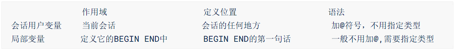

###### 54、循环结构之Loop

```sql
[loop_label:] LOOP
循环执行的语句
END LOOP [loop_label]
```

example:

```sql
DECLARE id INT DEFAULT 0;
add_loop:LOOP
SET id = id +1;
IF id >= 10 THEN LEAVE add_loop;
END IF;
END LOOP add_loop;
```

```sql
DELIMITER //
CREATE PROCEDURE update_salary_loop(OUT num INT)
BEGIN
DECLARE avg_salary DOUBLE;
DECLARE loop_count INT DEFAULT 0;
SELECT AVG(salary) INTO avg_salary FROM employees;
label_loop:LOOP
IF avg_salary >= 12000 THEN LEAVE label_loop;
END IF;
UPDATE employees SET salary = salary * 1.1;
SET loop_count = loop_count + 1;
SELECT AVG(salary) INTO avg_salary FROM employees;
END LOOP label_loop;
SET num = loop_count;
END //
DELIMITER ;
```

###### 55、循环REPEATE结构

```sql
[repeat_label:] REPEAT
循环体的语句
UNTIL 结束循环的条件表达式
END REPEAT [repeat_label]
```

example:

```sql
DELIMITER //
CREATE PROCEDURE test_repeat()
BEGIN
DECLARE i INT DEFAULT 0;
REPEAT
SET i = i + 1;
UNTIL i >= 10
END REPEAT;
SELECT i;
END //
DELIMITER ;
```

###### 56、对比三种循环

1、这三种循环都可以省略名称，但如果循环中添加了循环控制语句（LEAVE或ITERATE）则必须添加名称。

 2、 LOOP：一般用于实现简单的"死"循环 WHILE：先判断后执行 REPEAT：先执行后判断，无条件至少执行一次。

###### 57、LEAVE语句

```sql
LEAVE 标记名
```

example:

```sql
DELIMITER //
CREATE PROCEDURE leave_begin(IN num INT)
begin_label: BEGIN
IF num<=0
THEN LEAVE begin_label;
ELSEIF num=1
THEN SELECT AVG(salary) FROM employees;
ELSEIF num=2
THEN SELECT MIN(salary) FROM employees;
ELSE
SELECT MAX(salary) FROM employees;
END IF;
SELECT COUNT(*) FROM employees;
END //
DELIMITER ;
```

###### 58、ITERATE

```SQL
ITERATE label
```

example

```sql
DELIMITER //
CREATE PROCEDURE test_iterate()
BEGIN
DECLARE num INT DEFAULT 0;
my_loop:LOOP
SET num = num + 1;
IF num < 10
THEN ITERATE my_loop;
ELSEIF num > 15
END IF;
SELECT '尚硅谷：让天下没有难学的技术';
END LOOP my_loop;
END //
DELIMITER ;
```

###### 59、游标的使用

```sql
#第一步，声明游标
DECLARE cursor_name CURSOR FOR select_statement;
#第二步，打开游标
OPEN cursor_name
#第三步，使用游标（从游标中取得数据）
FETCH cursor_name INTO var_name [, var_name] ...
#第四步，关闭游标
CLOSE cursor_name
```

example:

```sql
DELIMITER //
CREATE PROCEDURE get_count_by_limit_total_salary(IN limit_total_salary DOUBLE,OUT
total_count INT)
BEGIN
DECLARE sum_salary DOUBLE DEFAULT 0; #记录累加的总工资
DECLARE cursor_salary DOUBLE DEFAULT 0; #记录某一个工资值
DECLARE emp_count INT DEFAULT 0; #记录循环个数
#定义游标
DECLARE emp_cursor CURSOR FOR SELECT salary FROM employees ORDER BY salary DESC;
#打开游标
OPEN emp_cursor;
REPEAT
#使用游标（从游标中获取数据）
FETCH emp_cursor INTO cursor_salary;
SET sum_salary = sum_salary + cursor_salary;
SET emp_count = emp_count + 1;
UNTIL sum_salary >= limit_total_salary
END REPEAT;
SET total_count = emp_count;
#关闭游标
CLOSE emp_cursor;
END //
DELIMITER ;
```

###### 60、触发器

```sql
CREATE TRIGGER 触发器名称
{BEFORE|AFTER} {INSERT|UPDATE|DELETE} ON 表名
FOR EACH ROW
触发器执行的语句块;
```

example:

```sql
#1、创建数据表：
CREATE TABLE test_trigger (
id INT PRIMARY KEY AUTO_INCREMENT,
t_note VARCHAR(30)
);
CREATE TABLE test_trigger_log (
id INT PRIMARY KEY AUTO_INCREMENT,
t_log VARCHAR(30)
);

#2、创建触发器：创建名称为before_insert的触发器，向test_trigger数据表插入数据之前，向test_trigger_log数据表中插入before_insert的日志信息。
DELIMITER //
CREATE TRIGGER before_insert
BEFORE INSERT ON test_trigger
FOR EACH ROW
BEGIN
INSERT INTO test_trigger_log (t_log)
VALUES('before_insert');
END //
DELIMITER ;

#3、向test_trigger数据表中插入数据
INSERT INTO test_trigger (t_note) VALUES ('测试 BEFORE INSERT 触发器');
#4、查看test_trigger_log数据表中的数据
mysql> SELECT * FROM test_trigger_log;
+----+---------------+
| id | t_log |
+----+---------------+
| 1 | before_insert |
+----+---------------+
1 row in set (0.00 sec)
```

example2:

```sql
#定义触发器“salary_check_trigger”，基于员工表“employees”的INSERT事件，在INSERT之前检查将要添加的新员工薪资是否大于他领导的薪资，如果大于领导薪资，则报sqlstate_value为'HY000'的错误，从而使得添加失败。
DELIMITER //
CREATE TRIGGER salary_check_trigger
BEFORE INSERT ON employees
FOR EACH ROW
BEGIN
DECLARE mgrsalary DOUBLE;
SELECT salary INTO mgrsalary FROM employees WHERE employee_id = NEW.manager_id;
IF NEW.salary > mgrsalary THEN
SIGNAL SQLSTATE 'HY000' SET MESSAGE_TEXT = '薪资高于领导薪资错误';
END IF;
END //
DELIMITER ;
```

###### 61、查看、删除触发器

- 查看 方式一

```sql
SHOW TRIGGERS\G
```

- 查看 方式二

```sql
SHOW CREATE TRIGGER 触发器名
```

- 查看 方式三

```sql
SELECT * FROM information_schema.TRIGGERS;
```

- 删除 触发器

```sql
DROP TRIGGER IF EXISTS 触发器名称;
```

###### 62、触发器优缺点

- 优点

1. 触发器可以确保数据的完整性。
2. 触发器可以帮助我们记录操作日志。
3. 触发器还可以用在操作数据前，对数据进行合法性检查。

- 缺点
  1. 触发器最大的一个问题就是可读性差。
  2. 关数据的变更，可能会导致触发器出错。	

—————————————————————————————JDBC———————————————————————————————————————

# JDBC

###### 1、JDBC程序编写的步骤


补充：ODBC(**Open Database Connectivity**，开放式数据库连接)，是微软在Windows平台下推出的。使用者在程序中只需要调用ODBC API，由 ODBC 驱动程序将调用转换成为对特定的数据库的调用请求。

###### 2、数据库的连接方式

- 连接方式一

```java
@Test
    public void testConnection1() {
        try {
            //1.提供java.sql.Driver接口实现类的对象
            Driver driver = null;
            driver = new com.mysql.jdbc.Driver();

            //2.提供url，指明具体操作的数据
            String url = "jdbc:mysql://localhost:3306/test";

            //3.提供Properties的对象，指明用户名和密码
            Properties info = new Properties();
            info.setProperty("user", "root");
            info.setProperty("password", "abc123");

            //4.调用driver的connect()，获取连接
            Connection conn = driver.connect(url, info);
            System.out.println(conn);
        } catch (SQLException e) {
            e.printStackTrace();
        }
    }
```

> 说明：上述代码中显式出现了第三方数据库的API

- 连接方式二

```java
	@Test
    public void testConnection2() {
        try {
            //1.实例化Driver
            String className = "com.mysql.jdbc.Driver";
            Class clazz = Class.forName(className);
            Driver driver = (Driver) clazz.newInstance();

            //2.提供url，指明具体操作的数据
            String url = "jdbc:mysql://localhost:3306/test";

            //3.提供Properties的对象，指明用户名和密码
            Properties info = new Properties();
            info.setProperty("user", "root");
            info.setProperty("password", "abc123");

            //4.调用driver的connect()，获取连接
            Connection conn = driver.connect(url, info);
            System.out.println(conn);

        } catch (Exception e) {
            e.printStackTrace();
        }
    }
```

> 说明：相较于方式一，这里使用反射实例化Driver，不在代码中体现第三方数据库的API。体现了面向接口编程思想。

- 连接方式三

```java
@Test
    public void testConnection3() {
        try {
            //1.数据库连接的4个基本要素：
            String url = "jdbc:mysql://localhost:3306/test";
            String user = "root";
            String password = "abc123";
            String driverName = "com.mysql.jdbc.Driver";

            //2.实例化Driver
            Class clazz = Class.forName(driverName);
            Driver driver = (Driver) clazz.newInstance();
            //3.注册驱动
            DriverManager.registerDriver(driver);
            //4.获取连接
            Connection conn = DriverManager.getConnection(url, user, password);
            System.out.println(conn);
        } catch (Exception e) {
            e.printStackTrace();
        }
    }
```

> 说明：使用DriverManager实现数据库的连接。体会获取连接必要的4个基本要素。

- 连接方式四

```java
@Test
    public void testConnection4() {
        try {
            //1.数据库连接的4个基本要素：
            String url = "jdbc:mysql://localhost:3306/test";
            String user = "root";
            String password = "abc123";
            String driverName = "com.mysql.jdbc.Driver";

            //2.加载驱动 （①实例化Driver ②注册驱动）
            Class.forName(driverName);


            //Driver driver = (Driver) clazz.newInstance();
            //3.注册驱动
            //DriverManager.registerDriver(driver);
            /*
            可以注释掉上述代码的原因，是因为在mysql的Driver类中声明有：
            static {
                try {
                    DriverManager.registerDriver(new Driver());
                } catch (SQLException var1) {
                    throw new RuntimeException("Can't register driver!");
                }
            }

             */


            //3.获取连接
            Connection conn = DriverManager.getConnection(url, user, password);
            System.out.println(conn);
        } catch (Exception e) {
            e.printStackTrace();
        }

    }
```

> 说明：不必显式的注册驱动了。因为在DriverManager的源码中已经存在静态代码块，实现了驱动的注册。

- 连接方式五（终极版）

```java
@Test
    public  void testConnection5() throws Exception {
    	//1.加载配置文件
        InputStream is = ConnectionTest.class.getClassLoader().getResourceAsStream("jdbc.properties");
        Properties pros = new Properties();
        pros.load(is);
        
        //2.读取配置信息
        String user = pros.getProperty("user");
        String password = pros.getProperty("password");
        String url = pros.getProperty("url");
        String driverClass = pros.getProperty("driverClass");

        //3.加载驱动
        Class.forName(driverClass);

        //4.获取连接
        Connection conn = DriverManager.getConnection(url,user,password);
        System.out.println(conn);

    }
```

其中，配置文件声明在工程的src目录下：【jdbc.properties】

```properties
user=root
password=abc123
url=jdbc:mysql://localhost:3306/test
driverClass=com.mysql.jdbc.Driver
```

> 说明：使用配置文件的方式保存配置信息，在代码中加载配置文件
>
> **使用配置文件的好处：**
>
> ①实现了代码和数据的分离，如果需要修改配置信息，直接在配置文件中修改，不需要深入代码
> ②如果修改了配置信息，省去重新编译的过程。

- 总结

​		其实就是把user、password、url、driverCLass单独在配置文件声明，利用Class.forName(driverClass)加载驱动，最后用Connection来获取连接，就可以得到连接。

> 补充：不需要再将Driver进行实体化，因为，在Driver的静态代码块中已经处理好了，直接隐式初始化

###### 3、操作和访问数据库

- 数据库连接被用于向数据库服务器发送命令和 SQL 语句，并接受数据库服务器返回的结果。其实一个数据库连接就是一个Socket连接。
- 在 java.sql 包中有 3 个接口分别定义了对数据库的调用的不同方式：
  - Statement：用于执行静态 SQL 语句并返回它所生成结果的对象。 
  - PrepatedStatement：SQL 语句被预编译并存储在此对象中，可以使用此对象多次高效地执行该语句。
  - CallableStatement：用于执行 SQL 存储过程


###### 4、PreparedStatement增删改code

```java
//通用的增、删、改操作（体现一：增、删、改 ； 体现二：针对于不同的表）
	public void update(String sql,Object ... args){
		Connection conn = null;
		PreparedStatement ps = null;
		try {
			//1.获取数据库的连接
			conn = JDBCUtils.getConnection();
			
			//2.获取PreparedStatement的实例 (或：预编译sql语句)
			ps = conn.prepareStatement(sql);
			//3.填充占位符
			for(int i = 0;i < args.length;i++){
				ps.setObject(i + 1, args[i]);
			}
			
			//4.执行sql语句
			ps.execute();
		} catch (Exception e) {
			
			e.printStackTrace();
		}finally{
			//5.关闭资源
			JDBCUtils.closeResource(conn, ps);
			
		}
	}
```

###### 5、PreparedStatement查

```java
	// 通用的针对于不同表的查询:返回一个对象 (version 1.0)
	public <T> T getInstance(Class<T> clazz, String sql, Object... args) {

		Connection conn = null;
		PreparedStatement ps = null;
		ResultSet rs = null;
		try {
			// 1.获取数据库连接
			conn = JDBCUtils.getConnection();

			// 2.预编译sql语句，得到PreparedStatement对象
			ps = conn.prepareStatement(sql);

			// 3.填充占位符
			for (int i = 0; i < args.length; i++) {
				ps.setObject(i + 1, args[i]);
			}

			// 4.执行executeQuery(),得到结果集：ResultSet
			rs = ps.executeQuery();

			// 5.得到结果集的元数据：ResultSetMetaData
			ResultSetMetaData rsmd = rs.getMetaData();

			// 6.1通过ResultSetMetaData得到columnCount,columnLabel；通过ResultSet得到列值
			int columnCount = rsmd.getColumnCount();
			if (rs.next()) {
				T t = clazz.newInstance();
				for (int i = 0; i < columnCount; i++) {// 遍历每一个列

					// 获取列值
					Object columnVal = rs.getObject(i + 1);
					// 获取列的别名:列的别名，使用类的属性名充当
					String columnLabel = rsmd.getColumnLabel(i + 1);
					// 6.2使用反射，给对象的相应属性赋值
					Field field = clazz.getDeclaredField(columnLabel);
					field.setAccessible(true);
					field.set(t, columnVal);

				}

				return t;

			}
		} catch (Exception e) {

			e.printStackTrace();
		} finally {
			// 7.关闭资源
			JDBCUtils.closeResource(conn, ps, rs);
		}

		return null;

	}
```

> 说明：使用PreparedStatement实现的查询操作可以替换Statement实现的查询操作，解决Statement拼串和SQL注入问题。

###### 6、JDBC事务处理

```java
public void testJDBCTransaction() {
	Connection conn = null;
	try {
		// 1.获取数据库连接
		conn = JDBCUtils.getConnection();
		// 2.开启事务
		conn.setAutoCommit(false);
		// 3.进行数据库操作
		String sql1 = "update user_table set balance = balance - 100 where user = ?";
		update(conn, sql1, "AA");

		// 模拟网络异常
		//System.out.println(10 / 0);

		String sql2 = "update user_table set balance = balance + 100 where user = ?";
		update(conn, sql2, "BB");
		// 4.若没有异常，则提交事务
		conn.commit();
	} catch (Exception e) {
		e.printStackTrace();
		// 5.若有异常，则回滚事务
		try {
			conn.rollback();
		} catch (SQLException e1) {
			e1.printStackTrace();
		}
    } finally {
        try {
			//6.恢复每次DML操作的自动提交功能
			conn.setAutoCommit(true);
		} catch (SQLException e) {
			e.printStackTrace();
		}
        //7.关闭连接
		JDBCUtils.closeResource(conn, null, null); 
    }  
}
```

其中，对数据库操作的方法为：

```java
//使用事务以后的通用的增删改操作（version 2.0）
public void update(Connection conn ,String sql, Object... args) {
	PreparedStatement ps = null;
	try {
		// 1.获取PreparedStatement的实例 (或：预编译sql语句)
		ps = conn.prepareStatement(sql);
		// 2.填充占位符
		for (int i = 0; i < args.length; i++) {
			ps.setObject(i + 1, args[i]);
		}
		// 3.执行sql语句
		ps.execute();
	} catch (Exception e) {
		e.printStackTrace();
	} finally {
		// 4.关闭资源
		JDBCUtils.closeResource(null, ps);

	}
```

###### 7、事务的ACID属性

1. 原子性（Atomicity）：原子性是指事务是一个不可分割的工作单位，事务中的操作要么都发生，要么都不发生。 
2. 一致性（Consistency）：事务必须使数据库从一个一致性状态变换到另外一个一致性状态。
3. 隔离性（Isolation）： 事务的隔离性是指一个事务的执行不能被其他事务干扰，即一个事务内部的操作及使用的数据对并发的其他事务是隔离的，并发执行的各个事务之间不能互相干扰。
4. 持久性（Durability）：持久性是指一个事务一旦被提交，它对数据库中数据的改变就是永久性的，接下来的其他操作和数据库故障不应该对其有任何影响。

###### 8、 四种隔离级别

- 数据库提供的4种事务隔离级别：

  

- Oracle 支持的 2 种事务隔离级别：**READ COMMITED**, SERIALIZABLE。 Oracle 默认的事务隔离级别为: **READ COMMITED** 。


- Mysql 支持 4 种事务隔离级别。Mysql 默认的事务隔离级别为: **REPEATABLE READ。**

###### 9、德鲁伊数据库连接池

Druid是阿里巴巴开源平台上一个数据库连接池实现，它结合了C3P0、DBCP、Proxool等DB池的优点，同时加入了日志监控，可以很好的监控DB池连接和SQL的执行情况，可以说是针对监控而生的DB连接池，**可以说是目前最好的连接池之一。**

```java
package com.atguigu.druid;

import java.sql.Connection;
import java.util.Properties;

import javax.sql.DataSource;

import com.alibaba.druid.pool.DruidDataSourceFactory;

public class TestDruid {
	public static void main(String[] args) throws Exception {
		Properties pro = new Properties();		 pro.load(TestDruid.class.getClassLoader().getResourceAsStream("druid.properties"));
		DataSource ds = DruidDataSourceFactory.createDataSource(pro);
		Connection conn = ds.getConnection();
		System.out.println(conn);
	}
}
```

其中，src下的配置文件为：druid.properties

```java
url=jdbc:mysql://localhost:3306/test?rewriteBatchedStatements=true
username=root
password=123456
driverClassName=com.mysql.jdbc.Driver

initialSize=10
maxActive=20
maxWait=1000
filters=wall
```

| **配置**                      | **缺省** | **说明**                                                     |
| ----------------------------- | -------- | ------------------------------------------------------------ |
| name                          |          | 配置这个属性的意义在于，如果存在多个数据源，监控的时候可以通过名字来区分开来。   如果没有配置，将会生成一个名字，格式是：”DataSource-” +   System.identityHashCode(this) |
| url                           |          | 连接数据库的url，不同数据库不一样。例如：mysql :   jdbc:mysql://10.20.153.104:3306/druid2      oracle :   jdbc:oracle:thin:@10.20.149.85:1521:ocnauto |
| username                      |          | 连接数据库的用户名                                           |
| password                      |          | 连接数据库的密码。如果你不希望密码直接写在配置文件中，可以使用ConfigFilter。详细看这里：<https://github.com/alibaba/druid/wiki/%E4%BD%BF%E7%94%A8ConfigFilter> |
| driverClassName               |          | 根据url自动识别   这一项可配可不配，如果不配置druid会根据url自动识别dbType，然后选择相应的driverClassName(建议配置下) |
| initialSize                   | 0        | 初始化时建立物理连接的个数。初始化发生在显示调用init方法，或者第一次getConnection时 |
| maxActive                     | 8        | 最大连接池数量                                               |
| maxIdle                       | 8        | 已经不再使用，配置了也没效果                                 |
| minIdle                       |          | 最小连接池数量                                               |
| maxWait                       |          | 获取连接时最大等待时间，单位毫秒。配置了maxWait之后，缺省启用公平锁，并发效率会有所下降，如果需要可以通过配置useUnfairLock属性为true使用非公平锁。 |
| poolPreparedStatements        | false    | 是否缓存preparedStatement，也就是PSCache。PSCache对支持游标的数据库性能提升巨大，比如说oracle。在mysql下建议关闭。 |
| maxOpenPreparedStatements     | -1       | 要启用PSCache，必须配置大于0，当大于0时，poolPreparedStatements自动触发修改为true。在Druid中，不会存在Oracle下PSCache占用内存过多的问题，可以把这个数值配置大一些，比如说100 |
| validationQuery               |          | 用来检测连接是否有效的sql，要求是一个查询语句。如果validationQuery为null，testOnBorrow、testOnReturn、testWhileIdle都不会其作用。 |
| testOnBorrow                  | true     | 申请连接时执行validationQuery检测连接是否有效，做了这个配置会降低性能。 |
| testOnReturn                  | false    | 归还连接时执行validationQuery检测连接是否有效，做了这个配置会降低性能 |
| testWhileIdle                 | false    | 建议配置为true，不影响性能，并且保证安全性。申请连接的时候检测，如果空闲时间大于timeBetweenEvictionRunsMillis，执行validationQuery检测连接是否有效。 |
| timeBetweenEvictionRunsMillis |          | 有两个含义： 1)Destroy线程会检测连接的间隔时间2)testWhileIdle的判断依据，详细看testWhileIdle属性的说明 |
| numTestsPerEvictionRun        |          | 不再使用，一个DruidDataSource只支持一个EvictionRun           |
| minEvictableIdleTimeMillis    |          |                                                              |
| connectionInitSqls            |          | 物理连接初始化的时候执行的sql                                |
| exceptionSorter               |          | 根据dbType自动识别   当数据库抛出一些不可恢复的异常时，抛弃连接 |
| filters                       |          | 属性类型是字符串，通过别名的方式配置扩展插件，常用的插件有：   监控统计用的filter:stat日志用的filter:log4j防御sql注入的filter:wall |
| proxyFilters                  |          | 类型是List，如果同时配置了filters和proxyFilters，是组合关系，并非替换关系 |

###### 10、JDBC总结

```java
总结
@Test
public void testUpdateWithTx() {
		
	Connection conn = null;
	try {
		//1.获取连接的操作（
		//① 手写的连接：JDBCUtils.getConnection();
		//② 使用数据库连接池：C3P0;DBCP;Druid
		//2.对数据表进行一系列CRUD操作
		//① 使用PreparedStatement实现通用的增删改、查询操作（version 1.0 \ version 2.0)
//version2.0的增删改public void update(Connection conn,String sql,Object ... args){}
//version2.0的查询 public <T> T getInstance(Connection conn,Class<T> clazz,String sql,Object ... args){}
		//② 使用dbutils提供的jar包中提供的QueryRunner类
			
		//提交数据
		conn.commit();
			
	
	} catch (Exception e) {
		e.printStackTrace();
			
			
		try {
			//回滚数据
			conn.rollback();
		} catch (SQLException e1) {
			e1.printStackTrace();
		}
			
	}finally{
		//3.关闭连接等操作
		//① JDBCUtils.closeResource();
		//② 使用dbutils提供的jar包中提供的DbUtils类提供了关闭的相关操作
			
	}
}
```

————————————————————————————JavaWeb———————————————————————————————————————

# JavaWeb

###### 1、JavaWeb技术体系


###### 2、HTML标签


###### 3、过滤器的三要素

1. 拦截

   过滤器之所以能够对请求进行预处理，关键是对请求进行拦截，把请求拦截下来才能够做后续的操作。而且对于一个具体的过滤器，它必须明确它要拦截的请求，而不是所有请求都拦截。

​	2.过滤

​		根据根据业务功能实际的需求，看看在把请求拦截到之后，需要做什么检查或什么操作，写对应的代码即可。

​	3.放行

​		过滤器完成自己的任务或者是检测到当前请求符合过滤规则，那么可以将请求放行。所谓放行，就是让请求继续去访问它原本要访问的资源。

> 补充：SpringMVC的拦截器也同样具备三要素

###### 4、创建Filter

- 准备工作
  1. 创建module
  2. 加入Thymeleaf环境
  3. 完成首页访问功能
  4. 创建Target01Servlet以及target01.html
  5. 创建SpecialServlet以及special.html

example

```java
public class Target01Filter implements Filter {
    @Override
    public void init(FilterConfig filterConfig) throws ServletException {

    }

    @Override
    public void doFilter(ServletRequest request, ServletResponse response, FilterChain chain) throws IOException, ServletException {

        // 1.打印一句话表明Filter执行了
        System.out.println("过滤器执行：Target01Filter");

        // 2.检查是否满足过滤条件
        // 人为设定一个过滤条件：请求参数message是否等于monster
        // 等于：放行
        // 不等于：将请求跳转到另外一个页面
        // ①获取请求参数
        String message = request.getParameter("message");

        // ②检查请求参数是否等于monster
        if ("monster".equals(message)) {

            // ③执行放行
            // FilterChain对象代表过滤器链
            // chain.doFilter(request, response)方法效果：将请求放行到下一个Filter，
            // 如果当前Filter已经是最后一个Filter了，那么就将请求放行到原本要访问的目标资源
            chain.doFilter(request, response);

        }else{

            // ④跳转页面
            request.getRequestDispatcher("/SpecialServlet?method=toSpecialPage").forward(request, response);

        }

    }

    @Override
    public void destroy() {

    }
}
```

- 进行注册

```xml
<!-- 配置Target01Filter -->
<filter>
    <!-- 配置Filter的友好名称 -->
    <filter-name>Target01Filter</filter-name>

    <!-- 配置Filter的全类名，便于Servlet容器创建Filter对象 -->
    <filter-class>com.atguigu.filter.filter.Target01Filter</filter-class>
</filter>

<!-- 配置Filter要拦截的目标资源 -->
<filter-mapping>
    <!-- 指定这个mapping对应的Filter名称 -->
    <filter-name>Target01Filter</filter-name>

    <!-- 通过请求地址模式来设置要拦截的资源 -->
    <url-pattern>/Target01Servlet</url-pattern>
</filter-mapping>
```

###### 5、Servlet生命周期

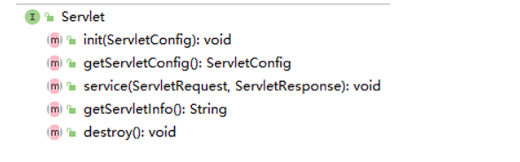

###### 6、Filter生命周期

和Servlet生命周期类比，Filter生命周期的关键区别是：**在Web应用启动时创建对象**

| 生命周期阶段 | 执行时机         | 执行次数 |
| ------------ | ---------------- | -------- |
| 创建对象     | Web应用启动时    | 一次     |
| 初始化       | 创建对象后       | 一次     |
| 拦截请求     | 接收到匹配的请求 | 多次     |
| 销毁         | Web应用卸载前    | 一次     |

###### 7、监听器

​		监听器：专门用于对其他对象身上发生的事件或状态改变进行监听和相应处理的对象，当被监视的对象发生情况时，立即采取相应的行动。 **Servlet监听器**：Servlet规范中定义的一种特殊类，它用于监听Web应用程序中的ServletContext，HttpSession 和HttpServletRequest等域对象的创建与销毁事件，以及监听这些域对象中的属性发生修改的事件。

- 用法

```java
public class AtguiguListener implements ServletContextListener {
    @Override
    public void contextInitialized(
            // Event对象代表本次事件，通过这个对象可以获取ServletContext对象本身
            ServletContextEvent sce) {
        System.out.println("Hello，我是ServletContext，我出生了！");

        ServletContext servletContext = sce.getServletContext();
        System.out.println("servletContext = " + servletContext);
    }

    @Override
    public void contextDestroyed(ServletContextEvent sce) {
        System.out.println("Hello，我是ServletContext，我打算去休息一会儿！");
    }
}
```

- 注册监听器

```xml
<!-- 每一个listener标签对应一个监听器配置，若有多个监听器，则配置多个listener标签即可 -->
<listener>
    <!-- 配置监听器指定全类名即可 -->
    <listener-class>com.atguigu.listener.AtguiguListener</listener-class>
</listener>
```

————————————————————————————SSM—————————————————————————————————————————

# MyBatis

###### 1、Mybatis核心配置文件

```xml
<?xml version="1.0" encoding="UTF-8" ?>
<!DOCTYPE configuration
PUBLIC "-//mybatis.org//DTD Config 3.0//EN"
"http://mybatis.org/dtd/mybatis-3-config.dtd">
<configuration>
<!--
MyBatis核心配置文件中，标签的顺序：
properties?,settings?,typeAliases?,typeHandlers?,
objectFactory?,objectWrapperFactory?,reflectorFactory?,
plugins?,environments?,databaseIdProvider?,mappers?
-->
<!--引入properties文件-->
<properties resource="jdbc.properties" />
<!--设置类型别名-->
<typeAliases>
<!--
typeAlias：设置某个类型的别名
属性：
type：设置需要设置别名的类型
alias：设置某个类型的别名，若不设置该属性，那么该类型拥有默认的别名，即类名
且不区分大小写
-->
<!--<typeAlias type="com.atguigu.mybatis.pojo.User"></typeAlias>-->
<!--以包为单位，将包下所有的类型设置默认的类型别名，即类名且不区分大小写-->
<package name="com.atguigu.mybatis.pojo"/>
</typeAliases>
<!--
environments：配置多个连接数据库的环境
属性：
default：设置默认使用的环境的id
-->
<environments default="development">
<!--
environment：配置某个具体的环境
属性：
id：表示连接数据库的环境的唯一标识，不能重复
-->
<environment id="development">
<!--
transactionManager：设置事务管理方式
属性：
type="JDBC|MANAGED"
JDBC：表示当前环境中，执行SQL时，使用的是JDBC中原生的事务管理方式，事
务的提交或回滚需要手动处理
MANAGED：被管理，例如Spring
-->
<transactionManager type="JDBC"/>
<!--
dataSource：配置数据源
属性：
type：设置数据源的类型
type="POOLED|UNPOOLED|JNDI"
POOLED：表示使用数据库连接池缓存数据库连接
UNPOOLED：表示不使用数据库连接池
JNDI：表示使用上下文中的数据源
-->
<dataSource type="POOLED">
<!--设置连接数据库的驱动-->
<property name="driver" value="${jdbc.driver}"/>
<!--设置连接数据库的连接地址-->
<property name="url" value="${jdbc.url}"/>
<!--设置连接数据库的用户名-->
<property name="username" value="${jdbc.username}"/>
<!--设置连接数据库的密码-->
<property name="password" value="${jdbc.password}"/>
</dataSource>
</environment>
<environment id="test">
<transactionManager type="JDBC"/>
<dataSource type="POOLED">
<property name="driver" value="com.mysql.cj.jdbc.Driver"/>
<property name="url"
value="jdbc:mysql://localhost:3306/ssmserverTimezone=UTC"/>
<property name="username" value="root"/>
<property name="password" value="123456"/>
</dataSource>
</environment>
</environments>
<!--引入映射文件-->
<mappers>
<!--<mapper resource="mappers/UserMapper.xml"/>-->
<!--
以包为单位引入映射文件
要求：
1、mapper接口所在的包要和映射文件所在的包一致
2、mapper接口要和映射文件的名字一致
-->
<package name="com.atguigu.mybatis.mapper"/>
</mappers>
</configuration>

```

###### 2、在Mybatis中参数值的两种方式${}和#{}的区别

${}的本质就是字符串拼接，#{}的本质就是占位符赋值 

${}使用字符串拼接的方式拼接sql，若为字符串类型或日期类型的字段进行赋值时，需要手动加单引号；

但是#{}使用占位符赋值的方式拼接sql，此时为字符串类型或日期类型的字段进行赋值时， 可以自动添加单引号

###### 3、多对一映射处理

- 级联方式处理映射

```xml
<resultMap id="empDeptMap" type="Emp">
<id column="eid" property="eid"></id>
<result column="ename" property="ename"></result>
<result column="age" property="age"></result>
<result column="sex" property="sex"></result>
<result column="did" property="dept.did"></result>
<result column="dname" property="dept.dname"></result>
</resultMap>
<!--Emp getEmpAndDeptByEid(@Param("eid") int eid);-->
<select id="getEmpAndDeptByEid" resultMap="empDeptMap">
select emp.*,dept.* from t_emp emp left join t_dept dept on emp.did =
dept.did where emp.eid = #{eid}
</select>
```

- 使用association处理映射关系

```xml
<resultMap id="empDeptMap" type="Emp">
<id column="eid" property="eid"></id>
<result column="ename" property="ename"></result>
<result column="age" property="age"></result>
<result column="sex" property="sex"></result>
<association property="dept" javaType="Dept">
<id column="did" property="did"></id>
<result column="dname" property="dname"></result>
</association>
</resultMap>
<!--Emp getEmpAndDeptByEid(@Param("eid") int eid);-->
<select id="getEmpAndDeptByEid" resultMap="empDeptMap">
select emp.*,dept.* from t_emp emp left join t_dept dept on emp.did =
dept.did where emp.eid = #{eid}
</select>
```

###### 4、分步查询

```java
/**
* 通过分步查询查询员工信息
* @param eid
* @return
*/
Emp getEmpByStep(@Param("eid") int eid);
```

```xml
<resultMap id="empDeptStepMap" type="Emp">
<id column="eid" property="eid"></id>
<result column="ename" property="ename"></result>
<result column="age" property="age"></result>
<result column="sex" property="sex"></result>
<!--
select：设置分步查询，查询某个属性的值的sql的标识（namespace.sqlId）
column：将sql以及查询结果中的某个字段设置为分步查询的条件
-->
<association property="dept"
select="com.atguigu.MyBatis.mapper.DeptMapper.getEmpDeptByStep" column="did">
</association>
</resultMap>
<!--Emp getEmpByStep(@Param("eid") int eid);-->
<select id="getEmpByStep" resultMap="empDeptStepMap">
select * from t_emp where eid = #{eid}
</select>
```

```xml
/**
* 分步查询的第二步： 根据员工所对应的did查询部门信息
* @param did
* @return
*/
Dept getEmpDeptByStep(@Param("did") int did);
<!--Dept getEmpDeptByStep(@Param("did") int did);-->
<select id="getEmpDeptByStep" resultType="Dept">
select * from t_dept where did = #{did}
</select>
```

###### 5、一对多映射

- collection

```java
/**
* 根据部门id查新部门以及部门中的员工信息
* @param did
* @return
*/
Dept getDeptEmpByDid(@Param("did") int did);
```

```xml
<resultMap id="deptEmpMap" type="Dept">
<id property="did" column="did"></id>
<result property="dname" column="dname"></result>
<!--
ofType：设置collection标签所处理的集合属性中存储数据的类型
-->
<collection property="emps" ofType="Emp">
<id property="eid" column="eid"></id>
<result property="ename" column="ename"></result>
<result property="age" column="age"></result>
<result property="sex" column="sex"></result>
</collection>
</resultMap>
<!--Dept getDeptEmpByDid(@Param("did") int did);-->
<select id="getDeptEmpByDid" resultMap="deptEmpMap">
select dept.*,emp.* from t_dept dept left join t_emp emp on dept.did =
emp.did where dept.did = #{did}
</select>
```

###### 6、Mybatis缓存

- 一级缓存

  一级缓存是SqlSession级别的，通过同一个SqlSession查询的数据会被缓存，下次查询相同的数据，就会从缓存中直接获取，不会从数据库重新访问 使一级缓存失效的四种情况：

  1) 不同的SqlSession对应不同的一级缓存 
  2) 同一个SqlSession但是查询条件不同 
  3) 同一个SqlSession两次查询期间执行了任何一次增删改操作 
  4) 同一个SqlSession两次查询期间手动清空了缓存

- 二级缓存

二级缓存是SqlSessionFactory级别，通过同一个SqlSessionFactory创建的SqlSession查询的结果会被 缓存；此后若再次执行相同的查询语句，结果就会从缓存中获取。

二级缓存开启的条件： a>在核心配置文件中，设置全局配置属性cacheEnabled="true"，默认为true，不需要设置

​										 b>在映射文件中设置标签

​										 c>二级缓存必须在SqlSession关闭或提交之后有效 

​										d>查询的数据所转换的实体类类型必须实现序列化的接口

 使二级缓存失效的情况： 两次查询之间执行了任意的增删改，会使一级和二级缓存同时失效

###### 7、Mybatis缓存查询的顺序

先查询二级缓存，因为二级缓存中可能会有其他程序已经查出来的数据，可以拿来直接使用。

 如果二级缓存没有命中，再查询一级缓存

 如果一级缓存也没有命中，则查询数据库

 SqlSession关闭之后，一级缓存中的数据会写入二级缓存

###### 8、关于mbg逆向工程

- 依赖和插件

```xml
<!-- 依赖MyBatis核心包 -->
<dependencies>
<dependency>
<groupId>org.mybatis</groupId>
<artifactId>mybatis</artifactId>
<version>3.5.7</version>
</dependency>
<!-- junit测试 -->
<dependency>
<groupId>junit</groupId>
<artifactId>junit</artifactId>
<version>4.12</version>
<scope>test</scope>
</dependency>
<!-- log4j日志 -->
<dependency>
<groupId>log4j</groupId>
<artifactId>log4j</artifactId>
<version>1.2.17</version>
</dependency>
<dependency>
<groupId>mysql</groupId>
<artifactId>mysql-connector-java</artifactId>
<version>8.0.16</version>
</dependency>
</dependencies>
<!-- 控制Maven在构建过程中相关配置 -->
<build>
<!-- 构建过程中用到的插件 -->
<plugins>
<!-- 具体插件，逆向工程的操作是以构建过程中插件形式出现的 -->
<plugin>
<groupId>org.mybatis.generator</groupId>
<artifactId>mybatis-generator-maven-plugin</artifactId>
<version>1.3.0</version>
<!-- 插件的依赖 -->
<dependencies>
<!-- 逆向工程的核心依赖 -->
<dependency>
<groupId>org.mybatis.generator</groupId>
<artifactId>mybatis-generator-core</artifactId>
<version>1.3.2</version>
</dependency>
<!-- MySQL驱动 -->
<dependency>
<groupId>mysql</groupId>
<artifactId>mysql-connector-java</artifactId>
<version>8.0.16</version>
</dependency>
</dependencies>
</plugin>
</plugins>
</build>

```

- 创建逆向工程的配置文件

> 文件名必须是：generatorConfig.xml

```xml
<?xml version="1.0" encoding="UTF-8"?>
<!DOCTYPE generatorConfiguration
PUBLIC "-//mybatis.org//DTD MyBatis Generator Configuration 1.0//EN"
"http://mybatis.org/dtd/mybatis-generator-config_1_0.dtd">
<generatorConfiguration>
<!--
targetRuntime: 执行生成的逆向工程的版本
MyBatis3Simple: 生成基本的CRUD（清新简洁版）
MyBatis3: 生成带条件的CRUD（奢华尊享版）
-->
<context id="DB2Tables" targetRuntime="MyBatis3">
<!-- 数据库的连接信息 -->
<jdbcConnection driverClass="com.mysql.cj.jdbc.Driver"
connectionURL="jdbc:mysql://localhost:3306/mybatis?
serverTimezone=UTC"
userId="root"
password="123456">
</jdbcConnection>
<!-- javaBean的生成策略-->
<javaModelGenerator targetPackage="com.atguigu.mybatis.pojo"
targetProject=".\src\main\java">
<property name="enableSubPackages" value="true" />
<property name="trimStrings" value="true" />
</javaModelGenerator>
<!-- SQL映射文件的生成策略 -->
<sqlMapGenerator targetPackage="com.atguigu.mybatis.mapper"
targetProject=".\src\main\resources">
<property name="enableSubPackages" value="true" />
</sqlMapGenerator>
<!-- Mapper接口的生成策略 -->
<javaClientGenerator type="XMLMAPPER"
targetPackage="com.atguigu.mybatis.mapper" targetProject=".\src\main\java">
<property name="enableSubPackages" value="true" />
</javaClientGenerator>
<!-- 逆向分析的表 -->
<!-- tableName设置为*号，可以对应所有表，此时不写domainObjectName -->
<!-- domainObjectName属性指定生成出来的实体类的类名 -->
<table tableName="t_emp" domainObjectName="Emp"/>
<table tableName="t_dept" domainObjectName="Dept"/>
</context>
</generatorConfiguration>

```

###### 9、QBC查询

```java
@Test
public void testMBG(){
try {
InputStream is = Resources.getResourceAsStream("mybatis-config.xml");
SqlSessionFactory sqlSessionFactory = new
SqlSessionFactoryBuilder().build(is);
SqlSession sqlSession = sqlSessionFactory.openSession(true);
EmpMapper mapper = sqlSession.getMapper(EmpMapper.class);
//查询所有数据
/*List<Emp> list = mapper.selectByExample(null);
list.forEach(emp -> System.out.println(emp));*/
//根据条件查询
/*EmpExample example = new EmpExample();
example.createCriteria().andEmpNameEqualTo("张
三").andAgeGreaterThanOrEqualTo(20);
example.or().andDidIsNotNull();
List<Emp> list = mapper.selectByExample(example);
list.forEach(emp -> System.out.println(emp));*/
mapper.updateByPrimaryKeySelective(new
Emp(1,"admin",22,null,"456@qq.com",3));
} catch (IOException e) {
e.printStackTrace();
}
}
```

###### 10、分页插件

limit index,pageSize

 pageSize：每页显示的条数 

pageNum：当前页的页码

 index：当前页的起始索引 index=(pageNum-1)*pageSize 

count：总记录数

 totalPage：总页数 totalPage = count / pageSize; 

if(count % pageSize != 0){ totalPage += 1; }

 pageSize=4，pageNum=1，index=0 limit 0,4

 pageSize=4，pageNum=3，index=8 limit 8,4

 pageSize=4，pageNum=6，index=20 limit 8,4

首页 上一页 2 3 4 5 6 下一页 末页

- 使用步骤

  ①添加依赖

  ```xml
  <dependency>
  <groupId>com.github.pagehelper</groupId>
  <artifactId>pagehelper</artifactId>
  <version>5.2.0</version>
  </dependency>
  ```

  ②配置分页插件

  在MyBatis的核心配置文件中配置插件

  ```xml
  <plugins>
  <!--设置分页插件-->
  <plugin interceptor="com.github.pagehelper.PageInterceptor"></plugin>
  </plugins>
  ```

- 插件的使用

a>在查询功能之前使用PageHelper.startPage(int pageNum, int pageSize)开启分页功能

> pageNum：当前页的页码 
>
> pageSize：每页显示的条数

b>在查询获取list集合之后，使用PageInfo pageInfo = new PageInfo<>(List list, int navigatePages)获取分页相关数据

> list：分页之后的数据 
>
> navigatePages：导航分页的页码数

c>分页相关数据

> PageInfo{ pageNum=8, pageSize=4, size=2, startRow=29, endRow=30, total=30, pages=8, list=Page{count=true, pageNum=8, pageSize=4, startRow=28, endRow=32, total=30, pages=8, reasonable=false, pageSizeZero=false}, prePage=7, nextPage=0, isFirstPage=false, isLastPage=true, hasPreviousPage=true, hasNextPage=false, navigatePages=5, navigateFirstPage4, navigateLastPage8, navigatepageNums=[4, 5, 6, 7, 8] }
>
>  pageNum：当前页的页码 
>
> pageSize：每页显示的条数
>
>  size：当前页显示的真实条数
>
>  total：总记录数 
>
> pages：总页数 
>
> prePage：上一页的页码
>
> nextPage：下一页的页码 
>
> isFirstPage/isLastPage：是否为第一页/最后一页
>
>  hasPreviousPage/hasNextPage：是否存在上一页/下一页
>
>  navigatePages：导航分页的页码数 navigatepageNums：导航分页的页码，[1,2,3,4,5]

——————————————————————————————————Spring——————————————————————————————

# Spring

###### 1、IOC容器

IOC:Inversion of Control, 反转控制

DI：Dependency Injection 依赖注入，DI是IOC的另一种表述方式：即组件以一些预先定义好的方式（例如：setter方法）接受来自于容器的资源注入。相对于IOC而言，这种表述更直接。

结论：IOC就是一种反转控制的思想，而DI是对IOC的一种具体实现。

###### 2、IOC容器在Spring中的实现

Spring 的 IOC 容器就是 IOC 思想的一个落地的产品实现。IOC 容器中管理的组件也叫做 bean。在创建 bean 之前，首先需要创建 IOC 容器。Spring 提供了 IOC 容器的两种实现方式：

- BeanFactory

​		这是 IOC 容器的基本实现，是 Spring 内部使用的接口。面向 Spring 本身，不提供给开发人员使用。

- ApplicationContext

  BeanFactory 的子接口，提供了更多高级特性。面向 Spring 的使用者，几乎所有场合都使用 ApplicationContext 而不是底层的 BeanFactory。

- ApplicationContext的主要实现类

  

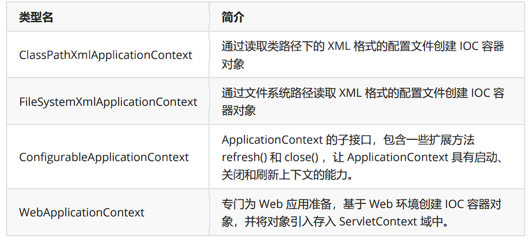

###### 3、基于XML管理bean

引入依赖

```xml
<dependencies>
<!-- 基于Maven依赖传递性，导入spring-context依赖即可导入当前所需所有jar包 -->
<dependency>
<groupId>org.springframework</groupId>
<artifactId>spring-context</artifactId>
<version>5.3.1</version>
</dependency>
<!-- junit测试 -->
<dependency>
<groupId>junit</groupId>
<artifactId>junit</artifactId>
<version>4.12</version>
<scope>test</scope>
</dependency>
</dependencies>

```

- Spring的配置文件中配置Bean

```xml
<!--
配置HelloWorld所对应的bean，即将HelloWorld的对象交给Spring的IOC容器管理
通过bean标签配置IOC容器所管理的bean
属性：
id：设置bean的唯一标识
class：设置bean所对应类型的全类名
-->
<bean id="helloworld" class="com.atguigu.spring.bean.HelloWorld"></bean>
```

- 创建测试类

```java
@Test
public void testHelloWorld(){
ApplicationContext ac = new
ClassPathXmlApplicationContext("applicationContext.xml");
HelloWorld helloworld = (HelloWorld) ac.getBean("helloworld");
helloworld.sayHello();
}
```

> 补充：Spring 底层默认通过反射技术调用组件类的无参构造器来创建组件对象，这一点需要注意。如果在需要 无参构造器时，没有无参构造器，则会抛出异常

###### 4、获取Bean

- 方式一：根据id获取

  由于 id 属性指定了 bean 的唯一标识，所以根据 bean 标签的 id 属性可以精确获取到一个组件对象。 上个实验中我们使用的就是这种方式。

- 方式二：根据类型获取

```java
@Test
public void testHelloWorld(){
ApplicationContext ac = new
ClassPathXmlApplicationContext("applicationContext.xml");
HelloWorld bean = ac.getBean(HelloWorld.class);
bean.sayHello();
}

```

- 方式三：根据id和类型

```java
@Test
public void testHelloWorld(){
ApplicationContext ac = new
ClassPathXmlApplicationContext("applicationContext.xml");
HelloWorld bean = ac.getBean("helloworld", HelloWorld.class);
bean.sayHello();
}
```

###### 5、依赖注入之setter注入

- 为配置的bean时属性赋值

  ```xml
  <bean id="studentOne" class="com.atguigu.spring.bean.Student">
  <!-- property标签：通过组件类的setXxx()方法给组件对象设置属性 -->
  <!-- name属性：指定属性名（这个属性名是getXxx()、setXxx()方法定义的，和成员变量无关）
  -->
  <!-- value属性：指定属性值 -->
  <property name="id" value="1001"></property>
  <property name="name" value="张三"></property>
  <property name="age" value="23"></property>
  <property name="sex" value="男"></property>
  </bean>
  ```

  - 测试

  ```java
  @Test
  public void testDIBySet(){
  ApplicationContext ac = new ClassPathXmlApplicationContext("spring-di.xml");
  Student studentOne = ac.getBean("studentOne", Student.class);
  System.out.println(studentOne);
  }
  ```

  

###### 6、依赖注入之构造器注入

- 在Student类中有参构造

```java
public Student(Integer id, String name, Integer age, String sex) {
this.id = id;
this.name = name;
this.age = age;
this.sex = sex;
}
```

- 配置Bean

  ```xml
  <bean id="studentTwo" class="com.atguigu.spring.bean.Student">
  <constructor-arg value="1002"></constructor-arg>
  <constructor-arg value="李四"></constructor-arg>
  <constructor-arg value="33"></constructor-arg>
  <constructor-arg value="女"></constructor-arg>
  </bean>
  ```

  > constructor-arg标签还有两个属性可以进一步描述构造器参数：
  >
  >  index属性：指定参数所在位置的索引（从0开始）
  >
  >  name属性：指定参数名

- 测试

```java
@Test
public void testDIBySet(){
ApplicationContext ac = new ClassPathXmlApplicationContext("spring-di.xml");
Student studentOne = ac.getBean("studentTwo", Student.class);
System.out.println(studentOne);
}
```

###### 7、为类属性赋值

- 配置Clazz类型的bean

  方式一：引用外部已声明的bean

```xml
<bean id="clazzOne" class="com.atguigu.spring.bean.Clazz">
<property name="clazzId" value="1111"></property>
<property name="clazzName" value="财源滚滚班"></property>
</bean>
```

```xml
<bean id="studentFour" class="com.atguigu.spring.bean.Student">
<property name="id" value="1004"></property>
<property name="name" value="赵六"></property>
<property name="age" value="26"></property>
<property name="sex" value="女"></property>
<!-- ref属性：引用IOC容器中某个bean的id，将所对应的bean为属性赋值 -->
<property name="clazz" ref="clazzOne"></property>
</bean>
```

​		方式二：内部bean

```xml
<bean id="studentFour" class="com.atguigu.spring.bean.Student">
<property name="id" value="1004"></property>
<property name="name" value="赵六"></property>
<property name="age" value="26"></property>
<property name="sex" value="女"></property>
<property name="clazz">
<!-- 在一个bean中再声明一个bean就是内部bean -->
<!-- 内部bean只能用于给属性赋值，不能在外部通过IOC容器获取，因此可以省略id属性 -->
<bean id="clazzInner" class="com.atguigu.spring.bean.Clazz">
<property name="clazzId" value="2222"></property>
<property name="clazzName" value="远大前程班"></property>
</bean>
</property>
</bean>

```

​		方式三：级联属性赋值

```xml
<bean id="studentFour" class="com.atguigu.spring.bean.Student">
<property name="id" value="1004"></property>
<property name="name" value="赵六"></property>
<property name="age" value="26"></property>
<property name="sex" value="女"></property>
<!-- 一定先引用某个bean为属性赋值，才可以使用级联方式更新属性 -->
<property name="clazz" ref="clazzOne"></property>
<property name="clazz.clazzId" value="3333"></property>
<property name="clazz.clazzName" value="最强王者班"></property>
</bean>
```

###### 8、为数据类型进行赋值

- Student中添加以下代码

  ```java
  private String[] hobbies;
  public String[] getHobbies() {
  return hobbies;
  }
  public void setHobbies(String[] hobbies) {
  this.hobbies = hobbies;
  }
  ```

- 配置bean

```xml
<bean id="studentFour" class="com.atguigu.spring.bean.Student">
<property name="id" value="1004"></property>
<property name="name" value="赵六"></property>
<property name="age" value="26"></property>
<property name="sex" value="女"></property>
<!-- ref属性：引用IOC容器中某个bean的id，将所对应的bean为属性赋值 -->
<property name="clazz" ref="clazzOne"></property>
<property name="hobbies">
<array>
<value>抽烟</value>
<value>喝酒</value>
<value>烫头</value>
</array>
</property>
</bean>
```

###### 9、为集合属性赋值

- 为List集合类型属性赋值

  ```java
  private List<Student> students;
  public List<Student> getStudents() {
  return students;
  }
  public void setStudents(List<Student> students) {
  this.students = students;
  }
  ```

- 配置bean

```xml
<bean id="clazzTwo" class="com.atguigu.spring.bean.Clazz">
<property name="clazzId" value="4444"></property>
<property name="clazzName" value="Javaee0222"></property>
<property name="students">
<list>
<ref bean="studentOne"></ref>
<ref bean="studentTwo"></ref>
<ref bean="studentThree"></ref>
</list>
</property>
</bean>
```

> 若为Set集合类型属性赋值，只需要将其中的list标签改为set标签

- 为Map集合类型属性赋值

```java
public class Teacher {
private Integer teacherId;
private String teacherName;
public Integer getTeacherId() {
return teacherId;
}
public void setTeacherId(Integer teacherId) {
this.teacherId = teacherId;
}
public String getTeacherName() {
return teacherName;
}
public void setTeacherName(String teacherName) {
this.teacherName = teacherName;
}
public Teacher(Integer teacherId, String teacherName) {
this.teacherId = teacherId;
this.teacherName = teacherName;
}
public Teacher() {
}
@Override
public String toString() {
return "Teacher{" +
"teacherId=" + teacherId +
", teacherName='" + teacherName + '\'' +
'}';
}
}
```

在Student类中添加以下代码：

```java
private Map<String, Teacher> teacherMap;
public Map<String, Teacher> getTeacherMap() {
return teacherMap;
}
public void setTeacherMap(Map<String, Teacher> teacherMap) {
this.teacherMap = teacherMap;
}
```

配置bean：

```xml
<bean id="teacherOne" class="com.atguigu.spring.bean.Teacher">
<property name="teacherId" value="10010"></property>
<property name="teacherName" value="大宝"></property>
</bean>
<bean id="teacherTwo" class="com.atguigu.spring.bean.Teacher">
<property name="teacherId" value="10086"></property>
<property name="teacherName" value="二宝"></property>
</bean>
<bean id="studentFour" class="com.atguigu.spring.bean.Student">
<property name="id" value="1004"></property>
<property name="name" value="赵六"></property>
<property name="age" value="26"></property>
<property name="sex" value="女"></property>
<!-- ref属性：引用IOC容器中某个bean的id，将所对应的bean为属性赋值 -->
<property name="clazz" ref="clazzOne"></property>
<property name="hobbies">
<array>
<value>抽烟</value>
<value>喝酒</value>
<value>烫头</value>
</array>
</property>
<property name="teacherMap">
<map>
<entry>
<key>
<value>10010</value>
</key>
<ref bean="teacherOne"></ref>
</entry>
<entry>
<key>
<value>10086</value>
</key>
<ref bean="teacherTwo"></ref>
</entry>
</map>
</property>
</bean>
```

###### 10、引入外部文件

- 加入依赖

```xml
<!-- MySQL驱动 -->
<dependency>
<groupId>mysql</groupId>
<artifactId>mysql-connector-java</artifactId>
<version>8.0.16</version>
</dependency>
<!-- 数据源 -->
<dependency>
<groupId>com.alibaba</groupId>
<artifactId>druid</artifactId>
<version>1.0.31</version>
</dependency>
```

- 创建外部文件

```properties
jdbc.user=root
jdbc.password=atguigu
jdbc.url=jdbc:mysql://localhost:3306/ssm?serverTimezone=UTC
jdbc.driver=com.mysql.cj.jdbc.Driver
```

- 引入属性文件

```xml
<!-- 引入外部属性文件 -->
<context:property-placeholder location="classpath:jdbc.properties"/>
```

- 配置bean

```xml
<bean id="druidDataSource" class="com.alibaba.druid.pool.DruidDataSource">
<property name="url" value="${jdbc.url}"/>
<property name="driverClassName" value="${jdbc.driver}"/>
<property name="username" value="${jdbc.user}"/>
<property name="password" value="${jdbc.password}"/>
</bean>
```

- Test

```java
@Test
public void testDataSource() throws SQLException {
ApplicationContext ac = new ClassPathXmlApplicationContext("springdatasource.xml");
DataSource dataSource = ac.getBean(DataSource.class);
Connection connection = dataSource.getConnection();
System.out.println(connection);
}
```

###### 11、关于bean文件的作用域

在Spring中可以通过配置bean标签的scope属性来指定bean的作用域范围，各取值含义参加下表：


如果是WebapplicationContext环境下还会有另外两个作用域（但是不常用）：


- 创建一个Student类

-  配置一个bean文件

  ```xml
  <!-- scope属性：取值singleton（默认值），bean在IOC容器中只有一个实例，IOC容器初始化时创建
  对象 -->
  <!-- scope属性：取值prototype，bean在IOC容器中可以有多个实例，getBean()时创建对象 -->
  <bean class="com.atguigu.bean.User" scope="prototype"></bean>
  ```

- 测试

  ```java
  @Test
  public void testBeanScope(){
  ApplicationContext ac = new ClassPathXmlApplicationContext("springscope.xml");
  User user1 = ac.getBean(User.class);
  User user2 = ac.getBean(User.class);
  System.out.println(user1==user2);  //通过IOC所获取的实例，是单例模式
  }
  ```

###### 12、bean的生命周期

- bean对象创建（调用无参构造器）
- 给bean对象设置属性
- bean对象初始化之前操作（由bean的后置处理器负责）
- bean对象初始化（需在配置bean时指定初始化方法）
- bean对象初始化之后操作（由bean的后置处理器负责）
- bean对象就绪可以使用
- bean对象销毁（需在配置bean时指定销毁方法）
- IOC容器关闭

###### 13、基于xml的自动装配

自动装配：根据指定的策略，在IOC容器中匹配某一个bean，自动为指定的bean中所依赖的类类型或者接口类型属性赋值

- 场景模拟

	​	创建UserController

	```java
	public class UserController {
	private UserService userService;
	public void setUserService(UserService userService) {
	this.userService = userService;
	}
	public void saveUser(){
	userService.saveUser();
	}
	}
	```

​			创建UserService

```java
public interface UserService {
void saveUser();
}
```

​			创建UserServiceImpl实现接口UserService

```java
public class UserServiceImpl implements UserService {
private UserDao userDao;
public void setUserDao(UserDao userDao) {
this.userDao = userDao;
}
@Override
public void saveUser() {
userDao.saveUser();
}
}
```

创建接口UserDAO

```JAVA
public interface UserDao {
void saveUser();
}
```

创建类UserDaoImpl实现接口UserDAO

```java
public class UserDaoImpl implements UserDao {
@Override
public void saveUser() {
System.out.println("保存成功");
}
}
```

- 配置bean

> 使用bean标签的autowire属性设置自动装配效果 
>
> 自动装配方式：byType
>
>  byType：根据类型匹配IOC容器中的某个兼容类型的bean，为属性自动赋值 若在IOC中，没有任何一个兼容类型的bean能够为属性赋值，则该属性不装配，即值为默认值 null 
>
> 若在IOC中，有多个兼容类型的bean能够为属性赋值，则抛出异常 NoUniqueBeanDefinitionException

```xml
<bean id="userController"
class="com.atguigu.autowire.xml.controller.UserController" autowire="byType">
</bean>
<bean id="userService"
class="com.atguigu.autowire.xml.service.impl.UserServiceImpl" autowire="byType">
</bean>
<bean id="userDao" class="com.atguigu.autowire.xml.dao.impl.UserDaoImpl"></bean>
```

> 自动装配方式：byName 
>
> byName：将自动装配的属性的属性名，作为bean的id在IOC容器中匹配相对应的bean进行赋值

```xml
<bean id="userController"
class="com.atguigu.autowire.xml.controller.UserController" autowire="byName">
</bean>
<bean id="userService"
class="com.atguigu.autowire.xml.service.impl.UserServiceImpl" autowire="byName">
</bean>
<bean id="userServiceImpl"
class="com.atguigu.autowire.xml.service.impl.UserServiceImpl" autowire="byName">
</bean>
<bean id="userDao" class="com.atguigu.autowire.xml.dao.impl.UserDaoImpl"></bean>
<bean id="userDaoImpl" class="com.atguigu.autowire.xml.dao.impl.UserDaoImpl">
</bean>
```

- 测试

```java
@Test
public void testAutoWireByXML(){
ApplicationContext ac = new ClassPathXmlApplicationContext("autowire-xml.xml");
UserController userController = ac.getBean(UserController.class);
userController.saveUser();
}
```

###### 14、基于注解管理bean

- 依赖

  ```xml
  <dependencies>
  <!-- 基于Maven依赖传递性，导入spring-context依赖即可导入当前所需所有jar包 -->
  <dependency>
  <groupId>org.springframework</groupId>
  <artifactId>spring-context</artifactId>
  <version>5.3.1</version>
  </dependency>
  <!-- junit测试 -->
  <dependency>
  <groupId>junit</groupId>
  <artifactId>junit</artifactId>
  <version>4.12</version>
  <scope>test</scope>
  </dependency>
  </dependencies>
  ```


> @Component：将类标识为普通组件 @Controller：将类标识为控制层组件 
>
> @Service：将类标 识为业务层组件 @Repository：将类标识为持久层组件

###### 15、以上四个注解有什么关系和区别

通过查看源码我们得知，@Controller、@Service、@Repository这三个注解只是在@Component注解的基础上起了三个新的名字。

 对于Spring使用IOC容器管理这些组件来说没有区别。所以@Controller、@Service、@Repository这 三个注解只是给开发人员看的，让我们能够便于分辨组件的作用。

###### 16、基于注解管理bean的具体步骤

- 创建相关组件

创建控制层组件

```java
@Controller
public class UserController{

}
```

创建接口UserService

```java
public interface UserService{

}
```

创建业务层组件UserServiceImpl

```java
@Service
public class UserServiceImpl implements UserService{

}
```

创建接口UserDao

```java
public interface UserDAO{

}
```

创建持久层组件UserDAOImpl

```java
@Repository
public class UserDaoImple implements userDao{

}
```

- 扫描组件

​		方式一：最基本的扫描方式

```xml
<context:component-scan base-package="com.atguigu"> 
</context:component-scan>
```

​		方式二：指定排除的组件

```xml
<context:component-scan base-package="com.atguigu">
<!-- context:exclude-filter标签：指定排除规则 -->
<!--
type：设置排除或包含的依据
type="annotation"，根据注解排除，expression中设置要排除的注解的全类名
type="assignable"，根据类型排除，expression中设置要排除的类型的全类名
-->
<context:exclude-filter type="annotation"
expression="org.springframework.stereotype.Controller"/>
<!--<context:exclude-filter type="assignable"
expression="com.atguigu.controller.UserController"/>-->
</context:component-scan>
```

​		方式三：仅扫描指定组件

```xml
<context:component-scan base-package="com.atguigu" use-default-filters="false">
<!-- context:include-filter标签：指定在原有扫描规则的基础上追加的规则 -->
<!-- use-default-filters属性：取值false表示关闭默认扫描规则 -->
<!-- 此时必须设置use-default-filters="false"，因为默认规则即扫描指定包下所有类 -->
<!--
type：设置排除或包含的依据
type="annotation"，根据注解排除，expression中设置要排除的注解的全类名
type="assignable"，根据类型排除，expression中设置要排除的类型的全类名
-->
<context:include-filter type="annotation"
expression="org.springframework.stereotype.Controller"/>
<!--<context:include-filter type="assignable"
expression="com.atguigu.controller.UserController"/>-->
</context:component-scan>
```

- 测试

  ```java
  @Test
  public void testAutowireByAnnotation(){
  ApplicationContext ac = new
  ClassPathXmlApplicationContext("applicationContext.xml");
  UserController userController = ac.getBean(UserController.class);
  System.out.println(userController);
  UserService userService = ac.getBean(UserService.class);
  System.out.println(userService);
  UserDao userDao = ac.getBean(UserDao.class);
  System.out.println(userDao);
  }
  ```

###### 17、基于注解的自动装配

- 场景模拟

  > 参考基于xml的自动装配
  >
  >  在UserController中声明UserService对象
  >
  >  在UserServiceImpl中声明UserDao对象

- @Autowired注解

  在成员变量上直接标记@Autowired注解即可完成自动装配，不需要提供setXxx()方法。以后我们在项 目中的正式用法就是这样。

  ```java
  @Controller
  public class UserController {
  @Autowired
  private UserService userService;
  public void saveUser(){
  userService.saveUser();
  }
  }
  ```

  ```java
  public interface UserService {
  void saveUser();
  }
  ```

  ```java
  @Service
  public class UserServiceImpl implements UserService {
  @Autowired
  private UserDao userDao;
  @Override
  public void saveUser() {
  userDao.saveUser();
  }
  }
  ```

  ```java
  public interface UserDao {
  void saveUser();
  }
  ```

  ```java
  @Repository
  public class UserDaoImpl implements UserDao {
  @Override
  public void saveUser() {
  System.out.println("保存成功");
  }
  }
  ```

- @autowired注解其他细节

> @Autowired注解可以标记在构造器和set方法上

```java
@Controller
public class UserController {
private UserService userService;
@Autowired
public UserController(UserService userService){
this.userService = userService;
}
public void saveUser(){
userService.saveUser();
}
}
```

```java
@Controller
public class UserController {
private UserService userService;
@Autowired
public void setUserService(UserService userService){
this.userService = userService;
}
public void saveUser(){
userService.saveUser();
}
}
```

- @AutoWired工作流程

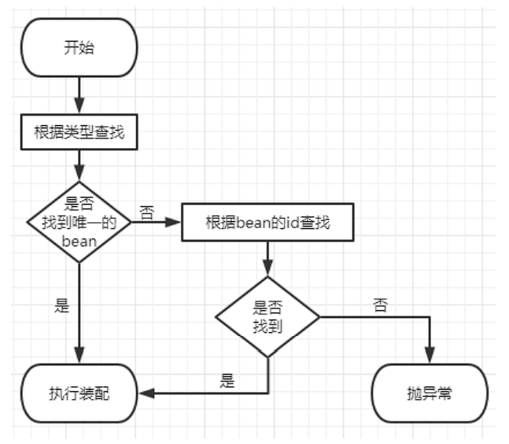

- 首先根据所需要的组件类型到IOC容器中查找
  - 能够找到唯一的bean：直接执行装配
  - 如果完全找不到匹配这个类型的bean：装配失败
  - 和所需类型匹配的bean不止一个
    - ​	没有@Qualifier注解：根据@Autowired标记位置成员变量的变量名作为bean的id进行 匹配
      - 能够找到：执行装配
      - 找不到：装配失败
    - 使用@Qualifier注解：根据@Qualifier注解中指定的名称作为bean的id进行匹配
      - 能够找到：执行装配
      - 找不到：装配失败

```java
@Controller
public class UserController {
@Autowired
@Qualifier("userServiceImpl")
private UserService userService;
public void saveUser(){
userService.saveUser();
}
}
```

> @Autowired中有属性required，默认值为true，因此在自动装配无法找到相应的bean时，会装配失败
>
> 可以将属性required的值设置为true，则表示能装就装，装不上就不装，此时自动装配的属性为默认值
>
> 但是实际开发时，基本上所有需要装配组件的地方都是必须装配的，用不上这个属性。

###### 18、@autowired和@resource的区别

 @Autowired 是Spring提供的，@Resource 是[J2EE](https://so.csdn.net/so/search?q=J2EE&spm=1001.2101.3001.7020)提供的。

 @Autowired只按type装配,@Resource默认是按name装配。

@Resource（这个注解属于J2EE的），默认按照名称进行装配，名称可以通过name属性进行指定，如果没有指定name属性，当注解写在字段上时，默认取字段名进行安装名称查找，如果注解写在setter方法上默认取属性名进行装配。当找不到与名称匹配的bean时才按照类型进行装配。但是需要注意的是，如果name属性一旦指定，就只会按照名称进行装配。

推荐使用：@Resource注解在字段上，这样就不用写setter方法了，并且这个注解是属于J2EE的，减少了与spring的耦合。这样代码看起就比较优雅。

###### 19、AOP

AOP(Aspect Oriented Programming)它是面 向对象编程的一种补充和完善，它以通过预编译方式和运行期动态代理方式实现在不修改源代码的情况 下给程序动态统一添加额外功能的一种技术。

- 添加依赖

```xml
<!-- spring-aspects会帮我们传递过来aspectjweaver -->
<dependency>
<groupId>org.springframework</groupId>
<artifactId>spring-aspects</artifactId>
<version>5.3.1</version>
</dependency>
```

- 创建切面配置类

```java
// @Aspect表示这个类是一个切面类
@Aspect
// @Component注解保证这个切面类能够放入IOC容器
@Component
public class LogAspect {
@Before("execution(public int com.atguigu.aop.annotation.CalculatorImpl.*
(..))")
public void beforeMethod(JoinPoint joinPoint){
String methodName = joinPoint.getSignature().getName();
String args = Arrays.toString(joinPoint.getArgs());
System.out.println("Logger-->前置通知，方法名："+methodName+"，参
数："+args);
}
@After("execution(* com.atguigu.aop.annotation.CalculatorImpl.*(..))")
public void afterMethod(JoinPoint joinPoint){
String methodName = joinPoint.getSignature().getName();
System.out.println("Logger-->后置通知，方法名："+methodName);
}
@AfterReturning(value = "execution(*
com.atguigu.aop.annotation.CalculatorImpl.*(..))", returning = "result")
public void afterReturningMethod(JoinPoint joinPoint, Object result){
String methodName = joinPoint.getSignature().getName();
System.out.println("Logger-->返回通知，方法名："+methodName+"，结
果："+result);
}
@AfterThrowing(value = "execution(*
com.atguigu.aop.annotation.CalculatorImpl.*(..))", throwing = "ex")
public void afterThrowingMethod(JoinPoint joinPoint, Throwable ex){
String methodName = joinPoint.getSignature().getName();
System.out.println("Logger-->异常通知，方法名："+methodName+"，异常："+ex);
}
@Around("execution(* com.atguigu.aop.annotation.CalculatorImpl.*(..))")
public Object aroundMethod(ProceedingJoinPoint joinPoint){
String methodName = joinPoint.getSignature().getName();
String args = Arrays.toString(joinPoint.getArgs());
Object result = null;
try {
System.out.println("环绕通知-->目标对象方法执行之前");
//目标对象（连接点）方法的执行
result = joinPoint.proceed();
System.out.println("环绕通知-->目标对象方法返回值之后");
} catch (Throwable throwable) {
throwable.printStackTrace();
System.out.println("环绕通知-->目标对象方法出现异常时");
} finally {
System.out.println("环绕通知-->目标对象方法执行完毕");
}
return result;
}
}
```

- 在spring中的配置

  ```xml
  <!--
  基于注解的AOP的实现：
  1、将目标对象和切面交给IOC容器管理（注解+扫描）
  2、开启AspectJ的自动代理，为目标对象自动生成代理
  3、将切面类通过注解@Aspect标识
  -->
  <context:component-scan base-package="com.atguigu.aop.annotation">
  </context:component-scan>
  <aop:aspectj-autoproxy />
  ```

  

###### 20、AOP的通知详情

- 前置通知：使用@Before注解标识，在被代理的目标方法前执行
- 返回通知：使用@AfterReturning注解标识，在被代理的目标方法成功结束后执行（寿终正寝）
- 异常通知：使用@AfterThrowing注解标识，在被代理的目标方法异常结束后执行（死于非命）
- 后置通知：使用@After注解标识，在被代理的目标方法最终结束后执行（盖棺定论）
- 环绕通知：使用@Around注解标识，使用try...catch...finally结构围绕整个被代理的目标方法，包 括上面四种通知对应的所有位置

###### 21、AOP注解在方法上面的方式

- 声明

```java
@Pointcut("execution(* com.atguigu.aop.annotation.*.*(..))")
public void pointCut(){}
```

- 在同一个切面中使用

```java
@Before("pointCut()")
public void beforeMethod(JoinPoint joinPoint){
String methodName = joinPoint.getSignature().getName();
String args = Arrays.toString(joinPoint.getArgs());
System.out.println("Logger-->前置通知，方法名："+methodName+"，参数："+args);
}
```

- 在不同切面中使用

```java
@Before("com.atguigu.aop.CommonPointCut.pointCut()")
public void beforeMethod(JoinPoint joinPoint){
String methodName = joinPoint.getSignature().getName();
String args = Arrays.toString(joinPoint.getArgs());
System.out.println("Logger-->前置通知，方法名："+methodName+"，参数："+args);
}
```

example

```java
@Around("execution(* com.atguigu.aop.annotation.CalculatorImpl.*(..))")
public Object aroundMethod(ProceedingJoinPoint joinPoint){
String methodName = joinPoint.getSignature().getName();
String args = Arrays.toString(joinPoint.getArgs());
Object result = null;
try {
System.out.println("环绕通知-->目标对象方法执行之前");
//目标方法的执行，目标方法的返回值一定要返回给外界调用者
result = joinPoint.proceed();
System.out.println("环绕通知-->目标对象方法返回值之后");
} catch (Throwable throwable) {
throwable.printStackTrace();
System.out.println("环绕通知-->目标对象方法出现异常时");
} finally {
System.out.println("环绕通知-->目标对象方法执行完毕");
}
return result;
}
```

###### 22、切面的优先级

相同目标方法上同时存在多个切面时，切面的优先级控制切面的内外嵌套顺序。

- 优先级高的切面：外面
- 优先级低的切面：里面

使用@Order注解可以控制切面的优先级：

- @Order(较小的数)：优先级高
- @Order(较大的数)：优先级低

###### 23、编程式事务

```java
Connection conn = ...;
try {
// 开启事务：关闭事务的自动提交
conn.setAutoCommit(false);
// 核心操作
// 提交事务
conn.commit();
}catch(Exception e){
// 回滚事务
conn.rollBack();
}finally{
// 释放数据库连接
conn.close();
}
```

###### 24、声明式事务

- 加入依赖

```xml
<dependencies>
<!-- 基于Maven依赖传递性，导入spring-context依赖即可导入当前所需所有jar包 -->
<dependency>
<groupId>org.springframework</groupId>
<artifactId>spring-context</artifactId>
<version>5.3.1</version>
</dependency>
<!-- Spring 持久化层支持jar包 -->
<!-- Spring 在执行持久化层操作、与持久化层技术进行整合过程中，需要使用orm、jdbc、tx三个
jar包 -->
<!-- 导入 orm 包就可以通过 Maven 的依赖传递性把其他两个也导入 -->
<dependency>
<groupId>org.springframework</groupId>
<artifactId>spring-orm</artifactId>
<version>5.3.1</version>
</dependency>
<!-- Spring 测试相关 -->
<dependency>
<groupId>org.springframework</groupId>
<artifactId>spring-test</artifactId>
<version>5.3.1</version>
</dependency>
<!-- junit测试 -->
<dependency>
<groupId>junit</groupId>
<artifactId>junit</artifactId>
<version>4.12</version>
<scope>test</scope>
</dependency>
<!-- MySQL驱动 -->
<dependency>
<groupId>mysql</groupId>
<artifactId>mysql-connector-java</artifactId>
<version>8.0.16</version>
</dependency>
<!-- 数据源 -->
<dependency>
<groupId>com.alibaba</groupId>
<artifactId>druid</artifactId>
<version>1.0.31</version>
</dependency>
</dependencies>
```

- 创建jdbc.propeties

```properties
jdbc.user=root
jdbc.password=atguigu
jdbc.url=jdbc:mysql://localhost:3306/ssm?serverTimezone=UTC
jdbc.driver=com.mysql.cj.jdbc.Driver
```

- 创建Spirng的配置文件

```xml
<!--扫描组件-->
<context:component-scan base-package="com.atguigu.spring.tx.annotation">
</context:component-scan>
<!-- 导入外部属性文件 -->
<context:property-placeholder location="classpath:jdbc.properties" />
<!-- 配置数据源 -->
<bean id="druidDataSource" class="com.alibaba.druid.pool.DruidDataSource">
<property name="url" value="${jdbc.url}"/>
<property name="driverClassName" value="${jdbc.driver}"/>
<property name="username" value="${jdbc.username}"/>
<property name="password" value="${jdbc.password}"/>
</bean>
<!-- 配置 JdbcTemplate -->
<bean id="jdbcTemplate" class="org.springframework.jdbc.core.JdbcTemplate">
<!-- 装配数据源 -->
<property name="dataSource" ref="druidDataSource"/>
</bean>
```

###### 25、例子

```java
@Controller
public class BookController {
@Autowired
private BookService bookService;
public void buyBook(Integer bookId, Integer userId){
bookService.buyBook(bookId, userId);
}
}
```

```java
@Service
public class BookServiceImpl implements BookService {
@Autowired
private BookDao bookDao;
@Override
public void buyBook(Integer bookId, Integer userId) {
//查询图书的价格
Integer price = bookDao.getPriceByBookId(bookId);
//更新图书的库存
bookDao.updateStock(bookId);
//更新用户的余额
bookDao.updateBalance(userId, price);
}
}
```

```java
public interface BookDao {
Integer getPriceByBookId(Integer bookId);
void updateStock(Integer bookId);
void updateBalance(Integer userId, Integer price);
}
```

```java
@Repository
public class BookDaoImpl implements BookDao {
@Autowired
private JdbcTemplate jdbcTemplate;
@Override
public Integer getPriceByBookId(Integer bookId) {
String sql = "select price from t_book where book_id = ?";
return jdbcTemplate.queryForObject(sql, Integer.class, bookId);
}
@Override
public void updateStock(Integer bookId) {
String sql = "update t_book set stock = stock - 1 where book_id = ?";
jdbcTemplate.update(sql, bookId);
}
@Override
public void updateBalance(Integer userId, Integer price) {
String sql = "update t_user set balance = balance - ? where user_id =
?";
jdbcTemplate.update(sql, price, userId);
}
}
```

- 测试无事务情况

```java
@RunWith(SpringJUnit4ClassRunner.class)
@ContextConfiguration("classpath:tx-annotation.xml")
public class TxByAnnotationTest {
@Autowired
private BookController bookController;
@Test
public void testBuyBook(){
bookController.buyBook(1, 1);
}
}
```

- 加入事务

```xml
<bean id="transactionManager"
class="org.springframework.jdbc.datasource.DataSourceTransactionManager">
<property name="dataSource" ref="dataSource"></property>
</bean>
<!--
开启事务的注解驱动
通过注解@Transactional所标识的方法或标识的类中所有的方法，都会被事务管理器管理事务
-->
<!-- transaction-manager属性的默认值是transactionManager，如果事务管理器bean的id正好就
是这个默认值，则可以省略这个属性 -->
<tx:annotation-driven transaction-manager="transactionManager" />
```

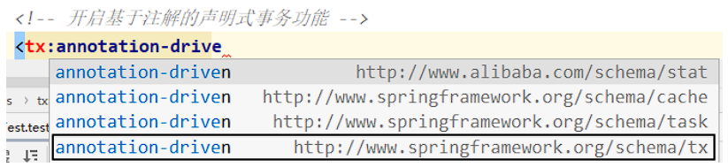

1. 添加事务注解

   因为service层表示业务逻辑层，一个方法表示一个完成的功能，因此处理事务一般在service层处理 

   在BookServiceImpl的buybook()添加注解@Transactional

​	2.@Transactional注解标识的位置

​	@Transactional标识在方法上，咋只会影响该方法 @Transactional标识的类上，咋会影响类中所有的方法

###### 26、有关事务属性

- 使用方法

  只读

  ```java
  @Transactional(readOnly = true)
  public void buyBook(Integer bookId, Integer userId) {
  //查询图书的价格
  Integer price = bookDao.getPriceByBookId(bookId);
  //更新图书的库存
  bookDao.updateStock(bookId);
  //更新用户的余额
  bookDao.updateBalance(userId, price);
  //System.out.println(1/0);
  }
  ```

  超时

  ```java
  @Transactional(timeout = 3)
  public void buyBook(Integer bookId, Integer userId) {
  try {
  TimeUnit.SECONDS.sleep(5);
  } catch (InterruptedException e) {
  e.printStackTrace();
  }
  //查询图书的价格
  Integer price = bookDao.getPriceByBookId(bookId);
  //更新图书的库存
  bookDao.updateStock(bookId);
  //更新用户的余额
  bookDao.updateBalance(userId, price);
  //System.out.println(1/0);
  }
  ```

  回滚策略

  ```java
  @Transactional(noRollbackFor = ArithmeticException.class)
  //@Transactional(noRollbackForClassName = "java.lang.ArithmeticException")
  public void buyBook(Integer bookId, Integer userId) {
  //查询图书的价格
  Integer price = bookDao.getPriceByBookId(bookId);
  //更新图书的库存
  bookDao.updateStock(bookId);
  //更新用户的余额
  bookDao.updateBalance(userId, price);
  System.out.println(1/0);
  }
  ```

###### 27、事务的隔离等级

- 读未提交：READ UNCOMMITTED 允许Transaction01读取Transaction02未提交的修改。
- 读已提交：READ COMMITTED、 要求Transaction01只能读取Transaction02已提交的修改。
- 可重复读：REPEATABLE READ 确保Transaction01可以多次从一个字段中读取到相同的值，即Transaction01执行期间禁止其它 事务对这个字段进行更新。
- 串行化：SERIALIZABLE 确保Transaction01可以多次从一个表中读取到相同的行，在Transaction01执行期间，禁止其它 事务对这个表进行添加、更新、删除操作。可以避免任何并发问题，但性能十分低下。

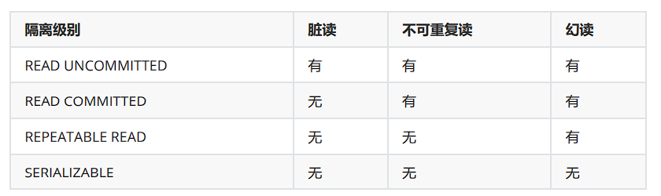

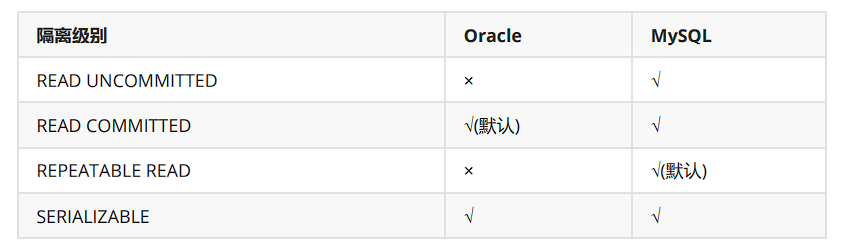

```java
@Transactional(isolation = Isolation.DEFAULT)//使用数据库默认的隔离级别
@Transactional(isolation = Isolation.READ_UNCOMMITTED)//读未提交
@Transactional(isolation = Isolation.READ_COMMITTED)//读已提交
@Transactional(isolation = Isolation.REPEATABLE_READ)//可重复读
@Transactional(isolation = Isolation.SERIALIZABLE)//串行化
```

###### 28、基于XML的声明式事务

- 修改Spring配置文件

将Spring配置文件中去掉tx:annotation-driven 标签，并添加配置：

```xml
<aop:config>
<!-- 配置事务通知和切入点表达式 -->
<aop:advisor advice-ref="txAdvice" pointcut="execution(*
com.atguigu.spring.tx.xml.service.impl.*.*(..))"></aop:advisor>
</aop:config>
<!-- tx:advice标签：配置事务通知 -->
<!-- id属性：给事务通知标签设置唯一标识，便于引用 -->
<!-- transaction-manager属性：关联事务管理器 -->
<tx:advice id="txAdvice" transaction-manager="transactionManager">
<tx:attributes>
<!-- tx:method标签：配置具体的事务方法 -->
<!-- name属性：指定方法名，可以使用星号代表多个字符 -->
<tx:method name="get*" read-only="true"/>
<tx:method name="query*" read-only="true"/>
<tx:method name="find*" read-only="true"/>
<!-- read-only属性：设置只读属性 -->
<!-- rollback-for属性：设置回滚的异常 -->
<!-- no-rollback-for属性：设置不回滚的异常 -->
<!-- isolation属性：设置事务的隔离级别 -->
<!-- timeout属性：设置事务的超时属性 -->
<!-- propagation属性：设置事务的传播行为 -->
<tx:method name="save*" read-only="false" rollback-for="java.lang.Exception" propagation="REQUIRES_NEW"/>
<tx:method name="update*" read-only="false" rollback-for="java.lang.Exception" propagation="REQUIRES_NEW"/>
<tx:method name="delete*" read-only="false" rollback-for="java.lang.Exception" propagation="REQUIRES_NEW"/>
</tx:attributes>
</tx:advice>
```

> 注意：基于XML实现的声明式事务，必须引入aspectJ的依赖

```xml
<dependency>
<groupId>org.springframework</groupId>
<artifactId>spring-aspects</artifactId>
<version>5.3.1</version>
</dependency>
```

——————————————————————————————SpringMVC————————————————————————————————————

# SpringMVC

###### 1、配置web.xml

注册SpringMVC的前端控制器DispatcherServlet

此配置作用下，SpringMVC的配置文件默认位于WEB-INF下，默认名称为- servlet.xml，例如，以下配置所对应SpringMVC的配置文件位于WEB-INF下，文件名为springMVCservlet.xml

```xml
<!-- 配置SpringMVC的前端控制器，对浏览器发送的请求统一进行处理 -->
<servlet>
<servlet-name>springMVC</servlet-name>
<servlet-class>org.springframework.web.servlet.DispatcherServlet</servlet-class>
</servlet>
<servlet-mapping>
<servlet-name>springMVC</servlet-name>
<!--
设置springMVC的核心控制器所能处理的请求的请求路径
/所匹配的请求可以是/login或.html或.js或.css方式的请求路径
但是/不能匹配.jsp请求路径的请求
-->
<url-pattern>/</url-pattern>
</servlet-mapping>
```

- 扩展配置方式

  可通过init-param标签设置SpringMVC配置文件的位置和名称，通过load-on-startup标签设置 SpringMVC前端控制器DispatcherServlet的初始化时间

  ```xml
  <!-- 配置SpringMVC的前端控制器，对浏览器发送的请求统一进行处理 -->
  <servlet>
  <servlet-name>springMVC</servlet-name>
  <servlet-class>org.springframework.web.servlet.DispatcherServlet</servlet-class>
  <!-- 通过初始化参数指定SpringMVC配置文件的位置和名称 -->
  <init-param>
  <!-- contextConfigLocation为固定值 -->
  <param-name>contextConfigLocation</param-name>
  <!-- 使用classpath:表示从类路径查找配置文件，例如maven工程中的
  src/main/resources -->
  <param-value>classpath:springMVC.xml</param-value>
  </init-param>
  <!--
  作为框架的核心组件，在启动过程中有大量的初始化操作要做
  而这些操作放在第一次请求时才执行会严重影响访问速度
  因此需要通过此标签将启动控制DispatcherServlet的初始化时间提前到服务器启动时
  -->
  <load-on-startup>1</load-on-startup>
  </servlet>
  <servlet-mapping>
  <servlet-name>springMVC</servlet-name>
  <!--
  设置springMVC的核心控制器所能处理的请求的请求路径
  /所匹配的请求可以是/login或.html或.js或.css方式的请求路径
  但是/不能匹配.jsp请求路径的请求
  -->
  <url-pattern>/</url-pattern>
  </servlet-mapping>
  ```

###### 2、创建SpringMVC的配置文件

```xml
<!-- 自动扫描包 -->
<context:component-scan base-package="com.atguigu.mvc.controller"/>
<!-- 配置Thymeleaf视图解析器 -->
<bean id="viewResolver"
class="org.thymeleaf.spring5.view.ThymeleafViewResolver">
<property name="order" value="1"/>
<property name="characterEncoding" value="UTF-8"/>
<property name="templateEngine">
<bean class="org.thymeleaf.spring5.SpringTemplateEngine">
<property name="templateResolver">
<bean
class="org.thymeleaf.spring5.templateresolver.SpringResourceTemplateResolver">
<!-- 视图前缀 -->
<property name="prefix" value="/WEB-INF/templates/"/>
<!-- 视图后缀 -->
<property name="suffix" value=".html"/>
<property name="templateMode" value="HTML5"/>
<property name="characterEncoding" value="UTF-8" />
</bean>
</property>
</bean>
</property>
</bean>
<!--
处理静态资源，例如html、js、css、jpg
若只设置该标签，则只能访问静态资源，其他请求则无法访问
此时必须设置<mvc:annotation-driven/>解决问题
-->
<mvc:default-servlet-handler/>
<!-- 开启mvc注解驱动 -->
<mvc:annotation-driven>
<mvc:message-converters>
<!-- 处理响应中文内容乱码 -->
<bean
class="org.springframework.http.converter.StringHttpMessageConverter">
<property name="defaultCharset" value="UTF-8" />
<property name="supportedMediaTypes">
<list>
<value>text/html</value>
<value>application/json</value>
</list>
</property>
</bean>
</mvc:message-converters>
</mvc:annotation-driven>
```

总结：浏览器发送请求，若请求地址符合前端控制器的url-pattern，该请求就会被前端控制器 DispatcherServlet处理。前端控制器会读取SpringMVC的核心配置文件，通过扫描组件找到控制器， 将请求地址和控制器中@RequestMapping注解的value属性值进行匹配，若匹配成功，该注解所标识的 控制器方法就是处理请求的方法。处理请求的方法需要返回一个字符串类型的视图名称，该视图名称会 被视图解析器解析，加上前缀和后缀组成视图的路径，通过Thymeleaf对视图进行渲染，最终转发到视 图所对应页面。

###### 3、@RequestMapping注解

- ​	@RequestMapping注解的功能

  从注解名称上我们可以看到，@RequestMapping注解的作用就是将请求和处理请求的控制器方法关联起来，建立映射关系。 SpringMVC 接收到指定的请求，就会来找到在映射关系中对应的控制器方法来处理这个请求。

- @RequestMapping注解的位置

  @RequestMapping标识一个类：设置映射请求的请求路径的初始信息

   @RequestMapping标识一个方法：设置映射请求请求路径的具体信息

```java
@Controller
@RequestMapping("/test")
public class RequestMappingController {
//此时请求映射所映射的请求的请求路径为：/test/testRequestMapping
@RequestMapping("/testRequestMapping")
public String testRequestMapping(){
return "success";
}
}
```

> 注： 1、对于处理指定请求方式的控制器方法，SpringMVC中提供了@RequestMapping的派生注解
>
>  处理get请求的映射-->@GetMapping 
>
> 处理post请求的映射-->@PostMapping 
>
> 处理put请求的映射-->@PutMapping 
>
> 处理delete请求的映射-->@DeleteMapping 
>
> 2、常用的请求方式有get，post，put，delete 
>
> 但是目前浏览器只支持get和post，若在form表单提交时，为method设置了其他请求方式的字符串（put或delete），则按照默认的请求方式get处理 
>
> 若要发送put和delete请求，则需要通过spring提供的过滤器HiddenHttpMethodFilter，在 RESTful部分会讲到

###### 4、SpringMVC支持路径中的占位符

原始方式：/deleteUser?id=1

rest方式：/user/delete/1

SpringMVC路径中的占位符常用于RESTful风格中，当请求路径中将某些数据通过路径的方式传输到服务器中，就可以在相应的@RequestMapping注解的value属性中通过占位符{xxx}表示传输的数据，在通过@PathVariable注解，将占位符所表示的数据赋值给控制器方法的形参

example:

```xml
<a th:href="@{/testRest/1/admin}">测试路径中的占位符-->/testRest</a><br>
```

```java
@RequestMapping("/testRest/{id}/{username}")
public String testRest(@PathVariable("id") String id, @PathVariable("username")
String username){
System.out.println("id:"+id+",username:"+username);
return "success";
}
//最终输出的内容为-->id:1,username:admin
```

###### 5、SpringMVC获取请求参数

- 方式一：使用原生的ServletAPI获取

  ```java
  @RequestMapping("/testParam")
  public String testParam(HttpServletRequest request){
  String username = request.getParameter("username");
  String password = request.getParameter("password");
  System.out.println("username:"+username+",password:"+password);
  return "success";
  }
  ```

- 方式二：通过控制器方法的形参获取请求参数

  ```xml
  <a th:href="@{/testParam(username='admin',password=123456)}">测试获取请求参数--
  >/testParam</a><br>
  ```

  ```java
  @RequestMapping("/testParam")
  public String testParam(String username, String password){
  System.out.println("username:"+username+",password:"+password);
  return "success";
  }
  ```

- 方式三：@RequestParam

  @RequestParam是将请求参数和控制器方法的形参创建映射关系 

  @RequestParam注解一共有三个属性：

   value：指定为形参赋值的请求参数的参数名 

  required：设置是否必须传输此请求参数，默认值为true 

  若设置为true时，则当前请求必须传输value所指定的请求参数，若没有传输该请求参数，且没有设置 defaultValue属性，则页面报错400：Required String parameter 'xxx' is not present；若设置为 false，则当前请求不是必须传输value所指定的请求参数，若没有传输，则注解所标识的形参的值为 null 

  defaultValue：不管required属性值为true或false，当value所指定的请求参数没有传输或传输的值 为""时，则使用默认值为形参赋值。

- 方式四：@RequestHeader、@CookieValue

  @RequestHeader注解一共有三个属性：value、required、defaultValue，用法同@RequestParam

  @CookieValue注解一共有三个属性：value、required、defaultValue，用法同@RequestParam

- 方式五：通过POJO获取请求参数

  可以在控制器方法的形参位置设置一个实体类类型的形参，此时若浏览器传输的请求参数的参数名和实体类中的属性名一致，那么请求参数就会为此属性赋值

```xml
<form th:action="@{/testpojo}" method="post">
用户名：<input type="text" name="username"><br>
密码：<input type="password" name="password"><br>
性别：<input type="radio" name="sex" value="男">男<input type="radio"
name="sex" value="女">女<br>
年龄：<input type="text" name="age"><br>
邮箱：<input type="text" name="email"><br>
<input type="submit">
</form>
```

```java
@RequestMapping("/testpojo")
public String testPOJO(User user){
System.out.println(user);
return "success";
}
//最终结果-->User{id=null, username='张三', password='123', age=23, sex='男',email='123@qq.com'}

```

###### 6、域对象共享数据

- 使用ServletAPI向request域对象共享数据

  ```java
  @RequestMapping("/testServletAPI")
  public String testServletAPI(HttpServletRequest request){
  request.setAttribute("testScope", "hello,servletAPI");
  return "success";
  }
  ```

- 使用ModelAndView向request域对象共享数据

  ```java
  @RequestMapping("/testModelAndView")
  public ModelAndView testModelAndView(){
  /**
  * ModelAndView有Model和View的功能
  * Model主要用于向请求域共享数据
  * View主要用于设置视图，实现页面跳转
  */
  ModelAndView mav = new ModelAndView();
  //向请求域共享数据
  mav.addObject("testScope", "hello,ModelAndView");
  //设置视图，实现页面跳转
  mav.setViewName("success");
  return mav;
  }
  ```

- 使用Model向request域对象共享数据

  ```java
  @RequestMapping("/testModel")
  public String testModel(Model model){
  model.addAttribute("testScope", "hello,Model");
  return "success";
  }
  ```

- 使用map向request域对象共享数据

  ```java
  @RequestMapping("/testMap")
  public String testMap(Map<String, Object> map){
  map.put("testScope", "hello,Map");
  return "success";
  }
  ```

- 使用ModelMap向request域对象共享数据

  ```java
  @RequestMapping("/testModelMap")
  public String testModelMap(ModelMap modelMap){
  modelMap.addAttribute("testScope", "hello,ModelMap");
  return "success";
  }
  ```

- Model、ModelMap、Map的关系

  Model、ModelMap、Map类型的参数其实本质上都是 BindingAwareModelMap 类型的

  ```java
  public interface Model{}
  public class ModelMap extends LinkedHashMap<String, Object> {}
  public class ExtendedModelMap extends ModelMap implements Model {}
  public class BindingAwareModelMap extends ExtendedModelMap {}
  ```

- 向session域共享数据

  ```java
  @RequestMapping("/testSession")
  public String testSession(HttpSession session){
  session.setAttribute("testSessionScope", "hello,session");
  return "success";
  }
  ```

- 向application域共享数据

  ```java
  @RequestMapping("/testApplication")
  public String testApplication(HttpSession session){
  ServletContext application = session.getServletContext();
  application.setAttribute("testApplicationScope", "hello,application");
  return "success";
  }
  ```

###### 7、SpringMVC的视图

SpringMVC中的视图是View接口，视图的作用渲染数据，将模型Model中的数据展示给用户

SpringMVC视图的种类很多，默认有转发视图和重定向视图

当工程引入jstl的依赖，转发视图会自动转换为JstlView 若使用的视图技术为Thymeleaf，在SpringMVC的配置文件中配置了Thymeleaf的视图解析器，由此视 图解析器解析之后所得到的是ThymeleafView

- ThymeleafView

  当控制器方法中所设置的视图名称没有任何前缀时，此时的视图名称会被SpringMVC配置文件中所配置 的视图解析器解析，视图名称拼接视图前缀和视图

  后缀所得到的最终路径，会通过转发的方式实现跳转

  ```java
  @RequestMapping("/testHello")
  public String testHello(){
  return "hello";
  }
  ```

  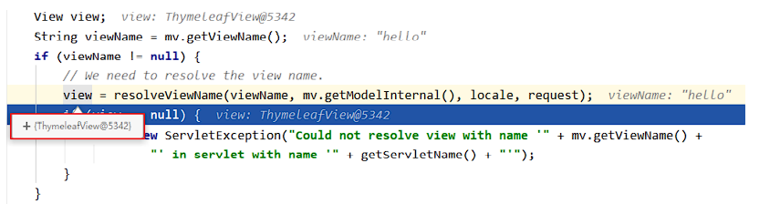

- 转发视图

  SpringMVC中默认的转发视图是InternalResourceView

   SpringMVC中创建转发视图的情况：

   当控制器方法中所设置的视图名称以"forward:"为前缀时，创建InternalResourceView视图，此时的视图名称不会被SpringMVC配置文件中所配置的视图解析器解析，而是会将前缀"forward:"去掉，剩余部 分作为最终路径通过转发的方式实现跳转

   例如"forward:/"，"forward:/employee"

```java
@RequestMapping("/testForward")
public String testForward(){
return "forward:/testHello";
}
```

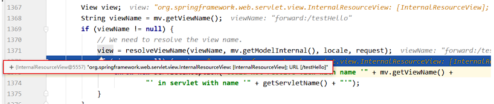

- 重定向视图

  SpringMVC中默认的重定向视图是RedirectView

  当控制器方法中所设置的视图名称以"redirect:"为前缀时，创建RedirectView视图，此时的视图名称不 会被SpringMVC配置文件中所配置的视图解析器解析，而是会将前缀"redirect:"去掉，剩余部分作为最 终路径通过重定向的方式实现跳转

  例如"redirect:/"，"redirect:/employee

  ```java
  @RequestMapping("/testRedirect")
  public String testRedirect(){
  return "redirect:/testHello";
  }
  ```

###### 8、Restful

REST：Representational State Transfer，表现层资源状态转移。

- Restful的规则

具体说，就是 HTTP 协议里面，四个表示操作方式的动词：GET、POST、PUT、DELETE。

它们分别对应四种基本操作：GET 用来获取资源，POST 用来新建资源，PUT 用来更新资源，DELETE 用来删除资源。

REST 风格提倡 URL 地址使用统一的风格设计，从前到后各个单词使用斜杠分开，不使用问号键值对方 式携带请求参数，而是将要发送给服务器的数据作为 URL 地址的一部分，以保证整体风格的一致性。

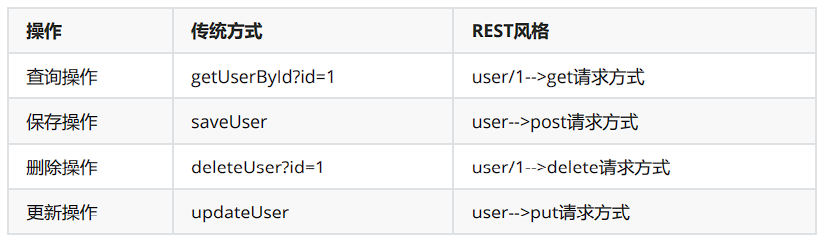

POST:增  DELETE:删 PUT：改 GET:查

###### 9、在浏览器中发送PUT和DELETE方式的请求

由于浏览器只支持发送get和post方式的请求，那么该如何发送put和delete请求呢？ 

SpringMVC 提供了 HiddenHttpMethodFilter 帮助我们将 POST 请求转换为 DELETE 或 PUT 请求 HiddenHttpMethodFilter 处理put和delete请求的条件：

 a>当前请求的请求方式必须为post

 b>当前请求必须传输请求参数_method _

_满足以上条件，HiddenHttpMethodFilter 过滤器就会将当前请求的请求方式转换为请求参数 _method的值，因此请求参数_method的值才是最终的请求方式

 在web.xml中注册HiddenHttpMethodFilter

```xml
<filter>
<filter-name>HiddenHttpMethodFilter</filter-name>
<filter-class>org.springframework.web.filter.HiddenHttpMethodFilter</filterclass>
</filter>
<filter-mapping>
<filter-name>HiddenHttpMethodFilter</filter-name>
<url-pattern>/*</url-pattern>
</filter-mapping>
```

> 注：
>
> 目前为止，SpringMVC中提供了两个过滤器：CharacterEncodingFilter和 HiddenHttpMethodFilter 在web.xml中注册时，必须先注册CharacterEncodingFilter，再注册HiddenHttpMethodFilter 原因：
>
> - 在 CharacterEncodingFilter 中通过 request.setCharacterEncoding(encoding) 方法设置字 符集的
>
> - request.setCharacterEncoding(encoding) 方法要求前面不能有任何获取请求参数的操作
>
> - 而 HiddenHttpMethodFilter 恰恰有一个获取请求方式的操作：
>
> - ```java
>   String paramValue = request.getParameter(this.methodParam);
>   ```

###### 10、SpringMVC处理ajax请求

- @RequestBody

  @RequestBody可以获取请求体信息，使用@RequestBody注解标识控制器方法的形参，当前请求的请求体就会为当前注解所标识的形参赋值

```xml
<!--此时必须使用post请求方式，因为get请求没有请求体-->
<form th:action="@{/test/RequestBody}" method="post">
用户名：<input type="text" name="username"><br>
密码：<input type="password" name="password"><br>
<input type="submit">
</form>
```

```java
@RequestMapping("/test/RequestBody")
public String testRequestBody(@RequestBody String requestBody){
System.out.println("requestBody:"+requestBody);
return "success";
}
```

输入结果：

requestBody:username=admin&password=123456

- @RequestBody获取json格式的请求参数

  > 在使用了axios发送ajax请求之后，浏览器发送到服务器的请求参数有两种格式： 
  >
  > 1、name=value&name=value...，此时的请求参数可以通过request.getParameter()获取，对应 SpringMVC中，可以直接通过控制器方法的形参获取此类请求参数
  >
  > 2、{key:value,key:value,...}，此时无法通过request.getParameter()获取，之前我们使用操作 json的相关jar包gson或jackson处理此类请求参数，可以将其转换为指定的实体类对象或map集 合。在SpringMVC中，直接使用@RequestBody注解标识控制器方法的形参即可将此类请求参数 转换为java对象

  - 怎么样使用jackson

    1. 导入jackson依赖

    ```xml
    <dependency>
    <groupId>com.fasterxml.jackson.core</groupId>
    <artifactId>jackson-databind</artifactId>
    <version>2.12.1</version>
    </dependency>
    ```

    ​	2.在SpringMVC的配置文件中，开启mvc注解驱动

    ```xml
    <!--开启mvc的注解驱动-->
    <mvc:annotation-driven />
    ```

    ​	3.在控制器方法的形参位置，设置json格式的请求参数要转换成的java类型（实体类或map）的参 数，并使用@RequestBody注解标识

    ```html
    <input type="button" value="测试@RequestBody获取json格式的请求参数"
    @click="testRequestBody()"><br>
    <script type="text/javascript" th:src="@{/js/vue.js}"></script>
    <script type="text/javascript" th:src="@{/js/axios.min.js}"></script>
    <script type="text/javascript">
    var vue = new Vue({
    el:"#app",
    methods:{
    testRequestBody(){
    axios.post(
    "/SpringMVC/test/RequestBody/json",
    {username:"admin",password:"123456"}
    ).then(response=>{
    console.log(response.data);
    });
    }
    }
    });
    </script>
    ```

    ```java
    //将json格式的数据转换为map集合
    @RequestMapping("/test/RequestBody/json")
    public void testRequestBody(@RequestBody Map<String, Object> map,
    HttpServletResponse response) throws IOException {
    System.out.println(map);
    //{username=admin, password=123456}
    response.getWriter().print("hello,axios");
    }
    //将json格式的数据转换为实体类对象
    @RequestMapping("/test/RequestBody/json")public void testRequestBody(@RequestBody User user, HttpServletResponse
    response) throws IOException {
    System.out.println(user);
    //User{id=null, username='admin', password='123456', age=null,
    gender='null'}
    response.getWriter().print("hello,axios");
    }
    ```

  ###### 11、@ResponseBody

  @ResponseBody用于标识一个控制器方法，可以将该方法的返回值直接作为响应报文的响应体响应到 浏览器

  ```java
  @RequestMapping("/testResponseBody")
  public String testResponseBody(){
  //此时会跳转到逻辑视图success所对应的页面
  return "success";
  }
  @RequestMapping("/testResponseBody")
  @ResponseBody
  public String testResponseBody(){
  //此时响应浏览器数据success
  return "success";
  }
  ```

###### 12、@ResponseBody响应浏览器json数据

- 导入jackson的依赖

```xml
<dependency>
<groupId>com.fasterxml.jackson.core</groupId>
<artifactId>jackson-databind</artifactId>
<version>2.12.1</version>
</dependency>
```

- 开启SpringMVC的配置文件开启mvc的注解驱动

```xml
<!--开启mvc的注解驱动-->
<mvc:annotation-driven />
```

- 使用@ResponseBody注解标识控制器方法，在方法中，将需要转换为json字符串并响应到浏览器 的java对象作为控制器方法的返回值，此时SpringMVC就可以将此对象直接转换为json字符串并响应到 浏览器

```xml
<input type="button" value="测试@ResponseBody响应浏览器json格式的数据"
@click="testResponseBody()"><br>
<script type="text/javascript" th:src="@{/js/vue.js}"></script>
<script type="text/javascript" th:src="@{/js/axios.min.js}"></script>
<script type="text/javascript">
var vue = new Vue({
el:"#app",
methods:{
testResponseBody(){
axios.post("/SpringMVC/test/ResponseBody/json").then(response=>{
console.log(response.data);
});
}
}
});
</script>
```

```java
//响应浏览器list集合
@RequestMapping("/test/ResponseBody/json")
@ResponseBody
public List<User> testResponseBody(){
User user1 = new User(1001,"admin1","123456",23,"男");
User user2 = new User(1002,"admin2","123456",23,"男");
User user3 = new User(1003,"admin3","123456",23,"男");
List<User> list = Arrays.asList(user1, user2, user3);
return list;
}
//响应浏览器map集合
@RequestMapping("/test/ResponseBody/json")
@ResponseBody
public Map<String, Object> testResponseBody(){
User user1 = new User(1001,"admin1","123456",23,"男");
User user2 = new User(1002,"admin2","123456",23,"男");
User user3 = new User(1003,"admin3","123456",23,"男");
Map<String, Object> map = new HashMap<>();
map.put("1001", user1);
map.put("1002", user2);
map.put("1003", user3);
return map;
}
//响应浏览器实体类对象
@RequestMapping("/test/ResponseBody/json")
@ResponseBody
public User testResponseBody(){
return user;
}
```

###### 13、@RestController注解

@RestController注解是springMVC提供的一个复合注解，标识在控制器的类上，就相当于为类添加了 @Controller注解，并且为其中的每个方法添加了@ResponseBody注解

###### 14、文件的上传

- 添加依赖

  ```xml
  <!-- https://mvnrepository.com/artifact/commons-fileupload/commons-fileupload -->
  <dependency>
  <groupId>commons-fileupload</groupId>
  <artifactId>commons-fileupload</artifactId>
  <version>1.3.1</version>
  </dependency>
  ```

- 在SpringMVC的配置文件中添加配置：

  ```xml
  <!--必须通过文件解析器的解析才能将文件转换为MultipartFile对象-->
  <bean id="multipartResolver"
  class="org.springframework.web.multipart.commons.CommonsMultipartResolver">
  </bean>
  ```

- 控制器方法

  ```java
  @RequestMapping("/testUp")
  public String testUp(MultipartFile photo, HttpSession session) throws
  IOException {
  //获取上传的文件的文件名
  String fileName = photo.getOriginalFilename();
  //处理文件重名问题
  String hzName = fileName.substring(fileName.lastIndexOf("."));
  fileName = UUID.randomUUID().toString() + hzName;
  //获取服务器中photo目录的路径
  ServletContext servletContext = session.getServletContext();
  String photoPath = servletContext.getRealPath("photo");
  File file = new File(photoPath);
  if(!file.exists()){
  file.mkdir();
  }
  String finalPath = photoPath + File.separator + fileName;
  //实现上传功能
  photo.transferTo(new File(finalPath));
  return "success";
  }
  ```

另一种实现方法

- 页面表单

```html
<form method="post" action="/upload" enctype="multipart/form-data">
    <input type="file" name="file"><br>
    <input type="submit" value="提交">
</form>
```

- 文件上传代码

  ```java
   /**
       * MultipartFile 自动封装上传过来的文件
       * @param email
       * @param username
       * @param headerImg
       * @param photos
       * @return
       */
      @PostMapping("/upload")
      public String upload(@RequestParam("email") String email,
                           @RequestParam("username") String username,
                           @RequestPart("headerImg") MultipartFile headerImg,
                           @RequestPart("photos") MultipartFile[] photos) throws IOException {
  
          log.info("上传的信息：email={}，username={}，headerImg={}，photos={}",
                  email,username,headerImg.getSize(),photos.length);
  
          if(!headerImg.isEmpty()){
              //保存到文件服务器，OSS服务器
              String originalFilename = headerImg.getOriginalFilename();
              headerImg.transferTo(new File("H:\\cache\\"+originalFilename));
          }
  
          if(photos.length > 0){
              for (MultipartFile photo : photos) {
                  if(!photo.isEmpty()){
                      String originalFilename = photo.getOriginalFilename();
                      photo.transferTo(new File("H:\\cache\\"+originalFilename));
                  }
              }
          }
  
  
          return "main";
      }
  ```

###### 15、拦截器

SpringMVC中的拦截器用于拦截控制器方法的执行

SpringMVC中的拦截器需要实现HandlerInterceptor

SpringMVC的拦截器必须在SpringMVC的配置文件中进行配置：

```xml
<bean class="com.atguigu.interceptor.FirstInterceptor"></bean>
<ref bean="firstInterceptor"></ref>
<!-- 以上两种配置方式都是对DispatcherServlet所处理的所有的请求进行拦截 -->
<mvc:interceptor>
<mvc:mapping path="/**"/>
<mvc:exclude-mapping path="/testRequestEntity"/>
<ref bean="firstInterceptor"></ref>
</mvc:interceptor>
<!--
以上配置方式可以通过ref或bean标签设置拦截器，通过mvc:mapping设置需要拦截的请求，通过
mvc:exclude-mapping设置需要排除的请求，即不需要拦截的请求
-->
```

- 三个抽象方法

  SpringMVC中的拦截器有三个抽象方法：

  preHandle：控制器方法执行之前执行preHandle()，其boolean类型的返回值表示是否拦截或放行，返回true为放行，即调用控制器方法；返回false表示拦截，即不调用控制器方法

  postHandle：控制器方法执行之后执行postHandle()

  afterCompletion：处理完视图和模型数据，渲染视图完毕之后执行afterCompletion()

###### 16、多个拦截器的执行顺序

①若每个拦截器的preHandle()都返回true

 此时多个拦截器的执行顺序和拦截器在SpringMVC的配置文件的配置顺序有关：

 preHandle()会按照配置的顺序执行，而postHandle()和afterCompletion()会按照配置的反序执行 

②若某个拦截器的preHandle()返回了false 

preHandle()返回false和它之前的拦截器的preHandle()都会执行，postHandle()都不执行，返回false 的拦截器之前的拦截器的afterCompletion()会执行

###### 17、异常处理器

SpringMVC提供了一个处理控制器方法执行过程中所出现的异常的接口：HandlerExceptionResolver HandlerExceptionResolver接口的实现类有：DefaultHandlerExceptionResolver和 SimpleMappingExceptionResolver SpringMVC提供了自定义的异常处理器SimpleMappingExceptionResolver，使用方式：

- 使用xml bean的方式处理异常页面

```xml
<bean
class="org.springframework.web.servlet.handler.SimpleMappingExceptionResolver">
<property name="exceptionMappings">
<props>
<!--
properties的键表示处理器方法执行过程中出现的异常
properties的值表示若出现指定异常时，设置一个新的视图名称，跳转到指定页面
-->
<prop key="java.lang.ArithmeticException">error</prop>
</props>
</property>
<!--
exceptionAttribute属性设置一个属性名，将出现的异常信息在请求域中进行共享
-->
<property name="exceptionAttribute" value="ex"></property>
</bean>
```

- ###### 基于注解的异常处理

```java
//@ControllerAdvice将当前类标识为异常处理的组件
@ControllerAdvice
public class ExceptionController {
//@ExceptionHandler用于设置所标识方法处理的异常
@ExceptionHandler(ArithmeticException.class)
//ex表示当前请求处理中出现的异常对象
public String handleArithmeticException(Exception ex, Model model){
model.addAttribute("ex", ex);
return "error";
}
}
```

###### 18、注解配置SpringMVC,创建初始化类，代替web.xml

在Servlet3.0环境中，容器会在类路径中查找实现javax.servlet.ServletContainerInitializer接口的类， 如果找到的话就用它来配置Servlet容器。 Spring提供了这个接口的实现，名为 SpringServletContainerInitializer，这个类反过来又会查找实现WebApplicationInitializer的类并将配 置的任务交给它们来完成。Spring3.2引入了一个便利的WebApplicationInitializer基础实现，名为 AbstractAnnotationConfigDispatcherServletInitializer，当我们的类扩展了 AbstractAnnotationConfigDispatcherServletInitializer并将其部署到Servlet3.0容器的时候，容器会自 动发现它，并用它来配置Servlet上下文。

```java
public class WebInit extends
AbstractAnnotationConfigDispatcherServletInitializer {
/**
* 指定spring的配置类
* @return
*/
@Override
protected Class<?>[] getRootConfigClasses() {
return new Class[]{SpringConfig.class};
}
/**
* 指定SpringMVC的配置类
* @return
*/
@Override
protected Class<?>[] getServletConfigClasses() {
return new Class[]{WebConfig.class};
}
/**
* 指定DispatcherServlet的映射规则，即url-pattern
* @return
*/
@Override
protected String[] getServletMappings() {
return new String[]{"/"};
}
/**
* 添加过滤器
* @return
*/
@Override
protected Filter[] getServletFilters() {
CharacterEncodingFilter encodingFilter = new CharacterEncodingFilter();
encodingFilter.setEncoding("UTF-8");
encodingFilter.setForceRequestEncoding(true);
HiddenHttpMethodFilter hiddenHttpMethodFilter = new
HiddenHttpMethodFilter();
return new Filter[]{encodingFilter, hiddenHttpMethodFilter};
}
}
```

- 创建SpringConfig配置类，代替Spring的配置文件

  ```java
  @Configuration
  public class SpringConfig {
  //ssm整合之后，spring的配置信息写在此类中
  }
  ```

- 创建WebConfig配置类，代替SpringMVC的配置文件

  ```java
  @Configuration
  //扫描组件
  @ComponentScan("com.atguigu.mvc.controller")
  //开启MVC注解驱动
  @EnableWebMvc
  public class WebConfig implements WebMvcConfigurer {
  //使用默认的servlet处理静态资源
  @Override
  public void configureDefaultServletHandling(DefaultServletHandlerConfigurer
  configurer) {
  configurer.enable();
  }
  //配置文件上传解析器
  @Bean
  public CommonsMultipartResolver multipartResolver(){
  return new CommonsMultipartResolver();
  }
  //配置拦截器
  @Override
  public void addInterceptors(InterceptorRegistry registry) {
  FirstInterceptor firstInterceptor = new FirstInterceptor();
  registry.addInterceptor(firstInterceptor).addPathPatterns("/**");
  }
  //配置视图控制
  /*@Override
  public void addViewControllers(ViewControllerRegistry registry) {
  registry.addViewController("/").setViewName("index");
  }*/
  //配置异常映射
  /*@Override
  public void
  configureHandlerExceptionResolvers(List<HandlerExceptionResolver> resolvers) {
  SimpleMappingExceptionResolver exceptionResolver = new
  SimpleMappingExceptionResolver();
  Properties prop = new Properties();
  prop.setProperty("java.lang.ArithmeticException", "error");
  //设置异常映射
  exceptionResolver.setExceptionMappings(prop);
  //设置共享异常信息的键
  exceptionResolver.setExceptionAttribute("ex");
  resolvers.add(exceptionResolver);
  }*/
  //配置生成模板解析器
  @Bean
  public ITemplateResolver templateResolver() {
  WebApplicationContext webApplicationContext =
  ContextLoader.getCurrentWebApplicationContext();
  // ServletContextTemplateResolver需要一个ServletContext作为构造参数，可通过
  WebApplicationContext 的方法获得
  ServletContextTemplateResolver templateResolver = new
  ServletContextTemplateResolver(
  webApplicationContext.getServletContext());
  templateResolver.setPrefix("/WEB-INF/templates/");
  templateResolver.setSuffix(".html");
  templateResolver.setCharacterEncoding("UTF-8");
  templateResolver.setTemplateMode(TemplateMode.HTML);
  return templateResolver;
  }
  //生成模板引擎并为模板引擎注入模板解析器
  @Bean
  public SpringTemplateEngine templateEngine(ITemplateResolver
  templateResolver) {
  SpringTemplateEngine templateEngine = new SpringTemplateEngine();
  templateEngine.setTemplateResolver(templateResolver);
  return templateEngine;
  }
  //生成视图解析器并未解析器注入模板引擎
  @Bean
  public ViewResolver viewResolver(SpringTemplateEngine templateEngine) {
  ThymeleafViewResolver viewResolver = new ThymeleafViewResolver();
  viewResolver.setCharacterEncoding("UTF-8");
  viewResolver.setTemplateEngine(templateEngine);
  return viewResolver;
  }
  }
  ```

###### 19、SpringMVC常见组件

- DispatcherServlet：前端控制器，不需要工程师开发，由框架提供 作用：统一处理请求和响应，整个流程控制的中心，由它调用其它组件处理用户的请求

- HandlerMapping：处理器映射器，不需要工程师开发，由框架提供作用：根据请求的url、method等信息查找Handler，即控制器方法

- Handler：处理器，需要工程师开发 作用：在DispatcherServlet的控制下Handler对具体的用户请求进行处理

- HandlerAdapter：处理器适配器，不需要工程师开发，由框架提供 作用：通过HandlerAdapter对处理器（控制器方法）进行执行

- ViewResolver：视图解析器，不需要工程师开发，由框架提供 作用：进行视图解析，得到相应的视图，例如：ThymeleafView、InternalResourceView、 RedirectView

- View：视图

  作用：将模型数据通过页面展示给用户

###### 20、DispatcherServlet初始化过程

DispatcherServlet 本质上是一个 Servlet，所以天然的遵循 Servlet 的生命周期。所以宏观上是 Servlet 生命周期来进行调度。

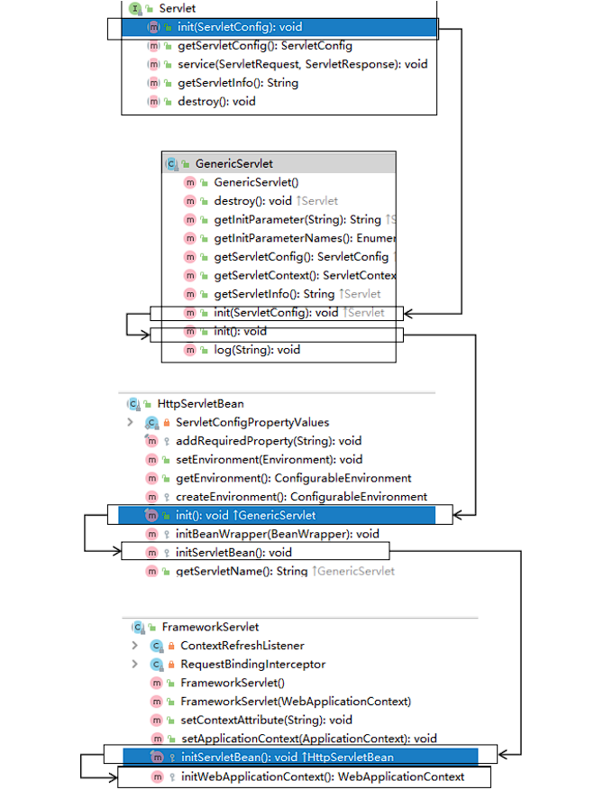

- 初始化过程的策略

  FrameworkServlet创建WebApplicationContext后，刷新容器，调用onRefresh(wac)，此方法在 DispatcherServlet中进行了重写，调用了initStrategies(context)方法，初始化策略，即初始化 DispatcherServlet的各个组件 

  所在类：org.springframework.web.servlet.DispatcherServlet

```java
protected void initStrategies(ApplicationContext context) {
initMultipartResolver(context);
initLocaleResolver(context);
initThemeResolver(context);
initHandlerMappings(context);
initHandlerAdapters(context);
initHandlerExceptionResolvers(context);
initRequestToViewNameTranslator(context);
initViewResolvers(context);
initFlashMapManager(context);
}
```

###### 21、SpringMVC的执行流程

1) 用户向服务器发送请求，请求被SpringMVC 前端控制器 DispatcherServlet捕获。

2) DispatcherServlet对请求URL进行解析，得到请求资源标识符（URI），判断请求URI对应的映射： 

   a) 不存在

    i. 再判断是否配置了mvc:default-servlet-handler 

   ii. 如果没配置，则控制台报映射查找不到，客户端展示404错误

​	 b) 存在则执行下面的流程

3) 根据该URI，调用HandlerMapping获得该Handler配置的所有相关的对象（包括Handler对象以及 Handler对象对应的拦截器），最后以HandlerExecutionChain执行链对象的形式返回。

4)  DispatcherServlet 根据获得的Handler，选择一个合适的HandlerAdapter。

5)  如果成功获得HandlerAdapter，此时将开始执行拦截器的preHandler(…)方法【正向】

6)   提取Request中的模型数据，填充Handler入参，开始执行Handler（Controller)方法，处理请求。 在填充Handler的入参过程中，根据你的配置，Spring将帮你做一些额外的工作：

   ​	 a) HttpMessageConveter： 将请求消息（如Json、xml等数据）转换成一个对象，将对象转换为指定 的响应信息

   ​	 b) 数据转换：对请求消息进行数据转换。如String转换成Integer、Double等

   ​	 c) 数据格式化：对请求消息进行数据格式化。 如将字符串转换成格式化数字或格式化日期等 

   ​	d) 数据验证： 验证数据的有效性（长度、格式等），验证结果存储到BindingResult或Error中

7. Handler执行完成后，向DispatcherServlet 返回一个ModelAndView对象。
8.   此时将开始执行拦截器的postHandle(...)方法【逆向】。 
9.  根据返回的ModelAndView（此时会判断是否存在异常：如果存在异常，则执行 HandlerExceptionResolver进行异常处理）选择一个适合的ViewResolver进行视图解析，根据Model 和View，来渲染视图。
10.   渲染视图完毕执行拦截器的afterCompletion(…)方法【逆向】。
11.   将渲染结果返回给客户端。

————————————————————————面试—————————————————————————————————————————————

# 面试题

### 1、单点登入（SSO）的方式

1. ​	session广播机制实现

2. 使用cookie+redis

   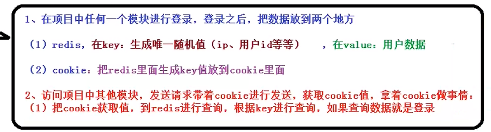

3. 使用token实现

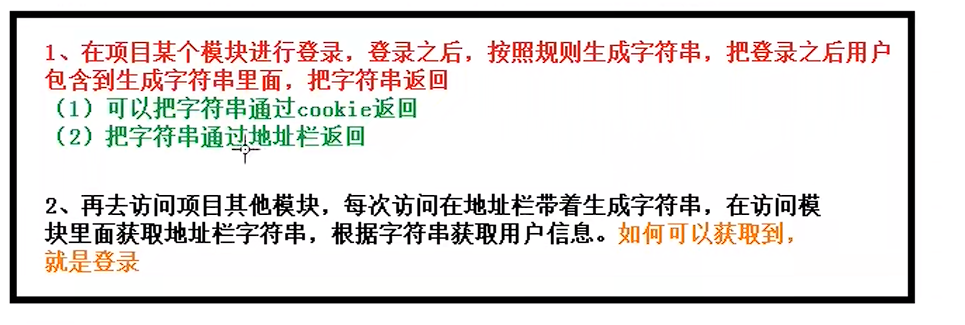
